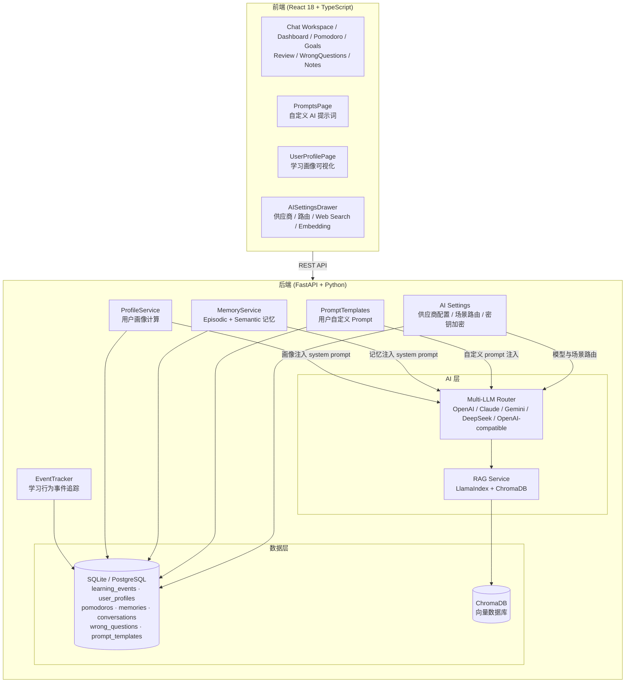

<div align="center">

# 🧠 Mnemox — AI 驱动的个性化学习教练

**不只是聊天助手，而是真正懂你学习规律的 AI 教练**

[](https://python.org)
[](https://fastapi.tiangolo.com)
[](https://react.dev)
[](https://typescriptlang.org)
[](LICENSE.md)

[快速开始](#快速开始) · [系统架构](#系统架构) · [核心功能](#核心功能) · [体验亮点](#体验亮点) · [安全与部署提示](#安全与部署提示) · [技术栈](#技术栈)

</div>

---

## 文档维护

- 文档导航：`/docs/README.md`
- 功能更新记录：`/docs/updates/README.md`
- 日常功能新增、优化和修复，统一记录到 `docs/updates/` 下的周期文档中，默认按周拆分，避免长期堆积在单一说明文件里。

---

## 项目背景

市面上的 AI 学习工具大多停留在「问答」层面——你问它答，但它不记得你上次学了什么，不知道你在哪个知识点反复出错，也不知道你最容易在什么时候放弃学习。

这个项目尝试解决一个更核心的问题：**AI 如何基于用户真实的学习行为数据，给出真正个性化的干预？**

出发点来自备考经历中的观察：
- 学习计划制定容易，但三天打鱼两天晒网是常态
- 番茄钟用了，但不知道自己哪个时段效率最高
- 错题本记了，但不知道哪些知识点是真正的薄弱项
- AI 每次对话都是「失忆」状态，无法给出基于历史的建议

---

## 核心问题与解法

| 问题 | 解法 |
|---|---|
| AI 不了解用户 | 用户画像系统：从行为数据自动计算专注度、坚持度、最佳学习时段 |
| AI 对话无记忆 | 双层记忆：Episodic 记忆（对话摘要）+ Semantic 记忆（长期事实提炼）|
| 学习资料利用率低 | RAG 管道：资料自动向量化，AI 回答时自动检索相关内容 |
| 无法追踪学习行为 | 事件追踪系统：记录每一次番茄钟、答题、复习的行为数据 |
| AI 配置容易出错 | AI Provider 设置：场景路由、RAG Embedding、自定义中转、联网搜索和可读错误提示 |

---

## 系统架构



---

## 数据从哪里来

系统通过 `EventTracker` 在每个用户操作节点埋点，将行为数据写入 `learning_events` 表：

```python
# 事件类型举例
EventType.POMODORO_COMPLETE    # 完成一个番茄钟
EventType.POMODORO_INTERRUPT   # 中断番茄钟（专注度信号）
EventType.QUESTION_WRONG       # 答题答错（薄弱点信号）
EventType.STUDY_START / END    # 学习会话开始/结束
EventType.REVIEW_COMPLETE      # 完成一次复习
```

每条事件记录：事件类型、发生时间、持续时长、关联资料/章节、会话 ID。

`ProfileService` 每小时自动从原始事件聚合计算用户画像，结果持久化到 `user_profiles` 表，并在每次 AI 对话时注入 system prompt。

---

## 核心功能

### 1. 学习行为事件系统
- 全链路行为埋点：番茄钟、答题、复习、笔记、AI 交互
- 时序数据存储，支持按时间窗口聚合分析
- 事件分类：`study` / `practice` / `review` / `goal`

### 2. 用户画像自动计算
- **专注度评分**：番茄钟完成率 vs 中断率
- **坚持度评分**：连续学习天数、断档频率（三天打鱼指数）
- **自控力评分**：每日计划执行完成比
- **最佳学习时段**：基于时间段内完成番茄钟数量分布
- **薄弱知识点**：错题本高频知识点 Top 10
- 画像自动注入 AI system prompt，实现真正个性化回复

### 3. AI 教练记忆系统
- **Episodic 记忆**：对话摘要，带时间衰减（久远记忆权重降低）
- **Semantic 记忆**：从对话中提炼长期事实（学习偏好、目标、薄弱点）
- **画像上下文注入**：每次对话携带用户历史画像数据

### 4. AI 对话工作区
- 根路径和 `/conversations/:conversationId` 都能直接恢复指定历史对话，刷新页面不会丢失当前上下文
- 左侧会话栏支持新建、搜索、按时间分组、置顶、重命名、项目筛选和项目资料管理
- 支持流式回复、会话持久化、学习会话聊天记录同步、对话摘要、长期记忆提取、错题自动检测和学习事件追踪
- 流式回复后处理采用分阶段提交：摘要、记忆、反思、错题检测、事件追踪中某一步失败时，不会连带回滚已保存的聊天内容
- 聊天输入区支持模型覆盖默认路由；开启联网搜索后，官方 OpenAI 走 Responses 内置 Web Search，OpenAI-compatible 中转可通过本地工具调用执行网页搜索，其他供应商使用应用层搜索上下文兜底
- 聊天中的自然语言写入会先生成可编辑草稿，再由用户确认写入笔记、目标任务或当天计划

### 5. RAG 知识库
- 支持 PDF / Word / Markdown / TXT 格式资料上传
- LlamaIndex 自动解析 + 章节结构化
- ChromaDB 向量存储，AI 回答自动检索相关章节
- 意图识别：对话中自动判断是否需要检索资料库
- **容错降级**：embedding 服务不可用时，资料创建、问答和分析不会 500；资料搜索自动回退到关键词检索

### 6. 多 AI 提供商支持
- OpenAI（GPT-4o / GPT-4）
- Anthropic Claude（Claude 3.5 Sonnet）
- Google Gemini
- DeepSeek / Qwen
- OpenAI-compatible 自定义中转
- 运行时切换，无需重启；支持按聊天、错题检测、复习、Agent、RAG Embedding 等场景分别指定模型
- AI 设置页支持模型搜索、连接测试、供应商删除、激活供应商自动接管和路由引用清理
- 常见连接问题会转成可读提示：API Key 错误、模型不存在、额度不足、Base URL 填错、返回非 JSON 或非 OpenAI-compatible 聊天格式

### 7. 学习工具集
- **番茄钟**：计时、统计、任务关联、离线同步；停止时记录原因（提前完成 / 临时中断 / 状态不好），自动纳入画像分析
- **间隔复习**：艾宾浩斯遗忘曲线调度
- **错题本**：知识点归类、薄弱点追踪
- **学习目标（OKR）**：目标拆解、7日计划生成、自适应重规划
- **掌握度地图**：章节级学习进度可视化
- **笔记系统**：关联资料章节，支持 Obsidian 导入

### 8. 自定义 Prompt 管理
- 10 种学习场景独立 prompt：AI 教练、费曼学习法、苏格拉底提问、出题、错题分析、复习引导、走神关怀等
- `/prompts` 页面可视化编辑，一键恢复默认
- 聊天时按场景自动切换对应 prompt，用户自定义优先

### 9. 用户画像可视化
- 四维雷达图：自控力 / 专注度 / 坚持度 / 计划执行
- 24 小时学习热力图：直观显示你的高效时段
- 薄弱知识点 Tag 展示
- 一键刷新重新计算画像

### 10. 学习行为 EDA 报告
- `/eda` 页面提供最近 7 / 30 / 90 天学习趋势分析
- pandas + scipy 聚合学习时长、番茄钟完成率、任务完成率、时段效率
- ECharts 展示日趋势、小时分布、周内热力图、停止原因占比、能力雷达
- 自动生成图表解读、关键洞察和建议动作，便于复盘学习节奏

### 11. AI 主动干预
- `/intervention` 页面生成每日学习报告和推送文案
- 根据今日学习时长、待办积压、到期复习、任务完成率评估风险等级
- AI 失败时使用模板兜底，确保干预报告稳定可用

### 12. 自主学习 Agent
- `/agent` 页面聚合画像、长期记忆、今日任务、过期任务、到期复习、错题薄弱点和番茄钟状态
- 输出 `autonomy_level`、`readiness_score`、`risk_level`、`current_focus` 和下一步行动建议
- 支持三层稳妥自主路径：先生成行动草案，再由用户确认执行，最后把执行反馈写入记忆用于后续规划
- 内置规则 Planner 作为稳定兜底；可在页面中手动开启 LLM Planner 增强规划，失败、超时或无 AI Key 时自动回退，不影响核心功能
- LLM Planner 默认 12 秒超时，返回中会标记 `planner.source` / `planner.error`，便于排查是否触发规则兜底
- Agent 可只读查询笔记、资料、错题、长期记忆、用户画像、Agent 学习画像、今日任务和近期反馈
- `agent_learning_profile` 会沉淀 `traits`、`do_more`、`avoid` 等学习风格偏好，让建议越来越贴合用户
- 支持将部分低风险建议转成今日任务，例如最低可行计划、薄弱点专项、降低走神和节奏维持；其余建议保持跳转执行
- 聊天 system prompt 自动注入 Agent 简报，让 AI 在普通对话中也能主动提醒复习积压、任务补救和薄弱点专项练习
- 聊天里的自然语言写入会先生成草稿，再确认后真正写入笔记或目标任务；重复内容会自动标记并跳过
- 确认后的 Agent 写入会同步落到聊天历史里，方便后续切换会话、回看记录和分支编辑

### 13. Anki 风格记忆卡
- `/anki` 页面支持手动创建、CSV 导入导出、AI 批量生成卡片
- 使用 SM-2 风格调度字段：到期时间、间隔天数、简易系数、复习评分
- 已接入 IndexedDB 离线缓存和同步适配器

### 14. 个性化界面与系统设置
- 设置面板：主题、背景图、AI 供应商、激励语录、提示词、系统更新
- 支持跟随系统 / 暖色 / 深色主题，自定义背景图和透明度
- 左右侧栏支持折叠和宽度调整；聊天区、会话侧栏、账户入口、设置弹窗和 AI 设置抽屉已统一为当前视觉风格
- 支持应用版本检查与自动检查间隔配置

---

## 技术栈

| 层级 | 技术 |
|---|---|
| 前端框架 | React 18 + TypeScript |
| 前端构建 | Vite |
| UI 组件库 | Ant Design |
| 数据可视化 | ECharts |
| 状态管理 | Zustand |
| 离线缓存 | Dexie / IndexedDB |
| Markdown 编辑 | Toast UI Editor / react-markdown |
| 后端框架 | FastAPI + Python 3.10+ |
| 数据库 ORM | SQLAlchemy 2.0（异步） |
| 数据库 | SQLite（本地）/ PostgreSQL（生产）|
| AI 编排 | 自研 Multi-LLM Router |
| RAG 框架 | LlamaIndex + ChromaDB |
| 向量嵌入 | OpenAI text-embedding-3-small |
| 文件解析 | PyPDF2 + python-docx |
| 容器化 | Docker + Docker Compose |
| 数据库迁移 | Alembic |

---

## 体验亮点

如果你只是想快速判断项目是否值得试用，可以优先体验这几条主线：

1. **上传资料 → 对话问答**：上传 Markdown / TXT / PDF 后，在聊天中围绕资料提问，观察 RAG 检索是否能把回答锚定到自己的学习材料上。
2. **番茄钟 → 用户画像**：完成几次番茄钟并记录中断原因，再刷新用户画像，查看专注度、坚持度和高效时段是否开始变化。
3. **错题 / 复习 → 主动干预**：录入错题、创建复习任务后，到干预页面生成每日建议，观察系统是否能识别薄弱点和任务积压。
4. **Agent 页面 → 下一步行动**：打开 `/agent` 查看自主学习简报，尝试把低风险建议转为今日任务，并提交反馈，让下一轮建议更贴近你的学习状态。
5. **自定义 Prompt**：在 `/prompts` 调整教练、费曼、苏格拉底等场景提示词，验证 AI 回复风格能否按你的学习偏好变化。

项目的核心不是“又一个聊天框”，而是把学习资料、行为数据、错题、复习、计划和 AI 建议串成一个闭环。

---

## 安全与部署提示

本项目默认更适合本地学习、个人服务器或小范围试用。公开部署前建议至少确认：

- `SECRET_KEY` 使用随机强密钥，生产环境不要使用默认占位符。
- `DEBUG=False`，避免在公网暴露调试信息。
- `CORS_ORIGINS` 只配置你的真实前端域名，不要使用 `*`。
- 不提交 `.env`、数据库文件、上传目录、ChromaDB 数据、日志或真实 API Key。
- 上传文件当前有扩展名、大小和 Content-Type 白名单校验，后端使用 UUID 文件名保存；公开服务仍建议增加反病毒扫描、速率限制和对象存储隔离。
- `MATERIAL_UPLOAD_MAX_MB` 默认 200MB，可按部署资源调整。
- Markdown 展示默认跳过原始 HTML，并对外链使用 `noopener`；如果后续引入新的 Markdown 渲染组件，也要保持同等安全策略。
- AI Provider Key 可以通过环境变量或设置页配置；多人部署时应评估 Key 的隔离、额度限制和审计需求。

---

## 此次更新说明

更新日期：2026-05-30

本次文档同步了最近几轮围绕聊天、AI 设置、桌面发布和界面体验的修复：

- **联网搜索**：聊天输入区新增“联网搜索”开关；开启后，官方 OpenAI Provider 会通过 Responses API 调用内置 Web Search，OpenAI-compatible 中转可通过 Chat Completions tools 调用本地 `web_search`。
- **供应商边界提示**：DeepSeek、Qwen、Claude、Gemini 和 OpenAI-compatible 中转不会误走 OpenAI 内置联网搜索；工具调用不兼容时会回退到应用层搜索结果注入，并通过 SSE 返回搜索结果事件。
- **AI 错误信息优化**：API Key 错误、模型不存在、额度不足、Base URL 填错、返回 HTML/非 JSON、非 OpenAI-compatible 聊天格式等问题，会在聊天流、模型搜索和连接测试里显示更容易理解的中文提示。
- **AI Provider 管理修复**：默认供应商也可以删除；删除激活供应商时会自动选择剩余可用供应商接管，并清理场景路由引用，避免数据库外键失败或设置页卡死。
- **流式聊天持久化增强**：聊天内容保存与摘要、记忆、反思、错题检测、事件追踪分阶段提交，后处理失败不会连带回滚已经保存的用户消息和 AI 回复。
- **学习会话记录修复**：流式聊天同时绑定普通对话和学习会话时，会先校验当前用户拥有对应学习会话，再写入学习会话聊天记录。
- **多用户隔离测试补强**：新增 AI Provider 删除、路由清理、学习计划写入隔离等测试覆盖，继续收敛多人环境下的越权风险。
- **聊天工作区体验升级**：左侧会话栏、项目筛选、折叠窄栏、账户入口、设置弹窗和 AI 设置抽屉统一视觉样式；聊天主区域高度和滚动行为更稳定。
- **桌面发布记录同步**：v1.0.5 增加 OpenAI 联网搜索；v1.0.6 优化桌面单实例、右侧边栏布局持久化、默认联网搜索和番茄 / 计划 / 笔记工作台体验。

上一轮更新日期：2026-05-01

本次更新重点提升了公开试用前的稳定性、安全性和 Agent 个性化能力：

- **RAG 容错增强**：embedding 或向量库异常时，资料创建不再失败；资料问答、资料分析和章节大纲生成会回退到资料原文片段。
- **关键词 fallback**：`/api/materials/search` 优先语义检索，RAG 关闭、embedding 失败或无结果时自动回退当前用户资料标题/正文关键词搜索，保持原有数组响应兼容。
- **Agent Planner 稳定性**：LLM Planner 增加默认 12 秒超时，超时或异常时返回规则 Planner 结果，并在 `planner.error` 中暴露原因。
- **Agent 只读工具扩展**：新增查询长期记忆、用户画像、Agent 学习画像、今日任务、近期反馈等工具。
- **Agent 学习风格沉淀**：`agent_learning_profile` 新增 `traits`、`trait_items`、`do_more`、`avoid`、`trait_controls`、`locked_trait_values`。
- **上传安全限制**：资料上传默认限制 200MB，校验扩展名和 Content-Type，后端生成 UUID 文件名，超限返回 413。
- **生产配置保护**：生产环境弱 `SECRET_KEY` 会拒绝启动；`.gitignore` 补充数据库、Chroma、上传目录、env 和运行产物忽略规则。
- **验证覆盖**：已通过核心文件 `py_compile`、RAG fallback / Agent tools / traits smoke、Planner timeout 定向验证、上传限制与关键词 fallback smoke。

上一轮更新围绕「学习数据闭环」补齐了分析、干预、复习和系统设置能力：

- **学习分析**：新增 EDA 报告页面与 `/api/analytics` 接口，支持学习趋势、时段效率、目标完成预测、图表洞察和报告文本生成。
- **主动干预**：新增 `/api/interventions` 与前端干预页面，按学习时长、任务积压、到期复习自动判断风险等级，并生成每日提醒。
- **自主学习 Agent**：新增 `/api/agent/brief`、`/api/agent/prompt`、行动草案/执行/反馈接口与 `/agent` 页面，整合画像、记忆、目标、复习和错题，支持规则兜底、可选 LLM Planner、用户确认后创建任务，并将反馈写入记忆。
- **Anki 记忆卡**：新增 AnkiCard 数据模型、卡片管理接口、AI 生成、CSV 导入导出、SM-2 风格复习调度和离线同步。
- **计划与目标体验**：优化目标拆解、计划页面、今日聚焦动作、离线目标/任务同步和重规划流程。
- **笔记编辑**：新增 Toast UI Markdown 实时编辑器，支持图片上传、任务列表快捷输入、代码高亮和数学公式样式。
- **界面与设置**：重构主布局与页面外观，新增主题切换、自定义背景、系统版本检查、激励语录和统计弹窗。
- **后端稳定性**：完善数据库初始化、Alembic 环境、配置校验、上传目录处理、RAG 自动索引和多 AI 供应商路由。
- **安全与仓库卫生**：示例配置统一使用占位符，移除配置说明中的明文密钥，并忽略本地 `.aionrs/` 会话目录。

---

## 快速开始

> 项目当前处于 beta / active development 阶段，适合本地学习、二次开发和开源试用。欢迎通过 Issue 反馈真实使用中的 bug 和体验问题。

### 方式一：Windows 双击体验（最简单）

适合只想本地跑起来看看 UI、交互和基础功能的用户。

**你只需要提前安装：**

- Python 3.10+：https://www.python.org/downloads/
- Node.js 18+ LTS：https://nodejs.org/

然后：

```bash
git clone https://github.com/wlohf/Mnemox.git
cd Mnemox
```

在 Windows 文件管理器里双击：

```text
start.bat
```

或者双击中文入口：

```text
一键启动.bat
```

脚本会自动完成：

- 检查 Python / Node / npm
- 创建 `backend\venv`
- 自动生成本地开发用 `backend\.env` 和安全随机 `SECRET_KEY`
- 默认使用 SQLite 本地数据库
- 默认关闭 RAG 向量索引，方便先体验 UI 和基础功能
- 首次安装后端和前端依赖，后续启动会自动跳过已安装依赖
- 启动后端 `http://localhost:8000`
- 启动前端 `http://localhost:5173`
- 自动打开浏览器

停止服务：

```text
stop.bat
```

> 第一次运行需要下载 Python / npm 依赖，可能比较慢。以后再次双击会复用已安装依赖。

> 如果你只想先看页面和交互，可以暂时不填 AI Key；需要 AI 聊天、AI 生成、RAG 语义检索时，再到设置页或 `backend\.env` 里配置 DeepSeek / OpenAI 等 Key。

### 方式二：Docker Compose 一键体验

适合想用容器隔离完整前后端环境的用户。

**1. 克隆项目**

```bash
git clone https://github.com/wlohf/Mnemox.git
cd Mnemox
```

**2. 创建根目录 `.env`**

```bash
cp .env.example .env
```

编辑 `.env`，至少填这些值：

```env
DB_PASSWORD=replace_with_strong_database_password
SECRET_KEY=replace_with_random_secret_at_least_32_chars

# 可选：需要 AI 功能时再配置
DEFAULT_AI_PROVIDER=deepseek
DEEPSEEK_API_KEY=your_deepseek_api_key_here
DEEPSEEK_MODEL=deepseek-chat
DEEPSEEK_BASE_URL=https://api.deepseek.com/v1
```

生成 `SECRET_KEY`：

```bash
python -c "import secrets; print(secrets.token_urlsafe(48))"
```

**3. 启动**

```bash
docker compose up -d --build
```

访问：

```text
http://localhost
```

停止：

```bash
docker compose down
```

### 方式三：手动本地开发启动

适合想改代码、调试、提交 PR 的开发者。本地开发默认使用 SQLite。

**1. 克隆项目**

```bash
git clone https://github.com/wlohf/Mnemox.git
cd Mnemox
```

**2. 配置后端环境变量**

```bash
cp backend/env.example backend/.env
```

编辑 `backend/.env`：

```env
DATABASE_URL=sqlite+aiosqlite:///./data/study.db
SECRET_KEY=replace_with_random_secret_at_least_32_chars

DEFAULT_AI_PROVIDER=deepseek
DEEPSEEK_API_KEY=your_deepseek_api_key_here
DEEPSEEK_MODEL=deepseek-chat
DEEPSEEK_BASE_URL=https://api.deepseek.com/v1

DEBUG=True
ENVIRONMENT=development
CORS_ORIGINS=["http://localhost:5173", "http://localhost:3000"]
MATERIAL_UPLOAD_MAX_MB=200
```

**3. 启动后端**

```bash
cd backend
pip install -r requirements.txt
python -m uvicorn app.main:app --reload --host 0.0.0.0 --port 8000
```

API 文档地址：

```text
http://localhost:8000/docs
```

**4. 启动前端**（另开一个终端）

```bash
cd frontend
npm install
npm run dev -- --host 0.0.0.0 --port 5173
```

访问：

```text
http://localhost:5173
```

> 不要把自己的 `.env`、数据库文件、上传目录或真实 API Key 提交到 GitHub。

### 首次使用建议流程

1. 注册一个本地账号并登录。
2. 如果要体验 AI 功能，打开设置里的 AI Provider，填写 DeepSeek 或其他模型 Key，并点击“测试连接”。
3. 上传一份小型 Markdown / TXT / PDF 学习资料。
4. 创建一个项目，把资料关联进去。
5. 在 AI 对话中询问资料内容，确认资料引用和回答正常。
6. 记录几条错题、写一条笔记、完成一次复习。
7. 使用番茄钟完成几次学习后，到用户画像页刷新画像。

### 常见问题

**Q: 启动时报 `SECRET_KEY 未安全配置`？**

A: 后端要求非调试环境必须配置至少 32 字符的 `SECRET_KEY`。按上面的命令生成并写入 `.env`。

**Q: AI 测试提示 API Key 未配置？**

A: 检查 `.env` 中的 `DEFAULT_AI_PROVIDER` 是否和你填写的 Key 对应。例如使用 DeepSeek 时应配置：

```env
DEFAULT_AI_PROVIDER=deepseek
DEEPSEEK_API_KEY=...
```

如果你是在页面里手动填写 Key，需要保存后再点击测试连接。

**Q: RAG / 向量检索不可用？**

A: RAG embedding 默认走 OpenAI 兼容 embedding 配置。仅配置 DeepSeek Chat Key 不一定能提供 embedding。现在系统会自动降级：资料创建、问答和分析不会因为 embedding 失败而中断；资料搜索会回退到关键词检索。若希望获得更好的语义搜索效果，请配置支持 `/v1/embeddings` 的 OpenAI 兼容服务。

**Q: 前端能打开但接口 401/500？**

A: 先确认已经登录；再查看后端日志：

```bash
docker compose logs -f backend
# 或本地开发时查看 uvicorn 终端输出
```

### Windows 一键启动

仓库中保留了 `start.bat`、`start.ps1`、`一键启动.bat` 等脚本，适合 Windows 用户快速尝试。不同系统环境差异较大，如果脚本失败，推荐优先使用 Docker Compose 或本地开发启动方式。

---

## 项目结构

```
Mnemox/
├── backend/
│   ├── app/
│   │   ├── ai/                # Multi-LLM Router + RAG 服务
│   │   │   ├── factory.py     # LLM 提供商工厂
│   │   │   ├── rag_service.py # LlamaIndex + ChromaDB
│   │   │   └── prompts.py     # 系统提示词
│   │   ├── models/            # SQLAlchemy 数据模型（18 张表）
│   │   ├── routers/           # FastAPI 路由（22 个模块）
│   │   ├── services/
│   │   │   ├── event_tracker.py   # 学习行为事件追踪
│   │   │   ├── profile_service.py # 用户画像计算
│   │   │   └── memory_service.py  # AI 记忆管理
│   │   └── main.py
│   └── requirements.txt
├── frontend/
│   └── src/
│       ├── pages/             # Dashboard / Anki / EDA / Intervention 等功能页面
│       ├── services/          # API 调用层
│       ├── sync/              # 离线同步引擎与适配器
│       └── stores/            # Zustand 状态
├── data/
│   ├── study.db               # SQLite 数据库
│   └── uploads/               # 上传的学习资料
├── docker-compose.yml
└── README.md
```

---

## 当前状态

### 已完成

- [x] 联网搜索：官方 OpenAI Provider 可使用 Web Search，OpenAI-compatible 中转可通过本地工具调用搜索，工具不兼容时回退到应用层搜索结果注入
- [x] AI 设置增强：供应商场景路由、RAG Embedding 配置、自定义中转、模型搜索、连接测试、供应商删除和路由清理
- [x] AI 错误提示优化：常见 Key、模型、额度、Base URL、JSON 格式和 OpenAI-compatible 响应异常会转成可读中文提示
- [x] 聊天工作区升级：会话路由、历史搜索、项目筛选、项目资料管理、左侧折叠栏、模型覆盖和流式回复
- [x] 流式聊天持久化增强：聊天内容、学习会话记录、摘要、记忆、反思、错题检测和事件追踪分阶段提交
- [x] 桌面体验修复：番茄钟记录恢复、历史对话直达路由、应用内更新检查和发布清单同步
- [x] 多用户隔离测试补强：覆盖 AI Provider 配置、供应商删除、路由清理和 Agent 写入等关键路径
- [x] 公开试用前稳定性增强：RAG embedding 异常降级、资料搜索关键词 fallback、Agent Planner 超时兜底、上传安全限制、生产 SECRET_KEY 校验
- [x] AI 多轮对话（流式输出、会话持久化、项目分组）
- [x] 多 AI 提供商运行时切换
- [x] RAG 知识库（资料上传、向量化、检索注入）
- [x] 学习行为事件追踪系统
- [x] 用户画像自动计算（专注度/坚持度/最佳时段）
- [x] AI 双层记忆系统（Episodic + Semantic）
- [x] 番茄钟计时与统计
- [x] 学习目标与 7 日计划生成
- [x] 掌握度地图
- [x] 错题本
- [x] 间隔复习调度
- [x] 笔记系统 + Obsidian 导入
- [x] Docker 容器化部署
- [x] 番茄钟中断原因分类（提前完成 / 临时中断 / 走神）+ 画像分析
- [x] 自定义 Prompt 管理（10 种场景，可视化编辑）
- [x] 用户画像可视化页面（雷达图 + 24小时热力图 + 薄弱点）
- [x] 学习行为 EDA 分析报告（pandas + scipy + ECharts）
- [x] AI 主动干预推送文案与每日学习报告
- [x] Anki 风格记忆卡（AI 生成 / CSV 导入导出 / SM-2 调度）
- [x] Toast UI Markdown 实时编辑器
- [x] 主题、背景、系统版本检查等设置面板

### 接下来计划

- [ ] 继续扩大多用户越权审计：系统性检查所有详情、更新、删除接口是否严格绑定 `current_user.id`
- [ ] Prompt injection 防护：把资料内容、笔记内容和工具返回统一标记为不可信上下文，避免资料中的恶意指令影响系统提示
- [ ] 前端 RAG 状态提示：展示语义检索是否可用、是否正在使用关键词 fallback、最近 embedding 错误
- [ ] AI Provider 连接测试增强：进一步区分 chat、embedding、streaming、Responses API / Web Search 能力是否可用
- [ ] pytest 自动化测试扩面：继续覆盖 auth、RAG fallback、上传限制、Agent feedback、Planner timeout 和前端关键交互
- [ ] 聊天框场景模式选择器（费曼 / 苏格拉底 / 教练 快速切换）
- [ ] 多人共同学习 / 好友监督：支持学习伙伴、学习房间、共同番茄钟、好友提醒和轻量打卡监督；默认以用户授权、低打扰和隐私可控为前提
- [ ] Demo 数据 / 一键体验模式，方便论坛用户无需大量配置即可看到完整效果
- [ ] 自动更新包分发与发布清单维护

---

## License

本项目采用 [PolyForm Noncommercial License 1.0.0](LICENSE.md)，仅允许非商业用途。

你可以将本项目用于个人学习、研究、测试、教学和其他非商业用途。任何商业使用、商业部署、付费产品集成、SaaS 托管或以盈利为目的的再分发，都需要获得作者的单独书面授权。

Copyright © 2026 xyleisure and contributors.
