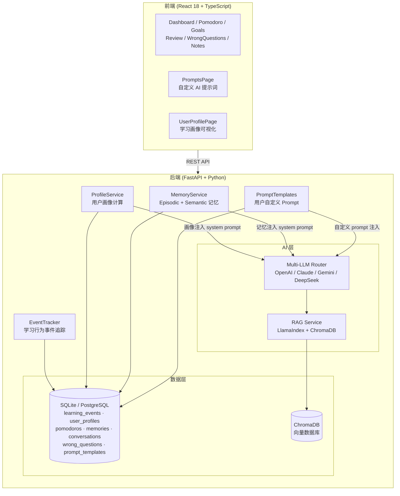

<div align="center">

# 🧠 Mnemox — AI 驱动的个性化学习教练

**不只是聊天助手，而是真正懂你学习规律的 AI 教练**

[](https://python.org)
[](https://fastapi.tiangolo.com)
[](https://react.dev)
[](https://typescriptlang.org)
[](LICENSE)

[快速开始](#快速开始) · [系统架构](#系统架构) · [核心功能](#核心功能) · [技术栈](#技术栈)

</div>

---

## 项目背景

市面上的 AI 学习工具大多停留在「问答」层面——你问它答，但它不记得你上次学了什么，不知道你在哪个知识点反复出错，也不知道你最容易在什么时候放弃学习。

这个项目尝试解决一个更核心的问题：**AI 如何基于用户真实的学习行为数据，给出真正个性化的干预？**

出发点来自备考经历中的观察：
- 学习计划制定容易，但三天打鱼两天晒网是常态
- 番茄钟用了，但不知道自己哪个时段效率最高
- 错题本记了，但不知道哪些知识点是真正的薄弱项
- AI 每次对话都是「失忆」状态，无法给出基于历史的建议

---

## 核心问题与解法

| 问题 | 解法 |
|---|---|
| AI 不了解用户 | 用户画像系统：从行为数据自动计算专注度、坚持度、最佳学习时段 |
| AI 对话无记忆 | 双层记忆：Episodic 记忆（对话摘要）+ Semantic 记忆（长期事实提炼）|
| 学习资料利用率低 | RAG 管道：资料自动向量化，AI 回答时自动检索相关内容 |
| 无法追踪学习行为 | 事件追踪系统：记录每一次番茄钟、答题、复习的行为数据 |

---

## 系统架构



---

## 数据从哪里来

系统通过 `EventTracker` 在每个用户操作节点埋点，将行为数据写入 `learning_events` 表：

```python
# 事件类型举例
EventType.POMODORO_COMPLETE    # 完成一个番茄钟
EventType.POMODORO_INTERRUPT   # 中断番茄钟（专注度信号）
EventType.QUESTION_WRONG       # 答题答错（薄弱点信号）
EventType.STUDY_START / END    # 学习会话开始/结束
EventType.REVIEW_COMPLETE      # 完成一次复习
```

每条事件记录：事件类型、发生时间、持续时长、关联资料/章节、会话 ID。

`ProfileService` 每小时自动从原始事件聚合计算用户画像，结果持久化到 `user_profiles` 表，并在每次 AI 对话时注入 system prompt。

---

## 核心功能

### 1. 学习行为事件系统
- 全链路行为埋点：番茄钟、答题、复习、笔记、AI 交互
- 时序数据存储，支持按时间窗口聚合分析
- 事件分类：`study` / `practice` / `review` / `goal`

### 2. 用户画像自动计算
- **专注度评分**：番茄钟完成率 vs 中断率
- **坚持度评分**：连续学习天数、断档频率（三天打鱼指数）
- **自控力评分**：每日计划执行完成比
- **最佳学习时段**：基于时间段内完成番茄钟数量分布
- **薄弱知识点**：错题本高频知识点 Top 10
- 画像自动注入 AI system prompt，实现真正个性化回复

### 3. AI 教练记忆系统
- **Episodic 记忆**：对话摘要，带时间衰减（久远记忆权重降低）
- **Semantic 记忆**：从对话中提炼长期事实（学习偏好、目标、薄弱点）
- **画像上下文注入**：每次对话携带用户历史画像数据

### 4. RAG 知识库
- 支持 PDF / Word / Markdown 格式资料上传
- LlamaIndex 自动解析 + 章节结构化
- ChromaDB 向量存储，AI 回答自动检索相关章节
- 意图识别：对话中自动判断是否需要检索资料库

### 5. 多 AI 提供商支持
- OpenAI（GPT-4o / GPT-4）
- Anthropic Claude（Claude 3.5 Sonnet）
- Google Gemini
- DeepSeek / Qwen
- 运行时切换，无需重启

### 6. 学习工具集
- **番茄钟**：计时、统计、任务关联、离线同步；停止时记录原因（提前完成 / 临时中断 / 状态不好），自动纳入画像分析
- **间隔复习**：艾宾浩斯遗忘曲线调度
- **错题本**：知识点归类、薄弱点追踪
- **学习目标（OKR）**：目标拆解、7日计划生成、自适应重规划
- **掌握度地图**：章节级学习进度可视化
- **笔记系统**：关联资料章节，支持 Obsidian 导入

### 7. 自定义 Prompt 管理
- 10 种学习场景独立 prompt：AI 教练、费曼学习法、苏格拉底提问、出题、错题分析、复习引导、走神关怀等
- `/prompts` 页面可视化编辑，一键恢复默认
- 聊天时按场景自动切换对应 prompt，用户自定义优先

### 8. 用户画像可视化
- 四维雷达图：自控力 / 专注度 / 坚持度 / 计划执行
- 24 小时学习热力图：直观显示你的高效时段
- 薄弱知识点 Tag 展示
- 一键刷新重新计算画像

---

## 技术栈

| 层级 | 技术 |
|---|---|
| 前端框架 | React 18 + TypeScript |
| 前端构建 | Vite |
| UI 组件库 | Ant Design |
| 数据可视化 | ECharts |
| 状态管理 | Zustand |
| 后端框架 | FastAPI + Python 3.10+ |
| 数据库 ORM | SQLAlchemy 2.0（异步） |
| 数据库 | SQLite（本地）/ PostgreSQL（生产）|
| AI 编排 | 自研 Multi-LLM Router |
| RAG 框架 | LlamaIndex + ChromaDB |
| 向量嵌入 | OpenAI text-embedding-3-small |
| 文件解析 | PyPDF2 + python-docx |
| 容器化 | Docker + Docker Compose |
| 数据库迁移 | Alembic |

---

## 快速开始

### 前置条件

- Node.js 18+
- Python 3.10+
- 至少一个 AI 提供商的 API Key（OpenAI / Claude / Gemini / DeepSeek）

### 方式一：本地手动启动（开发用）

**1. 克隆项目**

```bash
git clone https://github.com/wlohf/RagStudyAssistant.git
cd StudyAssistant
```

**2. 配置环境变量**

```bash
cp backend/env.example backend/.env
# 编辑 backend/.env，填入你的 API Key
```

```env
OPENAI_API_KEY=sk-...
CLAUDE_API_KEY=sk-ant-...
SECRET_KEY=your-secret-key
```

**3. 启动后端**

```bash
cd backend
pip install -r requirements.txt
python -m uvicorn app.main:app --reload --port 8000
```

**4. 启动前端**（另开终端）

```bash
cd frontend
npm install
npm run dev
```

**5. 访问应用**

打开浏览器：http://localhost:5173

### 方式二：Docker Compose（生产用）

```bash
cp .env.example .env
# 填写 .env 中的 API Key 和 DB_PASSWORD

docker compose up -d
```

访问：http://localhost

### Windows 一键启动

双击根目录的 `start.bat`，自动启动前后端并打开浏览器。

---

## 项目结构

```
StudyAssistant/
├── backend/
│   ├── app/
│   │   ├── ai/                # Multi-LLM Router + RAG 服务
│   │   │   ├── factory.py     # LLM 提供商工厂
│   │   │   ├── rag_service.py # LlamaIndex + ChromaDB
│   │   │   └── prompts.py     # 系统提示词
│   │   ├── models/            # SQLAlchemy 数据模型（18 张表）
│   │   ├── routers/           # FastAPI 路由（22 个模块）
│   │   ├── services/
│   │   │   ├── event_tracker.py   # 学习行为事件追踪
│   │   │   ├── profile_service.py # 用户画像计算
│   │   │   └── memory_service.py  # AI 记忆管理
│   │   └── main.py
│   └── requirements.txt
├── frontend/
│   └── src/
│       ├── pages/             # 10 个功能页面
│       └── services/          # API 调用层
├── data/
│   ├── study.db               # SQLite 数据库
│   └── uploads/               # 上传的学习资料
├── docker-compose.yml
└── README.md
```

---

## 当前状态

### 已完成

- [x] AI 多轮对话（流式输出、会话持久化、项目分组）
- [x] 多 AI 提供商运行时切换
- [x] RAG 知识库（资料上传、向量化、检索注入）
- [x] 学习行为事件追踪系统
- [x] 用户画像自动计算（专注度/坚持度/最佳时段）
- [x] AI 双层记忆系统（Episodic + Semantic）
- [x] 番茄钟计时与统计
- [x] 学习目标与 7 日计划生成
- [x] 掌握度地图
- [x] 错题本
- [x] 间隔复习调度
- [x] 笔记系统 + Obsidian 导入
- [x] Docker 容器化部署
- [x] 番茄钟中断原因分类（提前完成 / 临时中断 / 走神）+ 画像分析
- [x] 自定义 Prompt 管理（10 种场景，可视化编辑）
- [x] 用户画像可视化页面（雷达图 + 24小时热力图 + 薄弱点）

### 进行中

- [ ] 学习行为 EDA 分析报告（pandas + Jupyter）
- [ ] AI 主动干预推送（每日学习报告）
- [ ] 聊天框场景模式选择器（费曼 / 苏格拉底 / 教练 快速切换）

---

## License

MIT © 2025
