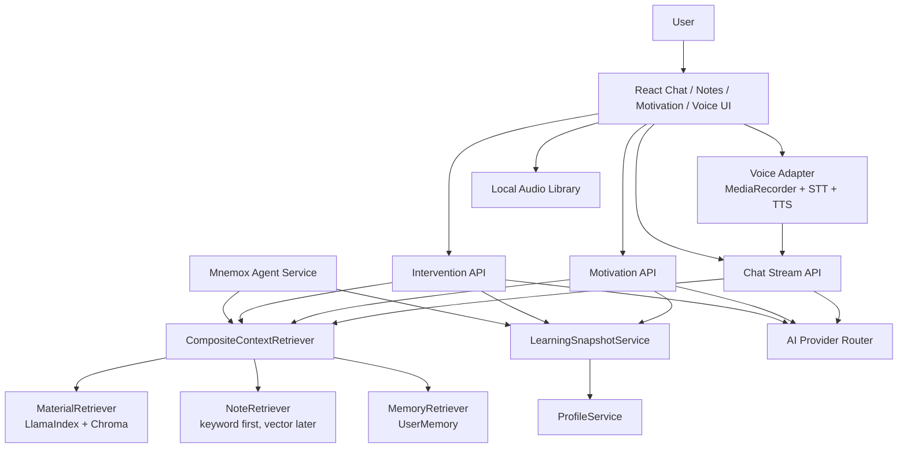

# Mnemox Voice, RAG Motivation, and Agent Design

Date: 2026-06-08
Status: Draft pending user approval

## Decision

Do not integrate `earendil-works/pi` as the primary runtime for this feature set in the current Mnemox architecture.

Pi is useful when the product needs a TypeScript stateful agent runtime with tool execution, event streaming, and coding-agent style extensibility. Mnemox already has the product primitives needed for this goal:

- FastAPI backend with AI provider routing
- Existing internal learning Agent service
- LlamaIndex + ChromaDB RAG
- Notes and Obsidian import
- Long-term memory
- User profile and learning event tracking
- Motivation and intervention endpoints
- Streaming chat UI

Adding Pi now would create a second agent runtime beside the existing Python service layer. It would add Node runtime operations, cross-process state synchronization, duplicated provider configuration, and a broader permission surface for private notes. The missing product capability is not "agent runtime"; it is a unified context retrieval and coaching layer over notes, materials, memory, and user state.

Use Mnemox-native services first. Revisit Pi only if Mnemox later needs a separate TypeScript agent SDK for plugin-style tool orchestration, external automations, or a standalone desktop agent process.

## User Requirements

The requested end state contains these capabilities:

1. Voice conversation: the user can speak to Mnemox and hear a spoken response.
2. Voice motivation: Mnemox can speak motivational content in a restrained, specific coaching tone.
3. Audio resources: the user can bring in music or audio used during motivation/focus flows.
4. Non-cliche encouragement: motivational text should be concrete, grounded, and avoid generic "chicken soup".
5. Note-aware coaching: Mnemox can read the user's notes and documents as context.
6. Knowledge association: when the user studies a new concept, Mnemox can connect it to earlier notes, materials, memories, and weak points.
7. Personal quote recall: when the user is tired or unmotivated, Mnemox can cite or lightly adapt the user's own notes, for example "还记得你在《...》里写过..."
8. Maintainable technical documentation: the architecture and implementation path should be documented for future maintenance.

## Existing Project Context

The current project already contains the following integration points:

- Chat prompt assembly: `backend/app/routers/chat.py`
- Material RAG: `backend/app/ai/rag_service.py`
- Notes API: `backend/app/routers/notes.py`
- Long-term memory: `backend/app/services/memory_service.py`
- User profile injection: `backend/app/services/profile_service.py`
- Learning Agent brief and tools: `backend/app/services/agent_service.py`
- Motivation routes: `backend/app/routers/motivation.py`
- Active intervention routes: `backend/app/routers/interventions.py`
- Frontend chat stream: `frontend/src/services/chatApi.ts`
- Main chat workspace: `frontend/src/components/Layout/ObsidianLayout.tsx`
- Motivation UI: `frontend/src/components/Layout/MotivationModal.tsx`

The working tree already includes partial implementation work for note-personalized motivation:

- `backend/app/services/motivation_service.py`
- `backend/tests/test_motivation_personalization.py`
- `docs/voice-rag-motivation-plan-2026-06-08.md`

That slice should be preserved and treated as the first concrete product step.

## Architecture

Use a bounded autonomy architecture instead of a single "super agent".

### Unit Boundaries

`LearningSnapshotService`

- Owns reusable learning state aggregation.
- Returns task, pomodoro, review, goal, recent note, memory, and risk summaries.
- Replaces repeated ad hoc queries currently split across motivation, intervention, and agent services.

`CompositeContextRetriever`

- Owns context recall for chat, motivation, intervention, and agent.
- Combines results from materials, notes, and memories.
- Enforces user ownership, source labels, max token budgets, and prompt-injection wrapping.

`NoteRetriever`

- Phase 1: keyword and recency retrieval from `notes`.
- Phase 2: vector indexing using the existing ChromaDB collection or a separate `mnemox_context` collection with `source_type=note`.
- Returns source title, note ID, excerpt, tags, updated time, and match reason.

`MotivationContextService`

- Builds note-grounded motivational prompts.
- Requires constrained output: one sentence, specific tone, no fabricated source titles, no invented quotes, next small action.
- Falls back to local templates when AI fails.

`VoiceAdapter`

- Frontend state machine: `idle -> listening -> transcribing -> thinking -> speaking`.
- Server endpoint for STT to avoid exposing provider keys.
- First TTS implementation can use browser `speechSynthesis`; backend TTS can be added later.

`AudioLibrary`

- Stores user-provided audio assets and scenario bindings.
- Initial source should be upload/local import, not direct Bilibili scraping.
- Metadata should track title, origin note, scenario, volume, and user ownership.

## Phased Delivery

### Phase 1: Note-Grounded Motivation and Chat Recall

Goal: make encouragement and chat feel grounded in the user's own notes without adding a new runtime.

Deliverables:

- Preserve the existing personalized motivation implementation.
- Add reusable recent-note highlight extraction if not already separated.
- Add `NoteRetriever` with keyword/recency retrieval.
- Inject top note excerpts into chat prompt when the user asks conceptual, motivational, review, or self-reflection questions.
- Return lightweight frontend indicators so the user can see which notes were used.
- Keep all note content wrapped as untrusted context.

Acceptance criteria:

- Motivation generation can cite a current user's note excerpt and never reads another user's note.
- Chat can retrieve relevant note excerpts for a concept query.
- AI failure keeps endpoints usable through deterministic fallback.
- Tests cover user isolation, no note match, generic note titles, and prompt construction.

### Phase 2: Unified Context and Knowledge Association

Goal: connect new concepts to older knowledge.

Deliverables:

- Add `CompositeContextRetriever`.
- Add source-type metadata to material and note chunks.
- Add vector indexing for notes.
- Add concept extraction on note save or scheduled background refresh.
- Add a `knowledge_links` table only after retrieval quality requires persistent links.

Acceptance criteria:

- Given a concept query, retrieval can return material chunks, note excerpts, and memory facts in one ranked result.
- The prompt identifies each source type and prevents the model from treating notes as instructions.
- Re-indexing one note does not delete other users' chunks or unrelated materials.

### Phase 3: Voice Conversation MVP

Goal: allow practical voice input/output while reusing text chat.

Deliverables:

- `POST /api/voice/transcribe` accepting audio upload.
- Frontend voice button in the chat input area.
- Browser `MediaRecorder` capture and state handling.
- Reuse `sendMessageStream` after transcription.
- Browser `speechSynthesis` for assistant reply playback.
- Stop/cancel controls for recording and speaking.

Acceptance criteria:

- User can record, transcribe, send, receive a streamed reply, and hear it spoken.
- Failed STT shows a readable error and does not submit an empty chat.
- Speech playback can be stopped.
- Chat history remains normal text history.

### Phase 4: Voice Motivation and Audio Assets

Goal: make motivation audible and optionally backed by user-provided audio.

Deliverables:

- "Speak this quote" action on motivation UI.
- Optional auto-speak setting with explicit opt-in.
- Audio upload/import from local files: `mp3`, `wav`, `m4a`.
- Scenario bindings: study start, low energy, focus end, motivation reminder.
- Volume cap and fade in/out.

Acceptance criteria:

- Audio assets are user-scoped.
- No direct Bilibili download/scraping is required for core flow.
- If the user imports audio from a platform manually, the app stores it as a local user asset with origin metadata.

### Phase 5: Stronger Proactivity

Goal: bounded active coaching without disruptive autonomy.

Deliverables:

- Fatigue/low-motivation signal from missed tasks, interrupted pomodoros, user feedback, and explicit "累了/没动力".
- Low-noise intervention policy that respects previous feedback.
- Agent action drafts remain confirmation-first for writes.
- Optional scheduled reminders in desktop mode.

Acceptance criteria:

- Agent suggestions include explanation metadata.
- User can dismiss, snooze, or mark suggestions as too disruptive.
- Feedback changes later suggestion tone/frequency.

## Pi-Agent Evaluation

Pi strengths:

- Stateful agent loop with events.
- Tool execution with preflight and postprocess hooks.
- TypeScript SDK and proxy support.
- Multi-provider abstraction through `pi-ai`.

Pi mismatches for current Mnemox:

- Mnemox backend is Python/FastAPI; Pi would add a Node runtime boundary.
- Mnemox already has multi-provider routing, memories, RAG, and agent jobs.
- Mnemox needs domain retrieval and coaching policy more than generic agent loop mechanics.
- Pi README states it does not include built-in permission sandboxing; private note access needs strict in-app ownership checks.
- Direct integration would duplicate provider configuration and model routing already managed by `AIProviderFactory`.

Revisit Pi if:

- Mnemox introduces a plugin marketplace for agent tools.
- The desktop app needs a separate local agent process that can run independent workflows.
- The frontend needs a TypeScript event-native agent SDK rather than FastAPI streaming.
- Tool execution becomes complex enough that Python service methods are no longer adequate.

## LangChain Evaluation

LangChain is not required for the first implementation.

The needed primitives already exist in Mnemox:

- embeddings and vector store via LlamaIndex + ChromaDB
- provider routing via `AIProviderFactory`
- prompt composition in chat/motivation/intervention services
- memory and profile services

Introduce LangChain only if the project needs a specific LangChain integration such as LangGraph-style durable workflows, a tool ecosystem not worth recreating, or evaluators/tracing that the existing stack cannot supply. Otherwise it is extra abstraction around already-working components.

## Safety and Privacy Rules

- Every note, material, memory, audio asset, and generated link must be scoped by `current_user.id`.
- Retrieved user content must be wrapped with `wrap_untrusted_context`.
- The model may cite or lightly adapt note excerpts, but must not invent book names, note titles, quotes, or experiences.
- Direct platform scraping/downloading is out of scope for the first audio implementation.
- Write actions remain draft-confirm-execute; no autonomous writes without user confirmation.
- Voice recording requires explicit user action and visible recording state.

## Testing Strategy

Backend tests:

- `NoteRetriever` returns only current user's notes.
- `NoteRetriever` ranks keyword matches above unrelated recent notes.
- Motivation prompt includes note context when available.
- Motivation fallback cites note title only when title is meaningful.
- Chat prompt includes note context under source and token limits.
- Voice STT endpoint rejects missing or unsupported files.
- Audio asset endpoints enforce ownership.

Frontend tests:

- Voice state machine transitions.
- Recording cancellation does not submit chat.
- TTS stop button cancels playback.
- Motivation speak action calls the voice/audio service.
- Audio asset scenario settings persist.

Manual verification:

- Create two users with separate notes and confirm no cross-user leakage.
- Add a note containing a motivational sentence, generate quote, and confirm grounded output.
- Ask about a concept from an older note and confirm chat receives note context.
- Record a short voice prompt and confirm text chat reuse.
- Upload a local audio file and bind it to a motivation scenario.

## Implementation Gate

This design requires user approval before implementation begins.

Recommended approval text:

> Approved: implement the Mnemox-native phased approach. Do not integrate Pi in this phase. Start with Phase 1 note-grounded motivation and chat recall.

