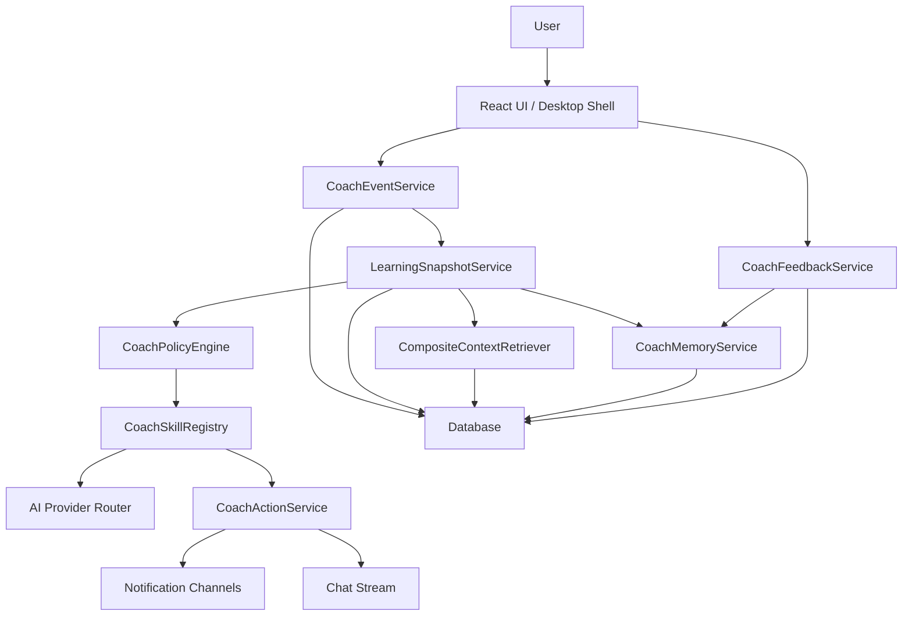

# Mnemox Autonomous Coach Agent Engineering Design

Date: 2026-06-15
Status: Draft for implementation planning

## Decision

Build a Mnemox-native autonomous coach layer before introducing a general-purpose agent framework such as LangGraph, OpenAI Agents SDK, CrewAI, or Pi.

Mnemox already owns the product-specific primitives that matter for a learning coach:

- FastAPI backend and user-scoped database models
- AI provider routing through `AIProviderFactory`
- Chat streaming and conversation persistence
- Long-term memory and conversation summaries
- Notes, materials, RAG, wrong questions, review schedules, goals, daily plans, and pomodoro records
- Existing lightweight agent brief, action draft, feedback, and profile-control flows
- Frontend notification and desktop pomodoro reminder integration

The missing capability is not a generic LLM loop. The missing capability is a bounded, user-scoped coaching runtime that can observe learning events, decide whether intervention is appropriate, choose a coaching skill, generate a low-noise response, and learn from feedback.

Use external frameworks later only when their capabilities are clearly needed:

- Use LangGraph if the coach grows into durable multi-step workflows that need pause/resume, checkpoints, and human-in-the-loop control.
- Use OpenAI Agents SDK if Mnemox standardizes on OpenAI-native agents, handoffs, tracing, and guardrails.
- Use CrewAI only if Mnemox needs role-based multi-agent teams, not just skills under one coach.
- Use Pi only if Mnemox needs a separate TypeScript agent runtime or plugin marketplace outside the Python service boundary.

## Goals

1. Make Mnemox feel like a coach instead of a question-answering chatbot.
2. Add bounded autonomy: proactive suggestions and reminders without disruptive behavior.
3. Provide better responses when the user is frustrated, discouraged, tired, or unable to study.
4. Reuse existing memory, profile, notes, RAG, task, review, and pomodoro data.
5. Create a maintainable skill library for coaching strategies.
6. Keep writes confirmation-first and keep all user data scoped by `current_user.id`.
7. Create a phased path that can be implemented and tested incrementally.

## Non-Goals

- Do not replace the existing FastAPI backend with a separate agent platform in the first implementation phase.
- Do not give the coach unrestricted access to files, shell commands, desktop apps, or the network.
- Do not allow autonomous writes to notes, tasks, plans, or goals without user confirmation.
- Do not make the coach send high-frequency push notifications.
- Do not treat emotional support as therapy or clinical mental-health advice.
- Do not add multi-agent role orchestration until one coach orchestrator with skills proves insufficient.

## Existing Context

Current integration points:

- `backend/app/services/agent_service.py`: agent brief, rule actions, optional LLM planner, action drafts, write drafts, feedback, and agent profile learning.
- `backend/app/routers/agent.py`: current agent APIs.
- `backend/app/services/memory_service.py`: conversation summaries, long-term memory extraction, relevant memory lookup, reflection, and review prompt generation.
- `backend/app/routers/interventions.py`: daily intervention report and push-style recommendations.
- `backend/app/routers/chat.py`: chat prompt assembly, memory injection, RAG, streaming, and post-processing.
- `backend/app/services/motivation_service.py`: note-personalized motivation generation in the current working tree.
- `frontend/src/components/Layout/ObsidianLayout.tsx`: chat workspace, notification hooks, daily intervention polling, motivation UI integration, and agent write confirmation modal.
- `frontend/src/pages/AgentPage.tsx`: agent brief, next actions, feedback controls, action draft preview, and execution.
- `frontend/src/services/desktopReminder.ts`: desktop pomodoro reminder bridge.

Current limitations:

- `agent_service.py` is a large service combining state collection, reasoning, action generation, write drafting, feedback learning, and profile control.
- Daily intervention and agent brief use overlapping state calculations but do not share a dedicated snapshot service.
- Proactivity mostly depends on frontend polling or page visits; there is no backend coach event model.
- The system has memory entries but no explicit coach-specific strategy memory.
- There is no first-class skill registry for coaching patterns.
- Emotional-state handling is prompt-level and scattered rather than part of a reusable policy.

## Architecture

Use a bounded autonomy architecture:



The coach runtime is event-driven, but it must remain bounded:

- The coach can read user-scoped learning state.
- The coach can generate nudges, chat responses, and write drafts.
- The coach can schedule or show reminders when policy allows.
- The coach cannot execute destructive or persistent writes without confirmation.
- The coach cannot bypass cooldown, quiet hours, snooze, or negative feedback rules.

## Core Concepts

### CoachEvent

A normalized signal that something relevant happened.

Examples:

- `chat.low_motivation_detected`
- `chat.frustration_detected`
- `pomodoro.interrupted`
- `pomodoro.completed`
- `task.overdue`
- `review.debt_high`
- `plan.day_started_without_plan`
- `app.inactive_returned`
- `agent.feedback_received`

Each event must include:

- `id`
- `user_id`
- `event_type`
- `source`
- `severity`
- `payload`
- `occurred_at`
- `created_at`

### LearningSnapshot

A reusable state object assembled from existing learning data.

It should include:

- active goals
- today tasks
- overdue tasks
- daily plan status
- due review count and sample items
- weak points
- today pomodoro minutes and completion count
- recent interrupted or distracted pomodoros
- recent notes and relevant memories
- recent agent feedback
- quiet-hour and notification preferences
- computed risk flags

This service should replace duplicate state collection currently spread across agent, motivation, and intervention code.

### CoachPolicy

A deterministic policy result deciding whether and how to intervene.

Policy result fields:

- `should_intervene`
- `intervention_type`
- `priority`
- `skill_id`
- `channel`
- `cooldown_until`
- `reason`
- `evidence`
- `requires_confirmation`

Policy should run before any LLM call. LLMs can improve wording and strategy, but they should not decide whether to bypass user preference or cooldown.

### CoachSkill

A reusable coaching strategy with a clear trigger and output contract.

Each skill should define:

- `id`
- `display_name`
- `description`
- `trigger_event_types`
- `required_context`
- `output_schema`
- `tone_rules`
- `safety_rules`
- optional deterministic fallback

Initial skills:

- `low_motivation`: user says they cannot start or continue studying.
- `frustration_support`: user shows discouragement, anger, or repeated failure.
- `restart_after_interruption`: pomodoro interrupted or app returned after inactivity.
- `review_debt_rescue`: due reviews exceed a threshold.
- `planning_rescue`: today's plan is missing or collapsed.
- `minimum_next_step`: convert overload into one concrete next action.
- `exam_sprint`: compress priorities when a deadline or exam is close.
- `reflection_prompt`: ask a short reflection question after a meaningful session.

### CoachNudge

A generated coach output.

Fields:

- `id`
- `user_id`
- `event_id`
- `skill_id`
- `channel`
- `priority`
- `title`
- `body`
- `suggested_action`
- `route`
- `requires_confirmation`
- `draft`
- `explainability`
- `status`
- `expires_at`
- `created_at`

Statuses:

- `pending`
- `shown`
- `accepted`
- `snoozed`
- `dismissed`
- `completed`
- `expired`

### CoachFeedback

User response that changes future policy and skill selection.

Outcomes:

- `helpful`
- `accepted`
- `completed`
- `later`
- `snoozed`
- `dismissed`
- `too_disruptive`
- `too_hard`
- `too_easy`
- `irrelevant`
- `not_my_style`

Feedback should update both event-level logs and coach memory.

## Backend Modules

### `backend/app/services/learning_snapshot_service.py`

Responsibility:

- Aggregate user-scoped learning state once.
- Provide stable snapshot objects for chat, agent, intervention, motivation, and coach policy.
- Keep SQL collection code out of the policy and skill layers.

Primary API:

```python
async def build_learning_snapshot(
    db: AsyncSession,
    user_id: int,
    *,
    now: datetime | None = None,
    include_recent_notes: bool = True,
    include_memories: bool = True,
) -> dict[str, Any]:
    ...
```

### `backend/app/services/coach_event_service.py`

Responsibility:

- Record normalized coach events.
- Provide idempotency where repeated polling could create duplicate events.
- Convert app actions into event records.

Primary APIs:

```python
async def record_coach_event(db, user_id, event_type, source, payload, severity="info") -> dict:
    ...

async def list_recent_coach_events(db, user_id, limit=50) -> list[dict]:
    ...
```

### `backend/app/services/coach_policy_engine.py`

Responsibility:

- Decide whether the coach should intervene.
- Enforce cooldowns, quiet hours, snooze, frequency caps, and negative feedback.
- Select a skill and channel.

Primary API:

```python
def evaluate_coach_policy(
    event: dict[str, Any],
    snapshot: dict[str, Any],
    preferences: dict[str, Any],
    recent_feedback: list[dict[str, Any]],
) -> dict[str, Any]:
    ...
```

### `backend/app/services/coach_skills/`

Responsibility:

- Store built-in coach skill definitions.
- Keep prompt logic and deterministic fallback isolated per skill.

Suggested files:

- `base.py`
- `registry.py`
- `low_motivation.py`
- `frustration_support.py`
- `restart_after_interruption.py`
- `review_debt_rescue.py`
- `planning_rescue.py`
- `minimum_next_step.py`
- `reflection_prompt.py`

Each skill should expose:

```python
class CoachSkill:
    id: str
    trigger_event_types: set[str]

    async def generate(self, ctx: CoachSkillContext) -> CoachSkillResult:
        ...
```

### `backend/app/services/coach_action_service.py`

Responsibility:

- Convert skill output into `CoachNudge`.
- Handle action draft creation.
- Keep persistent writes confirmation-first.

Allowed actions in Phase 1:

- show in-app nudge
- return chat-side coaching response
- open route
- create task draft
- create daily-plan draft

Disallowed in Phase 1:

- directly create tasks without confirmation
- directly modify schedules without confirmation
- send external messages
- run shell, file, browser, or desktop automation tools

### `backend/app/services/coach_feedback_service.py`

Responsibility:

- Record feedback for nudges and actions.
- Update coach memory and cooldown hints.
- Provide recent feedback summaries to policy.

It should reuse `UserMemory` for early implementation and add dedicated tables when analytics require it.

### `backend/app/routers/coach.py`

Initial endpoints:

```http
POST /api/coach/events
GET /api/coach/nudges
POST /api/coach/nudges/{nudge_id}/feedback
POST /api/coach/evaluate
GET /api/coach/skills
GET /api/coach/preferences
PATCH /api/coach/preferences
```

`POST /api/coach/evaluate` should be safe to call from frontend polling. It should return no nudge when cooldown or policy says no.

## Data Model

Phase 1 can start with three new tables and reuse `user_memories` for learned preferences.

### `coach_events`

- `id`: string primary key
- `user_id`: integer indexed
- `event_type`: string indexed
- `source`: string
- `severity`: string
- `payload`: JSON
- `dedupe_key`: string nullable indexed
- `occurred_at`: datetime indexed
- `created_at`: datetime

### `coach_nudges`

- `id`: string primary key
- `user_id`: integer indexed
- `event_id`: string nullable indexed
- `skill_id`: string indexed
- `channel`: string
- `priority`: string
- `title`: text
- `body`: text
- `suggested_action`: JSON
- `route`: string nullable
- `requires_confirmation`: boolean
- `draft`: JSON nullable
- `explainability`: JSON nullable
- `status`: string indexed
- `expires_at`: datetime nullable
- `created_at`: datetime
- `updated_at`: datetime

### `coach_preferences`

- `user_id`: integer primary key
- `enabled`: boolean
- `proactive_enabled`: boolean
- `desktop_notifications_enabled`: boolean
- `quiet_hours_start`: string nullable
- `quiet_hours_end`: string nullable
- `max_nudges_per_day`: integer
- `min_minutes_between_nudges`: integer
- `allowed_channels`: JSON
- `disabled_skill_ids`: JSON
- `updated_at`: datetime

Later optional tables:

- `coach_skill_stats`
- `coach_skill_memories`
- `coach_schedules`

## Policy Rules

### Frequency

Default policy:

- max 3 proactive nudges per day
- at least 60 minutes between proactive nudges
- high-severity events can bypass the daily count only for in-app passive display, not desktop notification
- no proactive desktop notifications during quiet hours

### Channel Selection

Channels:

- `chat_inline`: response inside chat
- `in_app_nudge`: notification or side panel card
- `agent_panel`: suggestion on Agent page
- `desktop_notification`: desktop shell notification

Default channel priority:

1. Use `chat_inline` when the event came from chat.
2. Use `in_app_nudge` when the user is active in the app.
3. Use `agent_panel` for low-priority suggestions.
4. Use `desktop_notification` only if explicitly enabled and cooldown allows it.

### Emotional-State Handling

When the user expresses discouragement, frustration, or inability to study:

- Acknowledge the state in one sentence.
- Avoid blame, moralizing, or generic slogans.
- Do not immediately generate a long plan.
- Offer one smallest next action.
- If repeated frustration appears, reduce task size and suggest a reset rather than pushing harder.
- If self-harm or crisis language appears, avoid coaching optimization and respond with immediate support guidance and local emergency-resource advice.

### Confirmation

Always require confirmation for:

- creating or editing notes
- creating goals or tasks
- adding daily plan items
- changing review schedules
- changing coach preferences

Do not require confirmation for:

- showing a nudge
- navigating to a page
- generating a draft
- recording feedback

## Skill Prompt Contract

Every LLM-backed skill prompt must include:

- user-scoped snapshot summary
- relevant memories and feedback
- event payload
- output schema
- tone constraints
- source and privacy constraints
- explicit instruction to avoid invented user history

Retrieved notes, materials, and memories must be wrapped as untrusted context with `wrap_untrusted_context`.

Skill output should follow this shape:

```json
{
  "title": "string, <= 24 Chinese chars",
  "body": "string, <= 120 Chinese chars",
  "suggested_action": {
    "type": "open_route | create_task_draft | ask_reflection | start_focus",
    "label": "string",
    "route": "/pomodoro"
  },
  "draft": {},
  "explainability": {
    "reason": "string",
    "signals": ["string"]
  }
}
```

If LLM generation fails, skills must return deterministic fallback text.

## Frontend Changes

### API Client

Add `frontend/src/services/coachApi.ts`:

- `recordCoachEvent`
- `evaluateCoach`
- `listCoachNudges`
- `recordCoachNudgeFeedback`
- `getCoachSkills`
- `getCoachPreferences`
- `updateCoachPreferences`

### UI Integration

Initial integration points:

- Chat send flow: classify explicit low-motivation or frustration text and record a coach event.
- Pomodoro flow: record completed, interrupted, and distracted events.
- App focus return: evaluate coach after a safe delay.
- Agent page: show coach nudges beside current agent actions.
- Settings modal: add proactive coach preferences.

UI requirements:

- Every nudge must have feedback controls: helpful, later, dismiss, too disruptive.
- Desktop notification must respect opt-in.
- No modal should appear automatically for low-priority nudges.
- Confirmation modals must be used before persistent writes.

## Relationship To Existing Agent Service

Do not delete the existing agent service in Phase 1.

Instead:

1. Extract duplicated collection logic into `LearningSnapshotService`.
2. Make `build_agent_brief` consume the snapshot.
3. Make daily intervention consume the snapshot.
4. Add coach policy on top of the snapshot.
5. Gradually move action generation into coach skills where appropriate.

The existing `/api/agent/*` endpoints can remain as the Agent workbench. New `/api/coach/*` endpoints become the proactive coach runtime.

## Framework Evaluation

### LangChain

Useful for generic prompt, tool, retriever, and model orchestration. Not required for Phase 1 because Mnemox already has provider routing, services, and RAG integration.

### LangGraph

Best fit among external frameworks if Mnemox later needs durable state machines. Candidate uses:

- multi-step weekly planning
- a coach follow-up sequence that waits for user response
- checkpointed workflows that can pause and resume
- human approval between steps

Do not use LangGraph for simple event policy and one-shot nudges in Phase 1.

### OpenAI Agents SDK

Useful if the project wants OpenAI-native agents with tools, handoffs, guardrails, and tracing. Consider later if provider strategy narrows to OpenAI-compatible runtimes or if tracing/guardrails become a strong requirement.

### LlamaIndex

Continue using it for RAG and context retrieval. It is more relevant to note/material/memory recall than to proactive coach policy.

### CrewAI

Useful for role-based multi-agent workflows. Not needed until the product has clearly separate agent roles with independent responsibilities.

### Pi / Hermes / OpenClaw

Treat these as architectural references rather than first-phase dependencies. Mnemox should borrow ideas such as skills, memory, scheduled jobs, and bounded tools, while keeping user data and coach policy inside the existing backend.

## Phased Implementation

### Phase 1: Coach Kernel MVP

Goal: introduce the coach runtime without changing the core chat protocol.

Deliverables:

- `LearningSnapshotService`
- `coach_events`, `coach_nudges`, `coach_preferences` models and migration
- `CoachPolicyEngine` with deterministic rules
- `CoachSkillRegistry` with three skills:
  - `low_motivation`
  - `restart_after_interruption`
  - `review_debt_rescue`
- `/api/coach/evaluate`
- `/api/coach/nudges/{id}/feedback`
- frontend coach API client
- in-app nudge UI with feedback

Acceptance criteria:

- A low-motivation chat event produces a supportive, small-step response.
- An interrupted pomodoro can produce at most one restart suggestion within cooldown.
- Review debt can produce a nudge when due review count crosses a threshold.
- User feedback affects later nudge frequency or priority.
- All reads and writes are scoped by `current_user.id`.

### Phase 2: Skill Library and Emotional Response

Goal: make coach responses feel materially better in frustrated or discouraged states.

Deliverables:

- Add skills:
  - `frustration_support`
  - `planning_rescue`
  - `minimum_next_step`
  - `reflection_prompt`
- Add chat-side emotional event classifier.
- Inject relevant memories and recent successful strategies into skill generation.
- Add deterministic fallback for every skill.

Acceptance criteria:

- "我学不进去" produces a short empathic response and one next action.
- "我感觉自己很差" does not produce productivity scolding.
- Repeated dismissal reduces proactive frequency.
- Repeated helpful feedback boosts matching skill priority.

### Phase 3: Unified Context and Note-Grounded Coaching

Goal: make coach nudges use user's notes, memories, and materials when relevant.

Deliverables:

- `CompositeContextRetriever`
- `NoteRetriever`
- memory and note context injection for coach skills
- frontend source indicators for note-grounded coach output

Acceptance criteria:

- Coach can cite a user note only when the note is actually retrieved.
- Coach does not invent note titles or quotes.
- Prompt-injection text inside notes is wrapped and ignored as instruction.

### Phase 4: Desktop and Scheduled Proactivity

Goal: support opt-in scheduled reminders and desktop notifications.

Deliverables:

- desktop notification bridge for coach nudges
- coach quiet hours
- recurring evaluation timer in desktop mode
- snooze controls
- daily nudge cap UI

Acceptance criteria:

- Desktop notifications never fire unless enabled.
- Snooze suppresses matching nudge type until the snooze expires.
- Quiet hours suppress proactive desktop notifications.

### Phase 5: Durable Workflows

Goal: add long-running coach flows only when simple event nudges are insufficient.

Candidate workflows:

- weekly review and planning
- exam sprint plan
- multi-day comeback plan after long inactivity
- guided reflection after repeated frustration

At this point, reassess whether LangGraph is worth adding. If yes, LangGraph should orchestrate workflow state while Mnemox still owns data access, policy, permissions, and skill prompts.

## Testing Strategy

Backend tests:

- snapshot aggregation filters by user
- event dedupe prevents repeated polling spam
- policy respects cooldown and daily cap
- policy respects disabled skill IDs
- policy suppresses desktop notification during quiet hours
- low-motivation skill returns fallback when LLM fails
- nudge feedback updates future policy context
- action drafts require confirmation for persistent writes
- prompt context wraps notes and memories as untrusted content

Frontend tests:

- coach API client handles empty no-nudge response
- in-app nudge shows feedback controls
- dismiss and snooze call feedback endpoint
- coach preferences persist
- chat low-motivation text records an event without blocking message send
- desktop notification controls are hidden or disabled when bridge is unavailable

Manual verification:

- Create two users and confirm no cross-user coach events or nudges.
- Interrupt a pomodoro twice and confirm cooldown suppresses repeated nudges.
- Mark a nudge too disruptive and confirm the next evaluation deprioritizes that skill.
- Ask "我学不进去了" and verify a short, supportive, concrete response.
- Disable proactive coach and confirm no proactive nudges appear.

## Migration and Rollout

1. Add tables and service modules behind unused APIs.
2. Implement deterministic policy and fallback skills.
3. Add frontend nudge UI but keep proactive evaluation disabled by default.
4. Enable in-app evaluation for explicit chat and pomodoro events.
5. Add settings for proactive coach and desktop notifications.
6. After manual verification, enable conservative defaults for in-app coach nudges.

Default settings:

- `enabled = true`
- `proactive_enabled = false` for desktop notifications
- `desktop_notifications_enabled = false`
- `max_nudges_per_day = 3`
- `min_minutes_between_nudges = 60`

## Risks

- The coach becomes annoying if policy is too aggressive.
- The coach becomes generic if skills do not use memory and context.
- `agent_service.py` may keep growing if snapshot and skill boundaries are not extracted early.
- Emotional support can feel fake if responses are too long or motivationally generic.
- Introducing a framework too early can duplicate existing provider, memory, and permission logic.

Mitigations:

- Ship with conservative cooldowns and visible feedback.
- Require every nudge to expose why it appeared.
- Keep deterministic fallback for every skill.
- Keep writes confirmation-first.
- Refactor toward snapshot and skill modules before expanding behavior.

## Implementation Gate

This document is ready to be converted into an implementation plan.

Recommended first implementation request:

> Implement Phase 1: Coach Kernel MVP. Start by adding `LearningSnapshotService`, coach event/nudge/preference models, deterministic policy rules, three initial skills, and conservative in-app nudge feedback.

