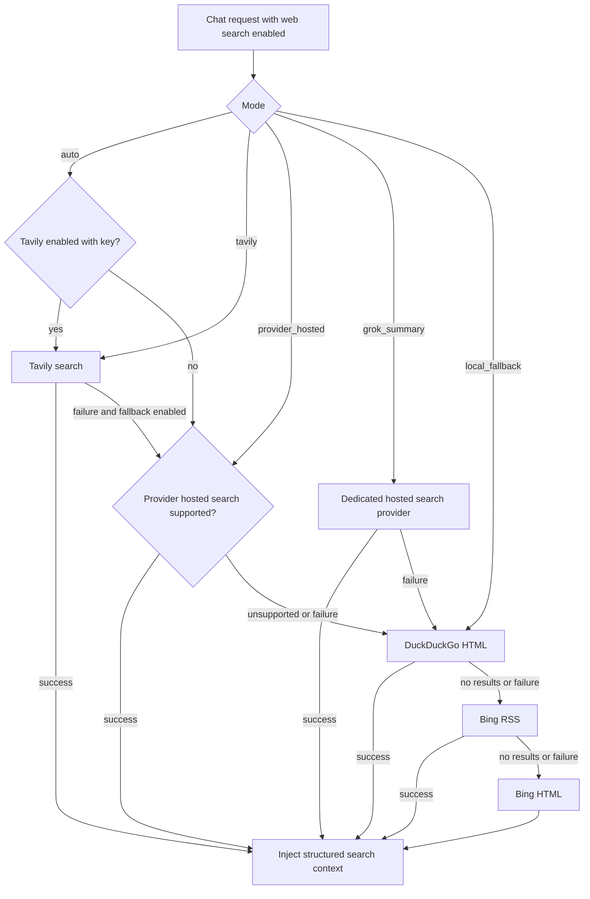

# AI Search, Token Budget, and Coach Self-Learning Roadmap

Date: 2026-06-22
Status: Implementation roadmap

## Decision

Add a first-class search provider layer and keep DuckDuckGo / Bing as the final fallback path.

The intended search order is:

1. If the user explicitly enables Tavily and provides a valid key, use Tavily for high-quality web search.
2. If the current chat provider has reliable hosted search, such as Responses web search or a Grok-like hosted search path, allow it as a selectable mode.
3. If Tavily, Grok, Responses tools, or other hosted search paths fail, fall back to local app search.
4. Local app search should use DuckDuckGo first and Bing second, without requiring a user key.

This keeps the product usable with no paid search key while giving advanced users a better search path.

Add user-facing token budget settings at the same time:

- context token budget: controls how much chat history, memory, RAG, notes, and search context can enter a request.
- output token budget: controls the maximum answer length requested from the model.

For Coach, move from "feedback-aware" behavior to an explicit self-learning loop. The current implementation can record feedback and suppress repeated bad nudges, but it does not yet maintain durable per-skill strategy statistics or a coach-specific learned profile. That should be the next capability layer.

## Current State

### Search

Current working-tree behavior:

- `backend/app/services/web_search.py` can search DuckDuckGo HTML.
- If DuckDuckGo returns no result or fails, it tries Bing RSS and then Bing HTML.
- `backend/app/routers/chat.py` supports web search modes:
  - `auto`
  - `provider_hosted`
  - `app_search`
  - `grok_summary`
- `frontend/src/components/AISettingsDrawer.tsx` already exposes a basic web search mode selector in local storage.

Missing pieces:

- No Tavily provider.
- No persistent search settings table or API.
- No search provider test button.
- No explicit "use Tavily first, DuckDuckGo/Bing final fallback" chain.
- No per-user search quality options.
- No search result budget tied to model context budget.

### Token Settings

Current provider settings include:

- display name
- provider name
- API key
- base URL
- model
- available models
- active / enabled flags

Missing pieces:

- No per-provider output token limit.
- No per-provider context token budget.
- No consistent provider mapping for `max_tokens`, `max_output_tokens`, or equivalent parameters.
- No retrieval budget that protects the request from overlong web/RAG/memory context.

### Coach Self-Learning

Current Coach state in the working tree:

- Coach events and nudges exist.
- Coach preferences exist.
- Coach nudge feedback is recorded into `UserMemory` under `coach_feedback`.
- Coach policy reads recent feedback and suppresses repeated negative patterns.
- Agent has a stronger learning profile path through `agent_feedback` and `agent_learning_profile`.

Current limitation:

The Coach is feedback-aware, but not yet fully self-learning. It does not have a durable strategy profile, per-skill success statistics, skill-specific decay, or adaptive skill selection beyond simple negative-feedback suppression.

## Search Provider Design

### Product Behavior

Search should feel simple in the UI:

- Off: no web search.
- Auto: best available search path.
- Tavily: use Tavily first, with fallback if enabled.
- Provider hosted: use Responses / Grok-like hosted search first, then fallback.
- Local fallback only: DuckDuckGo / Bing only.

Recommended default:

- `web_search_enabled = false` by default for new chats.
- When enabled, mode defaults to `auto`.
- In `auto`, if Tavily is configured and enabled, use Tavily first.
- If Tavily is not configured, try the selected model provider's hosted search when available.
- If hosted search fails or is unsupported, use DuckDuckGo / Bing final fallback.

Reasoning:

- Tavily is designed for agent/RAG-style search results and generally gives cleaner structured results.
- Hosted model search can be useful, but support varies by provider and proxy.
- DuckDuckGo / Bing keeps search usable without any key.

### Search Fallback Chain



Important rule:

DuckDuckGo / Bing are not the premium path. They are the final no-key safety net.

### Backend Modules

Add a provider-oriented package:

```text
backend/app/services/search_providers/
  __init__.py
  base.py
  router.py
  tavily.py
  duckduckgo.py
  bing.py
```

Suggested core types:

```python
@dataclass
class SearchProviderSettings:
    enabled: bool
    provider: str
    tavily_api_key: str
    tavily_search_depth: str
    tavily_max_results: int
    tavily_chunks_per_source: int
    include_answer: bool
    include_raw_content: bool
    timeout_seconds: float
    fallback_enabled: bool


@dataclass
class SearchResult:
    title: str
    url: str
    snippet: str
    source_provider: str
    score: float | None = None
    published_date: str | None = None
```

Primary API:

```python
async def search_web_for_chat(
    query: str,
    *,
    db: AsyncSession,
    user_id: int,
    mode: str,
    limit: int,
    timeout: float,
) -> SearchResponse:
    ...
```

`backend/app/services/web_search.py` can either become the local fallback provider or be moved into the new package without changing behavior.

### Tavily Defaults

Tavily should be configured for better quality by default, not minimum cost.

Recommended defaults:

- `search_depth = "advanced"`
- `max_results = 8`
- `chunks_per_source = 3`
- `include_answer = false`
- `include_raw_content = false`
- `timeout_seconds = 12`
- `fallback_enabled = true`

Rationale:

- Tavily's docs describe `advanced` as the higher-relevance option, with higher latency and cost than `basic`.
- Chunks are useful for agent-grade evidence because they are short, targeted snippets.
- `max_results = 8` gives enough breadth without flooding the model context.
- `include_answer = false` avoids treating Tavily's generated answer as the final authority. Mnemox should answer from sources through the selected chat model.
- `include_raw_content = false` avoids huge context unless an explicit extract/research mode is added later.

References:

- Tavily Search API: https://docs.tavily.com/documentation/api-reference/endpoint/search
- Tavily search best practices: https://docs.tavily.com/documentation/best-practices/best-practices-search
- Tavily agent guidance: https://docs.tavily.com/agents

### Settings Data Model

Add a dedicated user-scoped settings table rather than overloading AI provider settings:

```text
ai_search_settings
  user_id integer primary key
  enabled boolean not null default false
  default_mode string not null default "auto"
  provider string not null default "auto"
  tavily_api_key text not null default ""
  tavily_search_depth string not null default "advanced"
  tavily_max_results integer not null default 8
  tavily_chunks_per_source integer not null default 3
  tavily_include_answer boolean not null default false
  tavily_include_raw_content boolean not null default false
  timeout_seconds float not null default 12
  fallback_enabled boolean not null default true
  updated_at datetime
```

`tavily_api_key` must be encrypted with the same secret handling used by AI provider keys.

### Settings API

Add endpoints under AI settings:

```http
GET /api/ai-settings/search
PUT /api/ai-settings/search
POST /api/ai-settings/search/test
```

`POST /search/test` should:

- validate the encrypted or submitted Tavily key;
- run a small query such as `Mnemox connectivity test`;
- return provider name, result count, and a short message;
- never return the raw key.

### Frontend Settings

Add a "Web Search" section in the AI settings drawer:

- main switch: enable web search provider settings
- mode select:
  - Auto
  - Tavily first
  - Provider hosted first
  - Local fallback only
- Tavily key input
- quality preset:
  - Balanced: `basic`, 5 results
  - High quality: `advanced`, 8 results, 3 chunks per source
  - Research: `advanced`, 10 results, 3 chunks per source
- fallback toggle: use DuckDuckGo / Bing when Tavily or hosted search fails
- test button

The UI copy should make the fallback model clear:

> DuckDuckGo / Bing will be used only when no search key is configured or the configured search path fails.

## Token Budget Design

### Product Behavior

Add advanced token settings per AI provider:

- Context token budget
- Output token limit

Recommended defaults:

- Context budget: 32000 tokens
- Output limit: 4096 tokens
- High-output option: 8192 tokens
- Minimum output limit: 512
- Maximum output limit: 32000, clamped by provider capability when known

This gives longer answers by default without forcing huge generations on every provider.

### Why Context and Output Are Separate

Context budget answers: how much evidence can the model read?

It should budget:

- system prompt
- chat history
- memory
- RAG chunks
- note snippets
- web search results
- agent / coach brief

Output token limit answers: how long can the model reply?

It should map to provider-specific parameters:

- OpenAI Chat Completions: `max_tokens` or `max_completion_tokens` depending on model/API compatibility.
- OpenAI Responses: `max_output_tokens`.
- Anthropic: `max_tokens`.
- Gemini: `max_output_tokens`.
- OpenAI-compatible relays: use the OpenAI-compatible field and gracefully retry without the parameter if unsupported.

### Backend Model Changes

Extend `AIProviderSetting`:

```text
max_context_tokens integer nullable
max_output_tokens integer nullable
```

If null, use provider defaults.

Extend provider schemas:

```python
class ProviderOut(BaseModel):
    ...
    max_context_tokens: int | None = None
    max_output_tokens: int | None = None

class ProviderUpdate(BaseModel):
    ...
    max_context_tokens: int | None = None
    max_output_tokens: int | None = None
```

### Runtime Context Budgeting

Add a budget service:

```text
backend/app/services/context_budget_service.py
```

Responsibilities:

- estimate token count;
- reserve output tokens;
- allocate remaining context budget across memory, RAG, web search, chat history, and agent/coach brief;
- trim lowest-priority context first.

Initial approximate allocator:

```text
system prompt: fixed, never dropped
latest user message: fixed, never dropped
chat history: 35%
RAG / notes: 25%
web search: 25%
memory / profile / agent / coach: 15%
```

If web search is enabled, unused RAG budget can move to web search. If web search is disabled, unused web budget can move to RAG and history.

### Frontend UI

In each provider card:

- "Context 上限" numeric input
- "输出上限" numeric input
- preset buttons:
  - Conservative: 16000 / 2048
  - Balanced: 32000 / 4096
  - Long answer: 64000 / 8192

Warn when values are high:

> 较高的上下文和输出上限可能增加延迟和费用，且部分模型会自动截断。

## Coach Self-Learning Roadmap

### Target Capability

The Coach should learn which coaching strategies work for the current user.

It should learn:

- which skills are helpful;
- which skills are disruptive;
- what time and channel the user tolerates;
- whether the user prefers short prompts, plans, emotional support, reflection, or direct actions;
- what topics or task types should be prioritized or avoided;
- when to stop nudging.

It should not learn by blindly rewriting its own prompts. Self-learning must remain auditable, reversible, and bounded.

### Hermes-Agent Reference Model

Use Hermes-agent as an architectural inspiration, not as a direct dependency requirement.

The pattern to borrow:

```text
Observe -> Remember -> Decide -> Act -> Get feedback -> Reflect -> Update strategy
```

Mnemox-specific interpretation:

- Observe: coach events, chat signals, pomodoro events, overdue tasks, review debt, app inactivity.
- Remember: user memories, coach feedback, agent feedback, learning snapshots.
- Decide: deterministic policy first, skill selection second.
- Act: nudge, chat-side support, route suggestion, draft creation.
- Feedback: helpful, accepted, completed, later, too disruptive, too hard, irrelevant.
- Reflect: periodic summarization of which strategies work.
- Update strategy: per-user coach profile and skill weights.

### Phase 1: Coach Skill Statistics

Add table:

```text
coach_skill_stats
  id integer primary key
  user_id integer indexed
  skill_id string indexed
  channel string
  event_type string
  shown_count integer
  accepted_count integer
  completed_count integer
  snoozed_count integer
  dismissed_count integer
  too_disruptive_count integer
  too_hard_count integer
  too_easy_count integer
  irrelevant_count integer
  helpful_count integer
  last_positive_at datetime nullable
  last_negative_at datetime nullable
  updated_at datetime
```

Update this table when:

- a nudge is shown;
- feedback is recorded;
- a suggested action is accepted or completed.

Policy changes:

- suppress a skill if recent `too_disruptive` count is high;
- lower priority if acceptance rate is low;
- allow higher priority if accepted/completed rate is high;
- decay old stats so one bad week does not permanently disable a useful skill.

Acceptance criteria:

- If the user marks `review_debt_rescue` too disruptive twice, proactive review nudges should stop or move to Agent panel.
- If the user accepts `minimum_next_step` repeatedly, it can be prioritized for overload events.

### Phase 2: Coach Learning Profile

Add one semantic memory key or table:

```text
coach_learning_profile
```

Suggested JSON shape:

```json
{
  "preferred_channels": ["agent_panel", "in_app_nudge"],
  "avoid_channels": ["desktop_notification"],
  "preferred_styles": ["short_next_step", "low_pressure"],
  "avoid_styles": ["long_plan", "frequent_reminders"],
  "effective_skills": ["minimum_next_step"],
  "sensitive_skills": ["review_debt_rescue"],
  "best_times": ["evening"],
  "quiet_patterns": ["after repeated dismissals, wait longer"],
  "updated_at": "..."
}
```

Generate this profile from:

- coach feedback;
- agent feedback;
- nudge outcomes;
- learning snapshot trends;
- explicit settings.

The profile should be visible and controllable in the UI.

UI controls:

- "Coach 学到了什么"
- mark item inaccurate
- ignore item
- lock item
- reset Coach learning

### Phase 3: Adaptive Policy and Skill Selection

Move from fixed rules to weighted scoring.

Still deterministic, but adaptive:

```text
score = event_relevance
      + skill_success_weight
      + user_preference_weight
      + urgency_weight
      - disruption_penalty
      - cooldown_penalty
```

Policy must still enforce hard constraints:

- Coach disabled means no coach output.
- Quiet hours suppress desktop notifications.
- Daily cap still applies.
- Confirmed user opt-out overrides learned preference.
- Persistent writes still require confirmation.

This phase gives "self-learning" without letting the LLM decide policy boundaries.

### Phase 4: Reflection Jobs

Add periodic reflection:

- daily lightweight stats update;
- weekly Coach strategy reflection;
- manual "refresh Coach learning" button.

Reflection output should be structured and small:

```json
{
  "new_preferences": [],
  "strategy_changes": [],
  "skills_to_reduce": [],
  "skills_to_try_more": [],
  "confidence": 0.0
}
```

Use an LLM only after deterministic stats are assembled. Never feed raw private notes unless needed, and always wrap retrieved notes as untrusted context.

### Phase 5: Durable Workflows / Agent Runtime

Only after Phases 1-4 are working, consider a durable agent runtime.

Good candidates:

- weekly review planning;
- exam sprint planning;
- multi-day comeback plan after inactivity;
- repeated frustration recovery;
- long-running research + study-plan generation.

Framework guidance:

- LangGraph is a good fit if durable state machines, checkpoints, and pause/resume become necessary.
- OpenAI Agents SDK is useful if the project standardizes around OpenAI tools, tracing, and guardrails.
- A Hermes-like internal loop can be implemented without adding a framework if the workflows remain simple.

Do not add a full external agent framework just to show one-shot nudges.

## Implementation Order

### Milestone 1: Search Settings and Tavily

Deliverables:

- `ai_search_settings` model and migration.
- Search settings API.
- Tavily provider.
- DuckDuckGo / Bing fallback provider.
- Search test endpoint.
- AI settings UI section.
- Chat integration.

Acceptance criteria:

- With Tavily key configured, web search uses Tavily first.
- With no Tavily key, web search still works through DuckDuckGo / Bing.
- If Tavily fails, DuckDuckGo / Bing fallback runs when fallback is enabled.
- Returned search context includes source URLs and provider name.
- Real API key is never returned to frontend or logs.

### Milestone 2: Token Budget Settings

Deliverables:

- `max_context_tokens` and `max_output_tokens` columns.
- Provider settings API update.
- Provider card UI.
- Output token mapping in provider implementations.
- Context budget trimming service.

Acceptance criteria:

- User can set context and output token limits in settings.
- Chat requests pass output token limits to supported providers.
- Unsupported providers fail gracefully or retry without the token parameter.
- Web/RAG/memory context is trimmed before exceeding configured context budget.

### Milestone 3: Coach Self-Learning MVP

Deliverables:

- `coach_skill_stats`.
- feedback-to-stats updater.
- skill success / disruption scoring.
- basic `coach_learning_profile`.
- UI panel for learned Coach preferences.

Acceptance criteria:

- Negative feedback reduces similar future nudges.
- Positive feedback increases the rank of matching skills.
- User can inspect and reset learned Coach preferences.
- Learned preferences never override explicit settings.

### Milestone 4: Coach Reflection and Workflows

Deliverables:

- scheduled or manual reflection job;
- structured strategy update;
- workflow candidates for weekly planning and comeback plans;
- framework reassessment.

Acceptance criteria:

- Coach can explain why its behavior changed.
- Reflection output is auditable and reversible.
- Long-running workflows require user confirmation at write boundaries.

## Risks

- Tavily advanced search may increase cost and latency.
- High output token limits may make responses slow or expensive.
- Too much web/RAG context can reduce answer quality.
- Coach self-learning can become annoying if it overreacts to sparse feedback.
- A generic agent framework can add complexity before Mnemox has enough workflow demand.

## Mitigations

- Make Tavily quality presets explicit.
- Keep DuckDuckGo / Bing fallback no-key and conservative.
- Add token budget presets rather than only raw numbers.
- Keep all learned Coach preferences visible and reversible.
- Use deterministic policy as the boundary; use LLMs for wording and reflection, not permission.

## Recommended Next Implementation Request

Implement Milestone 1 and Milestone 2 together:

> Add persistent web search settings with Tavily support and DuckDuckGo/Bing final fallback, then add provider-level context/output token limits and wire output limits into chat provider calls.

After that, implement Milestone 3:

> Add Coach skill statistics and a visible Coach learning profile so feedback changes future nudge frequency, channel, and skill ranking.
