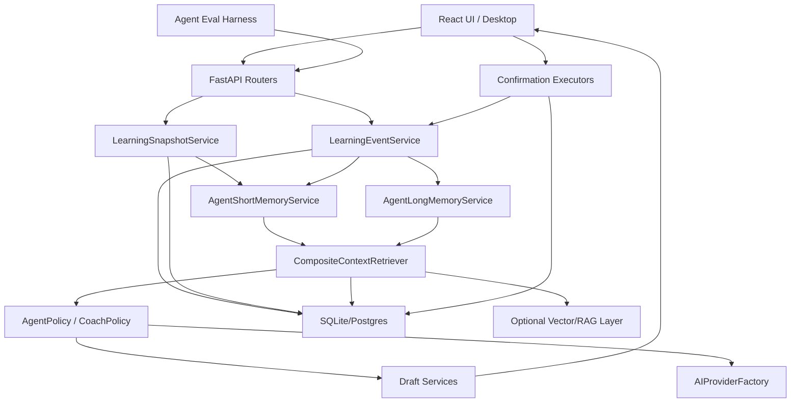
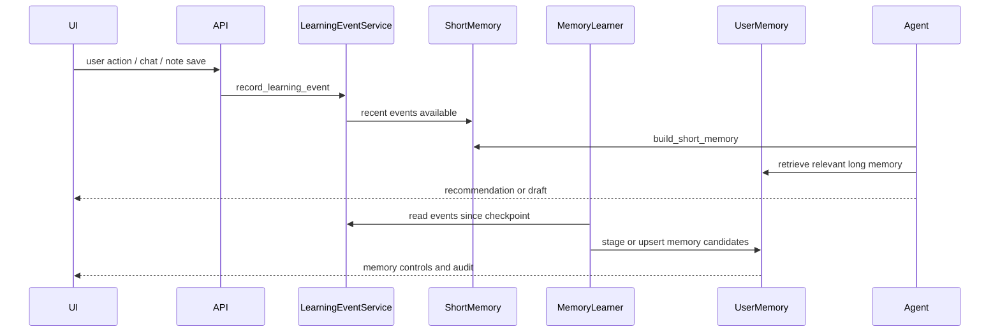

# Mnemox Goal-Driven Agent and Dual-Layer Memory Implementation Plan

Date: 2026-06-23
Status: Technical plan for staged implementation

## Decision

Build Mnemox Agent as a goal-driven orchestration layer over the existing learning product primitives, not as a separate general-purpose agent runtime.

The next implementation should cover four tracks:

1. Goal-driven Agent home and orchestration.
2. Proactive learning event flow.
3. Note system upgrade so notes become useful learning evidence.
4. Agent regression evaluation set.

The Agent memory design should use a dual-layer architecture:

- Short memory: current session, recent learning events, active goal state, today plan, temporary intent, and recent retrieved context.
- Long memory: durable user profile, stable preferences, recurring weaknesses, goal history, learning strategies, feedback-derived traits, and distilled summaries.

Embedding is useful but not mandatory for the first version. Mnemox already has structured database state, keyword search, conversation summaries, and RAG with fallback behavior. Start with deterministic, user-scoped retrieval; add vector recall as an optional enhancement that reuses the existing RAG embedding configuration.

## Why Not Start With A New Agent Runtime

Mnemox already owns the primitives the Agent needs:

- `backend/app/services/learning_snapshot_service.py`: reusable learning state snapshot.
- `backend/app/services/agent_service.py`: Agent brief, write draft, action draft, feedback, profile learning.
- `backend/app/agents/chat_agent.py`: read-only tools for notes, materials, wrong questions, memories, profile, tasks, and feedback.
- `backend/app/services/memory_service.py`: conversation summaries, long-term memories, reflection, memory decay.
- `backend/app/models/learning_event.py`: learning behavior event model.
- `backend/app/ai/rag_service.py`: material vector retrieval with keyword fallback at higher layers.
- `backend/app/routers/notes.py`: Markdown notes, note links, AI note assistance.
- `backend/app/services/coach_*`: Coach events, nudges, preferences, policy, feedback, skill stats.

The missing capability is integration discipline:

- One goal-centered context model.
- One event pipeline.
- One memory lifecycle.
- One retrieval contract.
- One eval harness.

## Hermes Agent Reference

Hermes Agent is a useful reference, but Mnemox should adapt the idea rather than copy the storage shape.

Hermes built-in memory is intentionally compact: `MEMORY.md` for agent notes and `USER.md` for user profile, both stored under `~/.hermes/memories/` and injected into the system prompt as a frozen snapshot at session start. The official memory docs list hard character limits of 2,200 chars for `MEMORY.md` and 1,375 chars for `USER.md`.

Hermes separates always-on curated memory from session search. Its session search stores sessions in SQLite with FTS5 and returns actual past messages on demand, so long history does not have to sit permanently in the prompt.

Hermes also supports external memory providers. The provider layer is additive: built-in memory remains active, while one external provider can add semantic search, user modeling, knowledge graphs, and provider-specific tools. Provider flow is roughly: prefetch relevant memories before a turn, inject provider context, sync conversation turns after the assistant response, extract memories on session end where supported, and mirror built-in memory writes.

Borrow these ideas:

- Keep a small, always-available curated memory block.
- Keep searchable history separate from curated memory.
- Use prefetch before the Agent acts and sync/extract after an interaction or event.
- Make external/vector memory additive, not foundational.
- Add memory write gates, duplicate checks, capacity limits, and user controls.

Do not copy these parts directly:

- Do not use local Markdown files as the primary memory store inside Mnemox. Mnemox is a multi-user app and should keep memory in user-scoped database rows.
- Do not inject raw notes/materials as trusted prompt content. Use `wrap_untrusted_context`.
- Do not allow autonomous persistent writes without staging, confirmation, or a visible audit trail.

References:

- Hermes Persistent Memory: https://hermes-agent.nousresearch.com/docs/user-guide/features/memory
- Hermes Memory Providers: https://hermes-agent.nousresearch.com/docs/user-guide/features/memory-providers
- Hermes GitHub README: https://github.com/NousResearch/hermes-agent

## Target Architecture



Core rule:

The Agent can read user-scoped state freely through approved services. It can generate drafts and recommendations. It cannot write goals, tasks, notes, plans, reminders, or memory entries silently unless the write is explicitly classified as low-risk telemetry or feedback and is visible in the audit trail.

## Track 1: Goal-Driven Agent Home

### Product Goal

The first screen should answer:

- What is my current main goal?
- What is the smallest useful next action today?
- What evidence says this is the right action?
- Which notes, materials, wrong questions, and review items support this goal?
- What changed since last time?

### Backend Design

Add `backend/app/services/goal_context_service.py`.

Primary function:

```python
async def build_goal_context(
    db: AsyncSession,
    user_id: int,
    *,
    goal_id: int | None = None,
    now: datetime | None = None,
) -> dict[str, Any]:
    ...
```

Output contract:

```json
{
  "active_goal": {
    "id": 1,
    "title": "两周提升英语听力",
    "deadline": "2026-07-07",
    "target_level": null,
    "progress": {
      "pending_task_count": 3,
      "completed_today_count": 1,
      "overdue_task_count": 0
    }
  },
  "today_focus": {
    "title": "每天精听20分钟",
    "reason": "目标今日暂无完成记录，且听力是当前高频弱点",
    "estimated_minutes": 20,
    "route": "/pomodoro"
  },
  "supporting_context": {
    "notes": [],
    "materials": [],
    "wrong_questions": [],
    "review_items": []
  },
  "risk_flags": {
    "no_daily_plan": false,
    "review_debt_high": false,
    "goal_stale": false
  }
}
```

Selection rules:

- If the user explicitly chooses a goal, use that goal.
- Otherwise choose an active goal with the strongest combination of due tasks, deadline proximity, recent activity, and Agent feedback.
- If no active goal exists, show a goal-creation draft prompt, not a blank dashboard.

Reuse:

- `build_learning_snapshot` for task, review, pomodoro, weak point, and daily plan state.
- `ChatAgent` read tools for existing scoped lookups.
- `remember_agent_feedback` for action feedback.

### Agent API

Add:

```text
GET /api/agent/goal-context?goal_id=
POST /api/agent/goal-context/actions/{action_id}/draft
POST /api/agent/goal-context/actions/{action_id}/feedback
```

Do not create a new write executor if the current Agent write/action executor is enough. Prefer routing drafts through existing confirmation-first endpoints:

- `build_agent_action_draft`
- `execute_agent_action`
- `build_agent_write_draft`
- `execute_agent_write_draft`

### Frontend Design

Update `frontend/src/pages/AgentPage.tsx`.

Add sections:

- Current Goal.
- Today's Smallest Useful Action.
- Evidence.
- Supporting Notes/Materials/Wrong Questions.
- Agent Learned From Feedback.

Avoid a feature grid. The Agent page should be a goal cockpit.

Acceptance criteria:

- With one active goal and one due task, Agent page shows that goal and task as the primary focus.
- With no goals, Agent page shows a goal creation path.
- The same user action can produce a draft, but does not write until confirmed.
- Another user's goals never appear in the context.

## Track 2: Proactive Learning Event Flow

### Product Goal

The Agent should learn from normal product use:

- User uploads a material.
- User creates or updates a note.
- User finishes, skips, or interrupts a pomodoro.
- User completes a task.
- User adds a wrong question.
- User gives Agent or Coach feedback.

The user should not need to say "please learn this" every time.

### Event Taxonomy

Reuse `LearningEvent`, but normalize names and payloads.

Recommended event types:

```text
goal.created
goal.updated
task.created
task.completed
task.overdue
daily_plan.created
daily_plan.updated
note.created
note.updated
note.ai_assist_used
material.uploaded
material.indexed
wrong_question.created
review.completed
pomodoro.started
pomodoro.completed
pomodoro.interrupted
chat.user_message
agent.draft_created
agent.action_feedback
coach.nudge_feedback
```

Add `backend/app/services/learning_event_service.py`.

Primary functions:

```python
async def record_learning_event(
    db: AsyncSession,
    user_id: int,
    event_type: str,
    *,
    source: str,
    payload: dict[str, Any] | None = None,
    material_id: int | None = None,
    chapter_id: int | None = None,
    duration: int | None = None,
    session_id: str | None = None,
    dedupe_key: str | None = None,
) -> dict[str, Any]:
    ...

async def list_recent_learning_events(
    db: AsyncSession,
    user_id: int,
    *,
    limit: int = 100,
) -> list[dict[str, Any]]:
    ...
```

Schema improvements:

- Add `source` to `learning_events`.
- Add `dedupe_key` to prevent frontend polling spam.
- Add index on `(user_id, event_type, timestamp)`.
- Add optional `goal_id`, `task_id`, `note_id`, `wrong_question_id` if query patterns require them.

Migration:

```sql
ALTER TABLE learning_events ADD COLUMN source VARCHAR(50);
ALTER TABLE learning_events ADD COLUMN dedupe_key VARCHAR(160);
CREATE INDEX IF NOT EXISTS ix_learning_events_user_type_time
ON learning_events(user_id, event_type, timestamp);
```

### Event To Memory Pipeline

Add `backend/app/services/agent_memory_learning_service.py`.

Pipeline:

1. Collect recent events since last checkpoint.
2. Group by day, goal, source, and event type.
3. Extract deterministic facts:
   - repeated weak point,
   - stable preferred study time,
   - repeated interruption pattern,
   - task completion rhythm,
   - note topics,
   - material focus.
4. Optionally ask an LLM to summarize only the already-filtered event digest.
5. Stage memory candidates.
6. Auto-commit only low-risk aggregate facts; stage subjective or sensitive claims for review.

Memory candidate shape:

```json
{
  "memory_key": "prefers_short_listening_drills",
  "memory_value": "英语听力目标下，用户更容易完成 15-25 分钟精听任务。",
  "category": "planning_style",
  "memory_type": "semantic",
  "confidence": 0.76,
  "source": "event_digest",
  "evidence": [
    {"event_type": "task.completed", "id": 123},
    {"event_type": "pomodoro.completed", "id": 456}
  ],
  "staging_required": false
}
```

### Scheduling

Start without a heavy worker system.

Trigger options:

- On Agent brief request: run a cheap checkpoint if last run was more than 6 hours ago.
- On app startup: run a lightweight catch-up for active users.
- Later: add a desktop/local scheduler or backend APScheduler-like process.

Checkpoint memory key:

```text
agent_memory_learning_checkpoint
```

Stored in `UserMemory` category `system`, locked or hidden from normal memory display.

Acceptance criteria:

- Completing a task creates a learning event.
- Updating a note creates a learning event.
- Agent brief can use recent events to update the learning profile.
- Learning extraction is idempotent by checkpoint and dedupe key.
- Memory candidates include evidence and user_id.

## Track 3: Notes As Useful Learning Evidence

### Product Goal

Notes should stop feeling like isolated Markdown files. They should become:

- real-time readable while editing,
- linkable to goals, tasks, materials, chapters, wrong questions, and sessions,
- retrievable by Agent/Coach,
- usable as review and motivation evidence,
- safe against prompt injection.

### Frontend Improvements

Current `NotesPage.tsx` already uses `MarkdownLiveEditor` for editing and `ReactMarkdown` for AI suggestion preview. The perceived issue is likely not only rendering, but workflow value.

Implement:

1. Split view mode:
   - edit only,
   - preview only,
   - edit + preview.
2. Autosave draft locally with sync status.
3. Note relation side panel:
   - linked goal,
   - linked tasks,
   - linked material/chapter,
   - linked wrong questions.
4. "Turn into review prompt" action.
5. "Create task from selection" action.
6. "Ask Agent about this note" action.

Files:

- `frontend/src/pages/NotesPage.tsx`
- `frontend/src/components/MarkdownLiveEditor.tsx`
- `frontend/src/services/noteApi.ts`

### Backend Improvements

Extend `NoteLink` usage.

Allowed link types:

```text
goal
task
material
chapter
wrong_question
conversation
pomodoro
review_schedule
```

Add relation validation in `notes.py`:

- `goal` and `task` must belong to current user.
- `wrong_question` must belong to current user.
- `material`/`chapter` must belong to current user.
- `conversation` must belong to current user.

Add `NoteRetriever`.

File:

```text
backend/app/services/note_retriever.py
```

Primary function:

```python
async def retrieve_notes(
    db: AsyncSession,
    user_id: int,
    query: str,
    *,
    goal_id: int | None = None,
    material_id: int | None = None,
    limit: int = 6,
) -> list[dict[str, Any]]:
    ...
```

Phase 1 ranking without embedding:

- title/tag exact match,
- linked goal/material match,
- content keyword match,
- recent update,
- note_type boost for summary/review/method,
- Agent feedback boost if note was useful before.

Phase 2 optional vector:

- Index notes into the existing Chroma collection with metadata:
  - `source_type=note`
  - `note_id`
  - `user_id`
  - `title`
  - `tags`
  - `goal_id` where known
- Or create a separate collection `mnemox_context` if mixing source types complicates filtering.

Do not block note save when embedding fails. Save first, index best-effort.

### Note Event Hooks

On create/update/delete:

- record `note.created` / `note.updated` / `note.deleted`;
- invalidate note retrieval cache if added later;
- enqueue optional note vector reindex if embedding is configured.

Acceptance criteria:

- Notes render live in preview.
- Agent can retrieve a relevant note by keyword without embedding.
- Linked goal notes appear in goal context.
- Notes from another user never appear.
- Prompt injection in note content is wrapped as untrusted context.

## Track 4: Agent Regression Evaluation Set

### Product Goal

Agent quality should be measurable. Every future Agent change should answer:

- Did intent routing improve or regress?
- Did user isolation remain intact?
- Did write operations still require confirmation?
- Did Agent choose goal-driven context?
- Did memory retrieval avoid irrelevant/private content?

### Eval File

Add:

```text
backend/tests/fixtures/agent_eval_cases.json
```

Case shape:

```json
{
  "id": "goal_create_zh_001",
  "message": "新建目标：两周提升英语听力，任务：每天精听20分钟",
  "setup": {
    "goals": [],
    "notes": [],
    "materials": []
  },
  "expected": {
    "intent": "create_goal_tasks",
    "requires_confirmation": true,
    "goal_title_contains": "两周提升英语听力",
    "task_titles_contains": ["每天精听20分钟"]
  }
}
```

Initial categories:

1. Goal creation.
2. Daily plan creation.
3. Note creation.
4. Non-write questions that must return `none`.
5. Duplicate goal/task/note detection.
6. Goal context selection.
7. Memory retrieval.
8. User isolation.
9. Prompt injection inside note/material content.
10. Coach feedback suppression.

### Test Harness

Add:

```text
backend/tests/test_agent_eval_cases.py
```

The harness should:

- create temporary SQLite database,
- seed user data from each case,
- call `build_agent_write_draft` or goal context service,
- assert stable contracts,
- avoid calling real LLM by default,
- optionally support `MNEMOX_AGENT_EVAL_USE_LLM=1` for manual LLM-assisted evaluation.

### Smoke Script

Extend existing:

```text
scripts/agent_coach_smoke.py
```

Add:

- `--eval-cases` to run the JSON cases through HTTP.
- `--base-url` argument.
- `--username`, `--password`, `--email` arguments or environment variables.

Acceptance criteria:

- At least 30 eval cases.
- Local deterministic run finishes under 10 seconds.
- CI/dev command fails if any safety invariant breaks.
- Each bug fix adds a case before or with the fix.

## Dual-Layer Agent Memory Design

### Layer A: Short Memory

Purpose:

Keep the Agent aware of the current working context without polluting long-term memory.

Data sources:

- current chat turn,
- current conversation summary,
- selected goal,
- current note/material if the user is viewing one,
- recent learning events,
- recent Agent/Coach feedback,
- retrieved context for this request.

Storage options:

- In-memory request object for per-turn data.
- `ConversationSummary` for rolling chat-level summary.
- `LearningEvent` for recent behavior.
- `AgentExecutionLog` for action/audit trail.

New service:

```text
backend/app/services/agent_short_memory_service.py
```

Primary function:

```python
async def build_short_memory(
    db: AsyncSession,
    user_id: int,
    *,
    conversation_id: int | None = None,
    goal_id: int | None = None,
    query: str = "",
    now: datetime | None = None,
) -> dict[str, Any]:
    ...
```

Output:

```json
{
  "conversation_summary": "...",
  "recent_events": [],
  "active_goal_context": {},
  "current_surface": {
    "type": "note",
    "id": 12
  },
  "temporary_preferences": [
    "本轮用户要求先不要创建任务，只讨论方案"
  ]
}
```

Rules:

- Short memory may be verbose because it is not always injected.
- Short memory can expire quickly.
- Short memory should not create durable beliefs without evidence.
- Short memory can feed long-memory candidate extraction.

### Layer B: Long Memory

Purpose:

Store stable user and learning patterns across sessions.

Current model:

- `UserMemory`
  - `memory_key`
  - `memory_value`
  - `category`
  - `confidence`
  - `status`
  - `is_locked`
  - `material_id`
  - `memory_type`
  - `last_seen_at`

Recommended additions:

```sql
ALTER TABLE user_memories ADD COLUMN source_type VARCHAR(40);
ALTER TABLE user_memories ADD COLUMN source_id VARCHAR(80);
ALTER TABLE user_memories ADD COLUMN evidence TEXT;
ALTER TABLE user_memories ADD COLUMN expires_at DATETIME;
ALTER TABLE user_memories ADD COLUMN review_status VARCHAR(20) DEFAULT 'auto';
```

Memory categories:

```text
identity_preference
communication_style
planning_style
goal
weakness
strength
motivation
friction
material_focus
agent_feedback
coach_feedback
system
```

Memory types:

```text
semantic      stable durable fact or preference
episodic      event-derived temporary pattern, decays faster
procedural    reusable strategy, e.g. "for listening, start with 10 min dictation"
profile       compact curated profile injected often
```

Core long memory block:

Create a compact `agent_core_profile` memory row. This is the Mnemox equivalent of Hermes `USER.md`/`MEMORY.md`, but stored in DB.

Suggested budget:

- 1,200-1,800 Chinese characters.
- Always user-scoped.
- Updated by summarizing high-confidence long memories.
- Never include raw note text, secrets, or large data.

Example:

```json
{
  "goals": ["两周提升英语听力"],
  "weaknesses": ["听力转折词识别不稳定"],
  "planning_style": ["更适合 15-25 分钟短任务"],
  "friction": ["对高频打断式提醒敏感"],
  "do_more": ["给出最小下一步", "解释建议依据"],
  "avoid": ["一次性安排过多任务"]
}
```

### Memory Lifecycle



Write policy:

- Auto-write allowed:
  - aggregate behavior metrics,
  - Agent/Coach feedback stats,
  - event checkpoint,
  - low-risk inferred planning style with evidence.
- Staged review required:
  - sensitive personal facts,
  - subjective psychological labels,
  - anything extracted from raw note text that might be misleading,
  - major goal changes.
- Never write:
  - secrets,
  - raw private note dumps,
  - prompt instructions from untrusted content,
  - one-off temporary details.

### Is Embedding Required?

No, not for the first implementation.

Use this progression:

Phase 1: no new embedding dependency.

- Use structured SQL queries.
- Use title/tag/content keyword match.
- Use recent event summaries.
- Use `ConversationSummary`.
- Use current `UserMemory` scoring.
- Add SQLite FTS5 later if keyword search becomes slow or weak.

Phase 2: optional vector recall using existing RAG config.

- Reuse `backend/app/ai/rag_service.py` embedding settings.
- Index notes and memory snippets best-effort.
- Keep keyword fallback.
- Surface RAG status in UI so users know whether semantic recall is active.

Phase 3: provider-style memory.

- If needed, add a pluggable `MemoryProvider` interface like Hermes:

```python
class AgentMemoryProvider(Protocol):
    async def prefetch(self, db: AsyncSession, user_id: int, query: str) -> list[dict[str, Any]]:
        ...

    async def sync_turn(self, db: AsyncSession, user_id: int, user_text: str, assistant_text: str) -> None:
        ...

    async def extract_session(self, db: AsyncSession, user_id: int, conversation_id: int) -> list[dict[str, Any]]:
        ...
```

Initial providers:

- `db_keyword`: default, no embedding.
- `rag_vector`: uses existing Chroma/OpenAI-compatible embedding when configured.
- Future external provider: only if local DB + RAG is insufficient.

Recommended decision:

Do not require users to configure embedding before Agent memory works. Embedding should improve recall quality, not unlock the feature.

## Implementation Order

### Milestone 1: Foundation

Files:

- `backend/app/services/learning_event_service.py`
- `backend/app/services/goal_context_service.py`
- `backend/app/services/agent_short_memory_service.py`
- `backend/tests/test_learning_event_service.py`
- `backend/tests/test_goal_context_service.py`

Work:

- Normalize event recording.
- Build goal context service.
- Build short memory service from snapshot + recent events.
- Add deterministic tests.

### Milestone 2: Long Memory Learner

Files:

- `backend/app/services/agent_memory_learning_service.py`
- `backend/app/services/agent_long_memory_service.py`
- `backend/migrations/add_agent_memory_metadata.sql`
- `frontend/src/pages/MemoryPage.tsx`

Work:

- Add evidence metadata.
- Add core profile row.
- Add event-to-memory learner.
- Add memory review status.
- Add user controls for staged memory candidates.

### Milestone 3: Notes As Context

Files:

- `backend/app/services/note_retriever.py`
- `backend/app/routers/notes.py`
- `frontend/src/pages/NotesPage.tsx`
- `frontend/src/services/noteApi.ts`

Work:

- Split editor/preview mode.
- Validate richer note links.
- Retrieve notes for goal context and Agent chat.
- Record note events.
- Optional note indexing hook, but do not block on embedding.

### Milestone 4: Eval Harness

Files:

- `backend/tests/fixtures/agent_eval_cases.json`
- `backend/tests/test_agent_eval_cases.py`
- `scripts/agent_coach_smoke.py`

Work:

- Add 30 deterministic cases.
- Add HTTP smoke eval option.
- Require each Agent bug fix to add a case.

## Testing Matrix

Backend:

```text
python -m pytest tests/test_learning_event_service.py -q
python -m pytest tests/test_goal_context_service.py -q
python -m pytest tests/test_agent_write_flow.py tests/test_agent_eval_cases.py -q
python -m pytest tests/test_coach_kernel.py -q
```

Frontend:

```text
npm test -- --run src/pages/NotesPage.test.tsx
npm test -- --run src/services/agentApi.test.ts src/services/coachApi.test.ts
npm run build
npm run lint
```

Smoke:

```text
python scripts/agent_coach_smoke.py
python scripts/agent_coach_smoke.py --eval-cases
```

Critical invariants:

- All reads and writes filter by `user_id`.
- Agent writes require confirmation.
- Prompt content from notes/materials/memories is wrapped as untrusted context.
- Embedding failure never breaks core note save, Agent brief, or memory lookup.
- Long memory includes evidence and can be ignored, locked, or marked inaccurate.
- Short memory does not leak into another user or another unrelated goal.

## Open Questions

1. Should Mnemox expose memory staging in the existing Memory page or in Agent settings?
2. Should `agent_core_profile` be human-editable as JSON or rendered as editable sections?
3. Should note vector indexing share `study_materials` Chroma collection or use `mnemox_context`?
4. Should proactive memory learning run on app startup, Agent page open, or a desktop scheduler?
5. What is the default privacy posture: auto-commit low-risk memory, or stage all inferred memory until the user trusts the system?

Recommended defaults:

- Auto-commit low-risk aggregate memory with evidence.
- Stage sensitive/subjective memory.
- Keep embedding optional.
- Keep note indexing best-effort.
- Put the Agent goal cockpit before deeper autonomous behavior.
