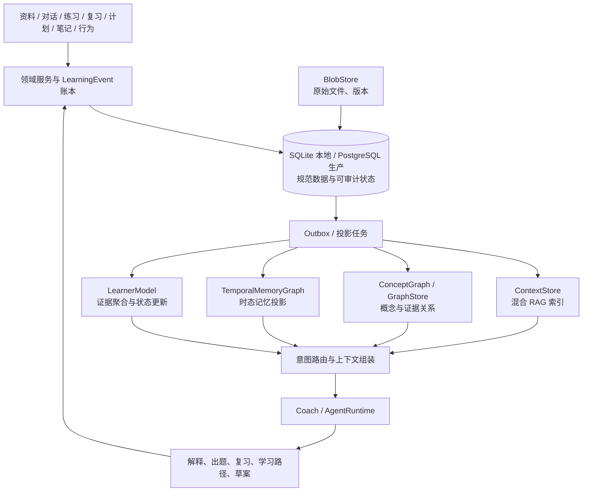

# Mnemox 学习智能底座架构决策

> 日期：2026-08-03
>
> 状态：已采纳（目标架构与实施约束；文中候选组件尚未视为已实现）
>
> 关联文档：[路线图](../../roadmap.md) · [需求基线](../../requirements.md) · [技术基线](../../technical.md) · [进度文档](../../progress.md)

> 2026-08-13 补充决策：[笔记、上下文与记忆边界](2026-08-13-note-context-memory-architecture.md) 细化了笔记三层逻辑存储、三阶段检索和向记忆/概念/学习证据投影的边界。

## 决策摘要

Mnemox 的长期目标不是把资料塞进一个向量库，也不是构建一张包罗万象的“超级知识图谱”。它应形成四个职责明确、可独立演进的层：

1. **混合 RAG / 资料上下文层**：回答“资料中有什么”，返回可追溯的原文证据。
2. **概念图谱层**：回答“知识点之间有什么关系”，维护前置、包含、解释、练习等可审核关系。
3. **时态记忆层**：回答“用户过去经历了什么、哪些状态已经变化”，维护目标、偏好、困惑和阶段变化。
4. **学习者模型层**：回答“用户现在真正会什么、下一步值得做什么”，将多源学习证据汇总为可解释的状态和计划建议。

四层共享关系型数据底盘和事件账本，但不能互相替代。特别是：

- **Microsoft GraphRAG 不进入本项目的运行时或离线索引链路。**
- **LightRAG 仅作为检索与图谱质量的参考/基准，不成为运行时依赖。**
- **Graphiti 是时态记忆候选，不是掌握度的唯一来源。**
- **Qdrant、Neo4j、Graphiti、LangGraph 都是受控 Spike 候选；先锁定数据边界、接口与验收标准，再决定是否采纳。**

这份决策覆盖 2026-07-26 决策中的以下范围：D2 中 `Concept.mastery` 兼作用户状态的做法、D3 的 OpenViking/Chroma 二选一结论、D4 对 LangGraph 的绝对排除，以及 D5 的记忆演进边界。D1 的“关系型核心保留”、FSRS 的调度定位、草案确认、用户隔离和不可信上下文边界继续有效。07-26 中“OpenViking 不适合 Windows 桌面分发”的 Spike 结论保持有效。

---

## 1. 目标与非目标

### 1.1 要解决的问题

| 用户问题 | 负责层 | 不能由什么替代 |
| --- | --- | --- |
| “我的资料如何解释这个问题？” | 混合 RAG | 不能只靠概念图谱或聊天记忆 |
| “学习 A 前要补哪些知识？” | 概念图谱 | 不能用向量相似度假装前置关系 |
| “我上个月为何把这个目标搁置了？” | 时态记忆 + 事件 | 不能用一条静态偏好替代时间变化 |
| “我对这个概念掌握到哪里，今晚应先学什么？” | 学习者模型 + FSRS + 图谱 | 不能让 LLM 或记忆图单独给结论 |

系统由“能回答资料问题”演进为“能基于证据帮助学习者推进”，但不把一次性 LLM 推断当成用户能力的事实。

### 1.2 不做的事情

- 不采用 Microsoft GraphRAG 的开放域实体抽取、社区摘要与全局搜索管线。
- 不将 LightRAG、Cognee、Mem0 或任何一体化框架作为用户数据的唯一事实来源。
- 不让 Graphiti、Neo4j、Qdrant 或 LangGraph 持有唯一不可重建的用户状态。
- 不将“学习过多久”“问过多少次”直接等同于“掌握了多少”。
- 不以“全能自主 Agent”为底座前提；主动写入始终走草案和用户确认，后台触达始终经过 Coach 治理。

---

## 2. 总体架构



### 2.1 数据主从规则

关系型数据库是用户数据的**规范来源（system of record）**。本地模式使用 SQLite，生产模式使用 PostgreSQL；文件本体由本地文件系统或对象存储保存。专用组件是可替换的查询引擎或投影，不是第二份业务真相。

| 数据类别 | 规范来源 | 可重建投影 / 查询引擎 | 恢复原则 |
| --- | --- | --- | --- |
| 原始资料、解析版本、chunk 元数据、权限 | BlobStore + SQL | Qdrant/Chroma 等 `ContextStore` 索引 | 从文件与 SQL 重建索引 |
| 概念、关系、关系来源、人工审核状态 | SQL `concepts` / `concept_edges` / `concept_links` | Neo4j 等 `GraphStore` | 从 SQL 重新投影图 |
| 用户事件、记忆声明、有效时间、证据与审核状态 | SQL `learning_events`、记忆声明表 | Graphiti 时态图 | 从事件与声明重放 / 重建 |
| 学习证据、掌握状态、FSRS 结果、人工修正 | SQL 学习者模型表 | 缓存或分析视图 | 从证据重算状态；人工修正保留 |
| Agent 运行、草案、确认与审计 | SQL | LangGraph checkpoint 等运行态存储 | SQL 记录始终可审计，运行态可恢复或重新发起 |

这条规则带来四个硬约束：

1. 用户删除、权限变更、资料更新先提交规范数据，再通过 outbox 删除或刷新所有投影。
2. 任何投影消费必须有稳定的幂等键、版本和错误状态；失败可重试，投影可整体重建。
3. 检索与图查询必须带 `user_id` / namespace 过滤，不能依赖调用方“记得过滤”。
4. 回答、记忆与学习建议均应能回链到原始事件、资料片段或人工修正，而不是只保留模型生成的结论。

---

## 3. 四层职责与接口边界

### 3.1 混合 RAG：资料上下文层

`ContextStore` 负责资料、笔记和可检索记忆的入库、更新、删除、混合召回与分层加载。现有协议 `ingest / retrieve / load_tiered / forget` 是正确起点，但当前 `KeywordContextStore` 只是无 embedding Key 时的保底实现，不应被误认为完成了统一检索。

目标查询链：

```text
查询理解
  -> Dense 语义召回 + Sparse / BM25 精确召回
  -> 融合（例如 RRF）
  -> 可选 reranker
  -> 原文片段、版本、来源与权限校验
```

RAG 的输出必须带来源标识、chunk/章节定位和检索模式。Embedding 不可用时，系统必须维持关键词检索，不让上传、问答和核心学习流程失效。

#### 3.1.1 笔记不是记忆的同义词

笔记在 `ContextStore` 中属于可引用的用户知识内容：SQL `notes` 保存原始 Markdown 和归属，检索索引是可重建投影，概念关系与记忆候选是带来源的派生理解。整篇笔记不得直接复制成长记忆，笔记中的“我已掌握”也不得直接改写学习者状态。详细写入、删除、审核和检索规则见 [2026-08-13 补充决策](2026-08-13-note-context-memory-architecture.md)。

### 3.2 概念图谱：知识关系层

概念图谱表达可审核的领域关系，不表达用户能力。初期保持现有封闭 schema，并补足：

- 节点：`Concept`、资料章节、笔记、题目、错题、卡片、学习目标。
- 关系：`prerequisite_of`、`part_of`、`explains`、`example_of`、`tests`、`applied_in`、`related_to` 等。关系类型扩展必须受 schema 约束。
- 证据：每条抽取关系保存来源片段、抽取模型/版本、置信度、审核状态与人工编辑历史。
- 维护：LLM 只产生候选；改名、合并、拆分、删除和重要先修关系都需要可审查、可回滚。

SQL 继续是概念图的规范来源。`GraphStore` 是为更复杂路径查询、可视化编辑或大规模关系分析预留的接口；是否使用 Neo4j 由后续 Spike 决定，不能因为“图数据库更专业”就自动引入一个桌面常驻服务。

### 3.3 时态记忆：用户变化层

时态记忆记录的是“在什么时间、依据什么证据，用户处于什么状态”，而不是未经校验的聊天摘要。现有 `UserMemory` 中的来源、证据、过期和审核字段应演进为规范的记忆声明模型（可通过版本化迁移扩展现表，不要求一次性重写）。

一条记忆声明至少具有：

```text
subject / predicate / value
valid_from / valid_to / observed_at
confidence / review_status / source_event_id / evidence
created_by / model_version / supersedes
```

适合进入时态记忆的内容包括：学习目标改变、长期偏好、被确认的困惑模式、重要里程碑、阶段性学习主题和用户主动纠正。原始对话全文、每一次提问、每一条学习事件都先留在 SQL 事件账本；只有经过规则或审核筛选的**状态变化 episode**才写入 Graphiti 候选投影。

Graphiti 可以帮助检索具有有效时间的关系、发现失效状态并连接跨会话事实；它不能替代记忆声明的审核、隐私治理或规范数据保存。Graphiti 产生的推断只能作为带来源的上下文，不能直接覆盖用户声明或学习状态。

### 3.4 学习者模型：能力和决策层

学习者模型是长期壁垒，应与概念图、记忆图严格分开。它以 `concept_id` 为粒度记录用户的可解释状态，并从多类信号汇总。

| 信号类别 | 示例 | 对状态的作用 |
| --- | --- | --- |
| 直接证据（主证据） | 答题正确性、回忆质量、解释质量、迁移应用、提示次数、作答时长、复习结果 | 更新掌握度、置信度、常见错误和遗忘风险 |
| 间接行为信号 | 学习时长、学习频率、重复提问、持续性、中断与恢复 | 调整置信度、风险和干预策略；不能单独抬高掌握度 |
| 时态记忆上下文 | 用户目标变化、已确认困惑、偏好与阶段状态 | 个性化解释与排序依据；必须保留来源，不充当直接能力分数 |
| 人工修正 | 用户自评、教师/用户确认、明确纠错 | 带来源的覆盖或校准输入，不能被模型静默抹掉 |

目标数据模型：

```text
learner_evidence
  id, user_id, concept_id, evidence_type, dimension,
  score, reliability, source_event_id, source_type, source_id,
  observed_at, model_version, payload_version, created_at

user_concept_state
  user_id, concept_id,
  mastery_estimate, confidence, forgetting_risk,
  mastery_dimensions, common_error_type,
  last_evidence_at, last_reviewed_at, next_review_at,
  manual_override, model_version, updated_at
```

`Concept.mastery` 当前把知识实体和单个学习者状态混在一起。迁移时先以 `legacy` 证据写入 `user_concept_state`，保留兼容读取一个版本周期，再停止写入并删除旧字段。状态值必须显示其模型版本、更新时间和证据摘要。

第一版聚合算法应优先采用可解释的加权、时效衰减与置信度规则；直接证据权重高于间接信号。等真实历史数据、校准评估和可回滚能力成熟后，再评估 BKT、IRT、PFA 或其他统计模型。LLM 可以辅助判定解释质量或错误类型，但其输出必须以低/可配置可靠度写成证据，不能直接改写掌握度。

FSRS 继续负责“何时复习”。学习者模型结合目标、先修图、掌握状态、遗忘风险、可用时间与行为成本，回答“此刻先学什么”。两者互补，不能互相替代。

---

## 4. 事件、投影与查询路由

### 4.1 事件驱动的规范写入

未来写入路径采用“领域事务 + LearningEvent + Outbox”的模式：

```text
用户完成复习 / 记录错题 / 修改目标 / 确认记忆
  -> 同一领域事务写入业务数据和 LearningEvent
  -> 写入 projection_outbox（稳定幂等键）
  -> 后台消费：检索索引、图谱、Graphiti episode、学习证据/状态、聚合指标
  -> 记录消费版本、结果、重试次数与错误
```

当前 `LearningEvent` 已是规范事件契约的起点；新工作不再在各 Router 中另建行为账本。Outbox 的目标是防止“主数据已成功、索引或学习状态静默漏更新”，并让重放、回填、删除与指标重算成为可操作流程。

### 4.2 查询按意图组合，而不是让所有请求跑全栈

| 意图 | 首选数据层 | 可追加层 | 结果要求 |
| --- | --- | --- | --- |
| 资料问答、引用原文 | ContextStore | 概念图谱定位章节 | 原始资料证据 |
| 知识关系、先修缺口 | 概念图谱 | ContextStore | 关系来源、置信度、可编辑入口 |
| 用户偏好、目标历史、过去困惑 | 时态记忆 | 事件摘要 | 有效时间和来源 |
| 掌握度、复习与学习路径 | LearnerModel + FSRS | 概念图谱、时态记忆 | 证据、模型版本和推荐理由 |
| 综合规划 | 路由器按需调用以上层 | AgentRuntime 仅编排 | 不因“Agent”绕过确认与治理 |

这样可以避免简单资料问答被不必要的图查询拖慢，也避免学习计划只凭语义检索或一段聊天记忆决定。

---

## 5. 候选技术与采纳规则

| 能力 | 当前状态 / 基线 | 候选定位 | 采纳前必须证明 |
| --- | --- | --- | --- |
| 文档解析与导入 | LlamaIndex + 现有解析链 | **保留**为导入/处理编排层 | 不承担用户状态或权限真相 |
| 混合检索 | Chroma + 关键词降级；`ContextStore` 未完成真实迁移 | Qdrant 是 `ContextStore` 的正式 Spike 候选 | Windows 桌面数据目录与升级、无 embedding Key 降级、用户过滤、更新/删除/重建、离线质量集、延迟与成本均通过 |
| 概念关系查询 | SQL 三表和局部邻域 | Neo4j 是 `GraphStore` Spike 候选 | 真实多跳/编辑场景明显优于 SQL；桌面部署、备份恢复、权限、关系溯源和迁移可接受 |
| 时态记忆 | SQL `UserMemory`、会话摘要、事件 | Graphiti 是 `TemporalMemoryGraph` Spike 候选；桌面端同时评估嵌入式图后端与服务端后端 | 有效时间/失效关系正确、只摄入筛选 episode、可按用户删除并从 SQL 重建、LLM/图后端不可用时安全降级 |
| 学习调度 | `py-fsrs` 已接入，仍需实库演练 | **保留并深化** | 存量迁移、时区、到期语义和真实历史校准有证据 |
| Agent 编排 | 原生 `AgentKernel` 原型和既有草案确认 | LangGraph 是 `AgentRuntime` 的受控 Spike 候选 | 能在 SQLite/PostgreSQL 下满足持久化、SSE、取消/恢复、确认式写入、回放、隔离、失败降级和桌面打包，且不复制 Mnemox 的权限/策略逻辑 |
| 一体化知识/记忆 | 无 | Cognee 仅作为原型/对照基线 | 不成为核心数据或学习模型依赖 |
| 简化记忆 API | 无 | Mem0 仅参考记忆生命周期设计 | 不成为事实来源或学习状态来源 |
| 资料图检索方案 | 无 | LightRAG 仅用于评估集、提示与检索策略参考 | 不进入运行时依赖树 |
| 全局文档图分析 | 无 | Microsoft GraphRAG 明确排除 | 不做 Spike，不纳入路线图 |

每个 Spike 都必须产出可复现的测试数据、性能/成本记录、桌面安装验证、删除/迁移验证、失败降级证据和明确的 go/no-go ADR。通过某一技术的能力演示，不等于允许它拥有规范数据或绕过产品安全边界。

公开参考：Qdrant 的 [Hybrid and Multi-Stage Queries](https://qdrant.tech/documentation/search/hybrid-queries/)；Graphiti 的 [概览与配置文档](https://help.getzep.com/graphiti/getting-started/welcome)；LangGraph 的 [持久化与人工确认机制](https://docs.langchain.com/oss/python/langgraph/persistence)；Cognee 的 [架构说明](https://docs.cognee.ai/core-concepts/architecture)；FSRS 的 [开源实现](https://github.com/open-spaced-repetition/fsrs4anki)。这些文档是能力参考，不构成自动采纳。

---

## 6. AgentRuntime 的边界

AgentRuntime 解决的是状态化工作流、工具编排、恢复与流式展示，不是学习决策的事实来源。无论保留原生 AgentKernel 还是采纳 LangGraph，以下能力都必须留在 Mnemox 自己的领域层：

- 用户鉴权与按用户的数据访问约束。
- 不可信资料/笔记/工具结果的上下文包装。
- 写入草案、用户确认、撤销与审计。
- Coach 的免打扰、冷却、每日上限和渠道策略。
- 学习证据采集、FSRS、掌握度计算、记忆审核和删除策略。
- 模型路由、成本上限、特性开关、事件归因和回滚。

因此，完整自主 Agent 被放在四层数据闭环和一个受控纵向切片之后。第一条切片只应覆盖一个可回放场景，例如“复习积压 -> 查询到期项/学习状态 -> 形成学习草案 -> 用户确认 -> 记录结果”，不直接扩大为后台自主写入。

---

## 7. 实施顺序与验收

### 7.1 先建地基

1. 固化规范数据边界、稳定 ID、版本和删除语义；补充 `learner_evidence`、`user_concept_state`、记忆声明字段与 `projection_outbox` 的版本化迁移。
2. 将领域写入接入规范事件与 outbox；实现投影重试、幂等、状态可视化和完整重建。
3. 让一个真实 RAG/笔记/记忆业务流只经过 `ContextStore`，再开展 Qdrant Spike。
4. 完成概念人工修正、关系证据和质量集；只有出现明确的多跳/编辑价值时再开展 Neo4j Spike。
5. 建立时态记忆声明、筛选 episode 和用户删除流程，再开展 Graphiti Spike。
6. 用直接/间接证据构建可解释的学习者模型 v0，并将 FSRS 结果接入推荐理由。

### 7.2 再做能力模块

资料问答、概念地图、弱点下钻、学习路径、自动出题、周报和 Agent 都通过上述接口访问数据。每个新模块必须回答：它消费哪些层、写入哪些事件、展示哪些证据、失败时如何降级、改善哪项北极星指标。

### 7.3 必需评测

| 评测域 | 最低证据 |
| --- | --- |
| 检索 | 带标准答案和来源片段的离线查询集；比较关键词、现有语义、候选混合检索的召回、引用正确率、延迟和成本 |
| 图谱 | 抽取关系的精确性、重要先修关系人工审核、改名/合并/删除回归、来源可追溯率 |
| 时态记忆 | 旧状态失效、新状态生效、冲突声明、用户纠错、导出和删除的端到端回归 |
| 学习者模型 | 从一次练习/复习到证据和状态更新的回放；预测校准、人工修正、直接与间接信号权重边界 |
| Agent | 草案确认、用户隔离、取消/重试/恢复、工具不可信上下文和失败降级的 HTTP/浏览器/桌面 E2E |

---

## 8. 对已有实现的影响

- 现有 `LearningEvent`、`UserMemory`、概念三表、`ContextStore` 协议、FSRS 和 Agent/Coach 治理都应复用，不进行推倒重写。
- `Concept.mastery` 需要迁移为 `user_concept_state`，这是数据语义修正，不是 UI 字段改名。
- 当前 Chroma 与关键词路径仍是运行时基线，直到真实 `ContextStore` 迁移和候选检索实现通过验收。
- 当前 AgentKernel 仍是未产品化原型；LangGraph 的重新评估不等于已替换它。
- Graphiti、Qdrant、Neo4j 和 LangGraph 的任何新依赖都必须通过桌面分发、数据迁移和安全评测，不能因“架构看起来完整”提前锁死实现。

本决策的重点是先让四个脑区有清晰、可验证、可替换的地基。功能模块可以随后逐步接入，避免资料、关系、记忆和学习能力在同一个存储或一个提示词中失去边界。
