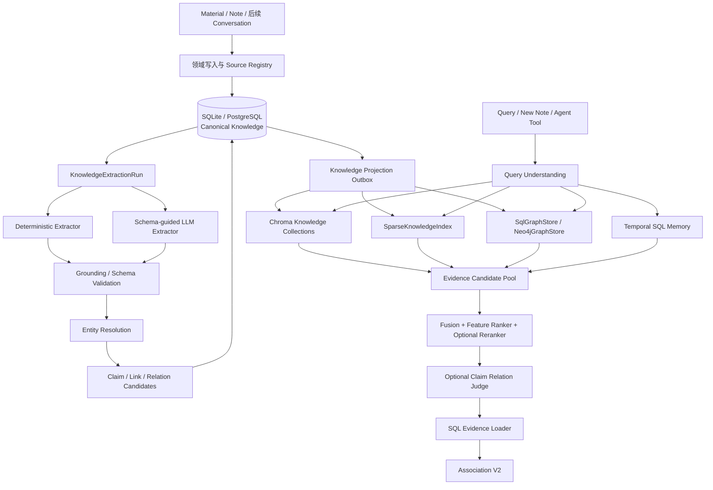

# Mnemox V2：以 Claim 为中心的个人知识图谱实施设计

> 日期：2026-09-02
>
> 状态：实施设计已确认；Stage 0 和 Stage 1 已于 2026-09-02 完成，Stage 2～3 已于 2026-09-03 完成。本文定义可以直接拆分开发任务的目标方案，但在对应阶段通过验收前，不把 Association V2、Neo4j/Graphiti、图关系检索或自动语义归一标记为已采纳运行时能力。
>
> 上游基线：[学习智能底座架构决策](2026-08-03-learning-intelligence-foundation-architecture.md)、[笔记、上下文与记忆边界](2026-08-13-note-context-memory-architecture.md)、[检索生命周期与质量决策](2026-08-22-retrieval-lifecycle-quality-adr.md)、[概念图谱与学习推荐决策](2026-08-22-concept-graph-learning-recommendations-adr.md)、[SQL 时态记忆生命周期决策](2026-08-23-temporal-memory-lifecycle-adr.md)。
>
> 路线图边界：[路线图](../../roadmap.md) 仍是阶段顺序和当前检查点的唯一权威来源。Stage 0～3 已按独立切片验收；Stage 4～7 不得仅依据本文并行启动。

## 0. 决策摘要

Mnemox V2 不采用“SQLite 换成 Neo4j”的替换式改造，而采用以下分层结构：

```text
SQLite（桌面）/ PostgreSQL（生产）
  └── 规范业务数据、Claim、Concept、证据、审核、版本、删除和投影命令

Chroma
  └── Material / Note / Claim / Concept 的可重建 Dense 向量投影

SparseKnowledgeIndex
  └── 可替换的关键词 / BM25 / FTS 查询投影

SqlGraphStore（默认）
  └── V2 首个可用版本的关系查询实现

Neo4jGraphStore（条件候选）
  └── 通过 Shadow Spike 后才可启用的图查询投影

Graphiti（条件候选）
  └── 通过独立 Shadow Spike 后才可启用的时态关系/检索投影

Temporal SQL
  └── 用户目标、偏好、困惑等带有效时间的个人状态记忆
```

V2 的核心变化不是数据库产品，而是新增 `Claim`：

- `Concept` 表示“讨论什么”；
- `Claim` 表示“某个来源具体表达了什么”；
- `ClaimEvidence` 表示“这句话在原文哪里”；
- `ClaimRelation` 表示“两个观点如何相互支持、冲突、细化或类比”；
- Association V2 通过 Claim、Concept、原文证据和用户记忆共同生成跨资料联想。

实施顺序固定为：

```text
评测与契约
  → SQL Claim 模型
  → 来源生命周期
  → 统一抽取
  → 实体归一与向量投影
  → Association V2 + SqlGraphStore
  → 稀疏索引规模化
  → Neo4j / Graphiti Shadow Spike
  → Go / No-Go 与可选切流
```

任何阶段都不得跳过用户隔离、来源证据、删除重建、失败降级和回滚门禁。

---

## 1. 为什么需要 V2

### 1.1 当前能力

当前项目已经具备：

- SQLite 本地模式和 PostgreSQL 生产模式；
- `Material / Chapter / Note / Conversation / Memory` 等规范业务数据；
- `RetrievalProjection` 与 SQL chunk 清单；
- Chroma Dense、资料 BM25 风格 Keyword 和 RRF；
- `Concept / ConceptAlias / ConceptEdge / ConceptLink`；
- 概念来源证据、审核、改名、合并、拆分和删除；
- SQL 时态记忆、冲突、替代、纠错和自动失效；
- `RetrievalRouter` 统一资料、笔记、记忆、概念和学习状态；
- Association V1 的确定性概念命中、一步邻域和笔记/错题证据；
- Coach 对联想展示、反馈和行为结果的归因入口。

这些能力继续保留，不推倒重写。

### 1.2 当前缺口

当前模型只能稳定回答：

> 哪些资料、笔记或错题与“机会成本”这个概念有关？

但不能稳定回答：

> 《小岛经济学》这段话表达了什么观点？它与另一份资料中的哪个具体观点结构相似？二者有什么差异？

根因包括：

1. 没有 Claim，一份来源只能直接挂到 Concept，丢失了“具体说了什么”。
2. Association V1 依赖概念名和别名在文本中直接出现，无法处理隐含概念。
3. 自动规则抽取和手动 LLM 抽取是两条独立链，审核状态和来源版本语义不一致。
4. 实体归一只有规范名和 Alias 精确匹配，没有语义候选与消歧流程。
5. Dense 主要覆盖 Material chunk；Note、Claim、Concept 没有统一向量投影。
6. `ConceptSourceEvidence` 只有摘录，没有统一的章节、页码、chunk、字符区间等定位契约。
7. 现有 `projection_outbox` 强绑定 `LearningEvent` 和学习者状态，不能直接承担知识图投影。
8. 当前检索质量集主要验证资料命中、隔离和删除，没有 Claim 抽取与跨来源联想质量集。

### 1.3 需求变化与旧 ADR 的关系

2026-08-22 的 Neo4j no-go 对当时的 Concept 先修图是正确结论。V2 新增 Claim、跨来源关系和多种图路径后，查询需求发生变化，因此允许重新开启受控 GraphStore Spike。

重新评估不等于直接采纳。以下旧原则继续有效：

- SQL 和原始文件是规范来源；
- 图数据库必须可由 SQL 重建；
- 模型输出先成为候选；
- 用户隔离必须在每一层强制执行；
- 删除先改变规范数据，再清理投影；
- 图、向量、模型或 worker 失败不得破坏资料、笔记和基础学习流程。

---

## 2. 目标、非目标与产品成功标准

### 2.1 V2 目标

1. 从 Material 和 Note 中抽取有原文证据的原子 Claim。
2. 将 Claim 解析到已有 Concept，避免同义概念无界增长。
3. 支持显式概念和隐含概念两种语义锚定。
4. 支持跨 Material、Note 的 Claim 级联想。
5. 每条联想返回两侧观点、关系、差异、图路径和原文证据。
6. 自动推断默认不作为客观事实写入；高风险或不确定结果进入审核。
7. 保留 SQL 图查询实现，并用同一 `GraphStore` 契约验证 Neo4j。
8. 让所有向量和图投影可更新、可删除、可重建、可观测、可回滚。

### 2.2 非目标

- 不构建开放域百科式知识图谱。
- 不在第一版增加任意实体类型和任意关系类型。
- 不把 LLM 生成的 Claim 当作世界事实。
- 不把两条相似 Claim 自动合并成同一 Claim。
- 不让 Neo4j、Chroma 或 LlamaIndex PropertyGraphIndex 成为规范来源。
- 不在第一版把全部向量迁移进 Neo4j。
- 不在第一版启用任意 Text2Cypher。
- 不把 Memory、Experience、学习事件全部复制进知识图。
- 不在 Stage 0～5 的产品路径中引入 Graphiti、Qdrant 或新的通用 Agent 框架；Graphiti 只可在 Stage 6 作为默认关闭、可删除重建的 Shadow 候选。
- 不因为新检索层上线而删除 Association V1 降级路径。

### 2.3 产品成功标准

V2 的价值不是“图里有多少节点”，而是：

- 用户输入没有显式概念名时，仍能找到值得关联的旧观点；
- 联想从“都与 X 有关”升级为“两个观点的共同结构与关键差异”；
- 用户可以打开两侧原文核对；
- 无证据、重复、牵强的联想不展示；
- 联想展示后已有 Coach 归因可以继续衡量接受、开始、完成和拒绝。

---

## 3. 领域语义

### 3.1 Source、Unit、Claim、Concept 的区别

| 类型 | 定义 | 示例 |
| --- | --- | --- |
| `KnowledgeSource` | 进入知识处理链的领域来源登记 | 一份 Material、一条 Note |
| `SourceRevision` | 来源在某一内容版本的不可变快照身份 | Material 版本 3 |
| `KnowledgeUnit` | 可定位、可抽取、可引用的内容单元 | 第三章、chunk 7、笔记正文 |
| `Claim` | 来源表达的单一、可独立比较的观点 | “投资生产资料会牺牲当前产出，但提升未来生产力” |
| `Concept` | Claim 讨论的规范主题 | 资本积累、机会成本 |
| `MemoryDeclaration` | 关于用户状态的时态声明 | “用户本月优先学习经济学” |
| `LearnerEvidence` | 关于用户能力的学习证据 | 一次正确回忆、一条错题 |

Claim 的 `confirmed` 只表示“该 Claim 准确概括了来源表达”，不表示该观点在现实世界中为真。

### 3.2 关系分层

#### 来源关系

```text
KnowledgeSource -HAS_REVISION-> SourceRevision
SourceRevision -CONTAINS-> KnowledgeUnit
KnowledgeUnit -STATES-> Claim
```

这些关系必须能回到明确的 SQL 来源版本和原文位置。

#### Claim 与 Concept

```text
Claim -ABOUT-> Concept
Claim -USES-> Concept
Claim -APPLIES_TO-> Concept
Claim -EXEMPLIFIES-> Concept
```

第一版必须支持 `ABOUT`；其他类型只有评测证明能够稳定区分时才开放自动抽取。

#### Concept 结构关系

```text
Concept -PART_OF-> Concept
Concept -PREREQUISITE_OF-> Concept
Concept -RELATED_TO-> Concept
```

`RELATED_TO` 是低信息关系，默认不参与高权重路径；`CONTRADICTS` 不再作为 Concept 关系新增，已有数据兼容读取，后续迁移到 Claim 关系。

#### Claim 语义关系

```text
Claim -SUPPORTS-> Claim
Claim -CONTRADICTS-> Claim
Claim -REFINES-> Claim
Claim -EXEMPLIFIES-> Claim
Claim -ANALOGOUS_TO-> Claim
```

`SIMILAR_TO` 默认由向量相似度查询时计算，不直接固化为长期关系。只有经过 LLM Judge 或用户确认，且能解释相似结构时，才产生 `ANALOGOUS_TO` 候选。

### 3.3 关系的来源类型

每条自动关系必须标记：

| `derivation_type` | 含义 | 默认审核 |
| --- | --- | --- |
| `explicit` | 原文明确表达 | `pending`，规则高置信可按策略确认 |
| `inferred` | 模型根据两个 Claim 推断 | `pending` 或查询时计算 |
| `manual` | 用户创建或明确确认 | `confirmed` |
| `migration` | 从旧模型迁移 | 保留原审核状态 |

“硬关系/软关系”不只由关系名决定，而由来源证据、推导方式和审核状态共同决定。

---

## 4. 目标架构



### 4.1 规范来源

SQL 保存：

- Source 登记和版本；
- Unit 定位；
- Claim 正文和状态；
- Claim/Concept 关系；
- 所有证据和审核；
- 抽取运行和模型版本；
- 实体归一候选及用户决定；
- 投影命令和失败状态。

Chroma、SparseKnowledgeIndex 和 Neo4j 只保存查询所需的可重建数据。

### 4.2 桌面与生产模式

| 场景 | SQL | Dense | Graph |
| --- | --- | --- | --- |
| Windows / 本地桌面 | SQLite | 本地 Chroma，可降级 | `SqlGraphStore` |
| Docker / 生产 | PostgreSQL | Chroma | `SqlGraphStore` 默认；Neo4j 可选 |
| Neo4j 不可用 | PostgreSQL/SQLite | 不受影响 | 自动回退 `SqlGraphStore` |
| Embedding 不可用 | PostgreSQL/SQLite | 跳过 | Exact/Alias + Sparse + Graph 继续工作 |

第一版不得要求桌面端安装 Java、Docker 或 Neo4j。

---

## 5. SQL 数据模型

模型建议新增到 `backend/app/models/knowledge.py`，通过下一可用 Alembic revision 和 SQLite lightweight migration 同时落地。创建迁移前必须检查当前 Alembic head，不能假设示例 revision 编号仍可用。

### 5.1 `knowledge_sources`

统一登记进入知识链的领域对象，不复制领域正文。

```text
id
user_id
source_type          material | note | conversation（后续）
source_record_id     领域表主键
source_key           稳定键，例如 material:42
title_snapshot
status               active | deleting | deleted
current_revision
created_at
updated_at
deleted_at
```

约束与索引：

- 唯一：`user_id + source_type + source_record_id`；
- 唯一：`user_id + source_key`；
- 索引：`user_id + status + updated_at`；
- 所有 Source 创建前必须重新验证领域对象属于当前用户。

### 5.2 `knowledge_source_revisions`

```text
id
user_id
knowledge_source_id
revision
content_hash
title_snapshot
status               current | superseded | deleted
created_at
superseded_at
```

约束：

- 唯一：`knowledge_source_id + revision`；
- 每个 Source 最多一条 `status=current`；
- 更新来源时旧 revision 标为 `superseded`，不直接伪装成新内容；
- 删除时保留最小审计身份，正文仍服从原领域数据删除策略。

### 5.3 `knowledge_units`

```text
id
user_id
source_revision_id
parent_unit_id        可空
unit_type             chapter | chunk | note_body | message
ordinal
text
text_hash
locator               JSON：page/chapter/chunk/char_start/char_end
created_at
```

第一版范围只要求：

- Material 使用现有分块配置生成 `chunk`；
- 有 Chapter 时写入章节定位；
- Note 使用单个或按长度切分的 `note_body`；
- Unit 是知识处理用的版本化快照，可以由领域正文重建；
- 单个 Unit 必须受最大字符数约束，不能把整本书交给一次模型调用。

约束与索引：

- 唯一：`source_revision_id + unit_type + ordinal`；
- 索引：`user_id + source_revision_id`；
- `text_hash` 用于幂等与重复 chunk 识别。

### 5.4 `knowledge_extraction_runs`

既是抽取审计，也是可恢复任务状态。

```text
id
user_id
source_revision_id
extractor_type        deterministic | llm | manual
extractor_version
schema_version
provider
model
prompt_hash
input_hash
status                queued | running | succeeded | partial | failed | cancelled
attempt_count
available_at
locked_at
lease_owner
started_at
finished_at
last_error            脱敏摘要
usage                  JSON：token/cost/latency，不保存 prompt 正文
stats                  JSON：units/claims/mentions/rejected
created_at
updated_at
```

约束：

- 唯一幂等键至少覆盖 `source_revision_id + extractor_type + extractor_version + schema_version + input_hash`；
- 同一 revision 不重复产生相同版本的成功运行；
- 模型调用失败不得删除规则抽取结果；
- 任务租约过期后可恢复；
- SQLite 只允许单消费者，PostgreSQL 使用行锁跳过忙任务。

### 5.5 `claims`

```text
id
user_id
source_revision_id
statement             原子观点，建议不超过 500 字符
claim_kind            definition | principle | causal | recommendation | comparison | observation
fingerprint           规范化 statement 的 SHA-256
confidence
derivation_type       explicit | inferred | manual | migration
review_status         pending | confirmed | rejected
lifecycle_status      active | superseded | deleted
extractor_version
schema_version
model_version
created_at
updated_at
reviewed_at
```

约束与语义：

- 唯一：`source_revision_id + fingerprint`；
- Claim 默认只在来源 revision 内去重，不跨书自动合并；
- 自动抽取默认 `pending`；
- 用户手工创建为 `manual + confirmed`；
- 来源更新后旧 Claim 变为 `superseded`，默认退出产品检索；
- `confirmed` 只确认抽取，不确认世界真值。

### 5.6 `claim_evidence`

```text
id
user_id
claim_id
knowledge_unit_id
excerpt
char_start
char_end
locator               JSON：页码、章节、chunk 等
grounding_method      exact_span | normalized_span | manual
confidence
created_at
```

硬约束：

- 每条可展示 Claim 至少有一条 Evidence；
- 自动抽取 Evidence 必须能在 Unit 原文中定位；
- 找不到可靠原文位置的模型输出直接拒绝，不得只保存模型总结；
- 不把完整敏感聊天内容复制进 evidence；Conversation 进入范围前另做隐私 ADR。

### 5.7 `claim_concept_links`

```text
id
user_id
claim_id
concept_id
relation_type         about | uses | applies_to | exemplifies
mention_text
confidence
derivation_type
review_status         pending | confirmed | rejected
resolution_candidate_id
created_at
updated_at
```

约束：

- 唯一：`user_id + claim_id + concept_id + relation_type`；
- 两端必须属于同一用户；
- 第一版产品检索只要求 confirmed `about`；
- exact canonical/alias 可以按策略确认，纯语义解析默认 pending。

### 5.8 `claim_relations`

```text
id
user_id
from_claim_id
to_claim_id
relation_type         supports | contradicts | refines | exemplifies | analogous_to
confidence
derivation_type       explicit | inferred | manual | migration
review_status         pending | confirmed | rejected
rationale             简短可展示解释，不保存模型隐藏推理
model_version
evaluator_version
created_at
updated_at
reviewed_at
```

约束：

- 禁止自环；
- 唯一：`user_id + from_claim_id + to_claim_id + relation_type`；
- 两端 Claim 必须 active 且属于同一用户；
- 自动跨来源关系默认 pending；
- `analogous_to` 在查询中按无向关系处理，但 SQL 只保存一个规范方向；
- 模型或评估器版本变化后，未确认 inferred 关系允许重新计算。

### 5.9 `entity_resolution_candidates`

```text
id
user_id
extraction_run_id
knowledge_unit_id
mention_text
mention_normalized
mention_context
candidate_concept_id  可空；为空表示建议新建 Concept
exact_score
alias_score
lexical_score
vector_score
context_score
combined_score
decision              pending | accepted | rejected | create_new
resolved_concept_id
decided_by            rule | model | user
decided_at
created_at
```

初始策略：

- 规范名精确命中：自动解析；
- Alias 精确命中：自动解析；
- 仅 embedding 相似：产生候选，不自动合并 Concept；
- 一个 mention 可以有多个 Top-K 候选；
- 用户选择后可以决定只链接本次 mention，或同时新增 Alias；
- “语义相关”不能自动等同于“同一个概念”。

### 5.10 `knowledge_embedding_projections`

只保存向量投影元数据，实际向量保存在 Chroma。

```text
id
user_id
object_type           claim | concept | note_unit | material_unit
object_id
content_hash
embedding_model
collection
vector_key
status                pending | ready | degraded | failed | deleting | deleted
attempt_count
last_error
indexed_at
deleted_at
created_at
updated_at
```

约束：

- 唯一：`user_id + object_type + object_id + embedding_model`；
- Embedding 模型变化时旧投影标记 degraded 并可按用户重建；
- Chroma 结果必须回 SQL 检查对象仍 active、confirmed、属于当前用户。

### 5.11 `knowledge_projection_outbox`

不要在第一版直接改造现有学习者 `projection_outbox`。新增知识专用 outbox，复用已有重试、DLQ、心跳和脱敏工具。

```text
id
user_id
aggregate_type        source | revision | unit | claim | concept | relation
aggregate_id
aggregate_version
operation             upsert | delete | rebuild_user
projection_target     chroma_knowledge | sparse_knowledge | neo4j_graph
idempotency_key
payload_version
payload               只放删除/定位所需的最小标识
status                pending | processing | processed | failed
attempts
available_at
locked_at
processed_at
last_error
dead_lettered_at
created_at
updated_at
```

关键规则：

- 规范 SQL 变化与 outbox 命令在同一事务写入；
- consumer 主要根据 ID 回读当前 SQL，不把完整 Claim/原文复制进 outbox；
- delete 命令必须携带删除投影所需的稳定 key；
- 一个投影目标失败不阻止其他目标完成；
- Neo4j 未启用时不创建对应 target 命令，或由消费者安全标记 skipped；
- 全量 rebuild 不依赖历史 outbox 完整存在，而从当前 SQL 状态重放。

---

## 6. 抽取契约

### 6.1 统一输出 Schema

新增 `backend/app/schemas/knowledge_extraction.py`，使用 Pydantic 严格校验：

```python
class ExtractedEvidence(BaseModel):
    quote: str
    char_start: int | None = None
    char_end: int | None = None


class ExtractedConceptMention(BaseModel):
    text: str
    relation_type: Literal["about", "uses", "applies_to", "exemplifies"] = "about"


class ExtractedClaim(BaseModel):
    local_id: str
    statement: str
    claim_kind: Literal[
        "definition", "principle", "causal",
        "recommendation", "comparison", "observation",
    ]
    evidence: list[ExtractedEvidence]
    concepts: list[ExtractedConceptMention]
    confidence: float


class ExtractedClaimRelation(BaseModel):
    from_local_id: str
    to_local_id: str
    relation_type: Literal[
        "supports", "contradicts", "refines", "exemplifies",
    ]
    evidence_quote: str | None = None
    confidence: float


class KnowledgeExtractionResult(BaseModel):
    claims: list[ExtractedClaim]
    relations: list[ExtractedClaimRelation]
```

Pydantic 模型必须设置额外字段拒绝或统一忽略策略，不能让供应商返回的新字段静默改变领域写入。

### 6.2 确定性抽取

保留当前标题、定义、括号别名、显式箭头等规则，但改为输出同一 Schema 的候选，而不是直接操作 Concept 表。

确定性抽取适合：

- 标题和术语定义；
- Markdown 加粗或代码标记中的术语；
- 明确“X 是 Y 的先修知识”；
- 明确“也称为/英文名/缩写”；
- 用户手工创建的 Claim 或 Concept。

规则版本必须进入 `extractor_version`，修改正则或归一化逻辑时递增。

### 6.3 LLM 抽取

LLM 只做规则难以完成的能力：

- 将段落拆成原子 Claim；
- 识别未显式出现名称的概念 mention；
- 识别来源内部明确的 Claim 关系；
- 输出精确 Evidence quote。

实现要求：

1. 来源正文继续通过不可信上下文包装。
2. 优先使用 Provider 原生 structured output；不支持时降级为 JSON 文本 + Pydantic 校验。
3. 不要求业务层直接依赖某一家 Provider 的响应格式。
4. 单 Unit 有 Claim 数量、输出字符和超时上限。
5. 解析失败只标记当前 Unit/Run partial，不回滚已经保存的规则候选。
6. 模型输出不直接创建 confirmed Concept 或 ClaimRelation。
7. 不保存模型隐藏推理，只保存简短 rationale、证据和版本。

LlamaIndex `SchemaLLMPathExtractor` 可以作为实验性 extraction helper，但必须适配 Mnemox Provider 接口并输出上述业务 Schema；`PropertyGraphIndex` 不得成为事实源。

### 6.4 Grounding Validation

写入 Claim 前必须依次校验：

1. `statement` 非空、长度合规、不是纯标题或无信息句；
2. `evidence.quote` 能在当前 Unit 原文中精确匹配；
3. 精确匹配失败时只允许做空白、Unicode 和标点归一后匹配；
4. 仍无法定位则拒绝该 Claim；
5. relation 引用的 `local_id` 必须存在；
6. relation 类型必须在 Schema 菜单内；
7. 同一 revision 内按 fingerprint 去重；
8. chunk overlap 导致的重复 Evidence 合并，但保留不同位置的真实重复陈述。

### 6.5 抽取触发

第一阶段只支持：

- Material 创建/更新后的持久抽取任务；
- Note 创建/更新后的持久抽取任务；
- 用户手动重试或强制重抽取。

领域写入不能等待整本资料的 LLM 抽取完成。推荐流程：

```text
保存 Material / Note
  → 同事务登记 Source + Revision + queued ExtractionRun
  → 返回业务成功
  → worker 分批处理 Unit
  → SQL 写 Claim 候选 + Knowledge Outbox
  → 前端展示抽取状态和待审核数量
```

SQLite 桌面端只运行单消费者；PostgreSQL worker 使用 `FOR UPDATE SKIP LOCKED`。应用退出后 queued/running 任务必须可以恢复。

---

## 7. Entity Resolution

### 7.1 解析顺序

```text
mention
  → normalize
  → canonical exact
  → alias exact
  → lexical candidates
  → Concept embedding Top-K
  → context compatibility
  → accepted / pending / create_new
```

### 7.2 默认自动化边界

第一版采用保守策略：

- canonical exact：自动 accepted；
- alias exact：自动 accepted；
- 同一来源中已经由用户确认过的 mention 映射：自动复用；
- 只有 lexical/vector/context 相似：全部 pending；
- 新建 Concept：pending；
- 自动 Alias：默认关闭；
- embedding 自动合并 Concept：禁止。

积累评测数据后，才允许在 feature flag 下启用高置信自动解析。阈值必须来自评测，不硬编码为产品真理。

### 7.3 Concept embedding 文本

Concept 向量输入建议固定为：

```text
名称：{name}
别名：{aliases}
定义：{description}
```

修改 Concept 名称、别名或描述时，必须写入 `chroma_knowledge` outbox 命令。

### 7.4 用户审核

审核 UI/API 至少支持：

- 将 mention 解析到某个已有 Concept；
- 创建新 Concept；
- 解析并新增 Alias；
- 只解析本次、不新增 Alias；
- 拒绝该 mention；
- 合并错误重复 Concept，继续复用现有 merge 迁移能力。

---

## 8. RetrievalRouter 与 Association V2

### 8.1 新增统一命中类型

`RetrievalRouter` 增加 `claim` 来源，并引入内部统一候选：

```python
@dataclass(frozen=True)
class EvidenceCandidate:
    evidence_key: str
    source_type: str
    source_id: int
    source_revision: int
    unit_id: int
    claim_id: int | None
    concept_ids: tuple[int, ...]
    excerpt: str
    path: tuple[dict, ...]
    scores: dict[str, float]
    metadata: dict[str, Any]
```

`evidence_key` 使用来源 revision、Unit 和 span 构造。跨后端命中同一原文时必须合并到同一候选，不能因 `material/claim/graph` 来源名不同重复计权。

### 8.2 Query Understanding

优先使用低成本确定性步骤：

1. 规范名和 Alias 扫描；
2. Claim/Concept embedding 检索；
3. 对长文本抽取临时 Query Claim；
4. 只有锚点不足或歧义明显时才调用 LLM Query Analyzer。

Query Analyzer 只输出：

```text
intent
query_claims
concept_mentions
requested_source_scope
```

不允许它直接生成最终关联内容。

### 8.3 召回通道

```text
Dense:
  Material Unit / Note Unit / Claim / Concept

Sparse:
  Material Unit / Note Unit / Claim / Concept name + alias

Exact:
  Concept canonical / alias / source metadata

Graph:
  Claim → Concept ← Claim
  Claim → Claim
  Concept → prerequisite/part_of → Concept
  Claim → Concept → linked personal evidence

Memory:
  已确认、未过期的 Temporal SQL Memory
```

图召回不是向量召回的替代品，而是从语义锚点扩展到有结构关系的证据。

### 8.4 GraphStore 查询模板

第一版只允许预定义路径，不允许任意生成查询：

1. `shared_concept_claims`：当前 Claim → Concept ← 历史 Claim；
2. `direct_claim_relations`：当前/候选 Claim → confirmed ClaimRelation；
3. `concept_structure`：Concept 的 prerequisite/part_of 邻域；
4. `personal_evidence_by_concept`：Concept → Note/WrongQuestion 等现有证据；
5. `source_claims`：按 Source/Revision 加载 Claim。

每个模板必须有：

- `user_id` 必填；
- 最大 depth；
- 每层 fanout；
- 最大路径数；
- review/lifecycle 过滤；
- 超时；
- SQL Evidence Loader 回查。

### 8.5 融合与排序

处理顺序：

```text
各通道 Top-K
  → 按 evidence_key 去重
  → RRF / rank normalization
  → 图路径特征
  → Evidence 质量和来源多样性
  → Feature Ranker
  → 可选 Cross-Encoder / LLM Reranker
  → Top-N Claim Pair Judge
```

第一版 Feature Ranker 建议使用可解释权重：

```text
0.25 × semantic_rerank
+ 0.18 × dense_score
+ 0.14 × sparse_score
+ 0.16 × graph_path_score
+ 0.12 × evidence_quality
+ 0.08 × source_diversity
+ 0.07 × personal_relevance
- unsupported / stale / duplicate penalties
```

权重放在版本化配置中，并通过离线评测调整。没有 semantic reranker 时，将其权重按比例分配给其他特征，不能把缺失值当零分惩罚。

图路径分数应区分：

- confirmed direct ClaimRelation > shared confirmed Concept；
- `ABOUT` > `RELATED_TO`；
- 一跳 > 两跳 > 三跳；
- 有双侧 Evidence > 单侧 Evidence；
- confirmed > pending；产品默认不展示 pending。

### 8.6 Claim Pair Judge

只对排序后的少量候选调用 Judge，输出严格 Schema：

```text
relation_type
shared_structure
important_difference
evidence_ids
confidence
worth_showing
```

Judge 规则：

- 只能引用给定 Claim 和 Evidence；
- 不得补充来源中不存在的观点；
- `worth_showing=false` 的候选直接丢弃；
- 超时或失败时使用 Feature Ranker 结果，但只展示已有 confirmed 路径；
- Judge 结果可以作为短期缓存或 pending relation candidate；
- 不保存隐藏思维链。

### 8.7 Association V2 返回契约

```json
{
  "associations": [
    {
      "anchor": {
        "claim": "当前内容表达的观点",
        "concepts": [{"id": 1, "name": "机会成本"}]
      },
      "related": {
        "claim_id": 88,
        "claim": "历史来源表达的观点",
        "source_type": "material",
        "source_id": 12,
        "source_title": "富爸爸穷爸爸"
      },
      "relation": "analogous_to",
      "shared_structure": "两者都强调牺牲当前消费以换取未来产出",
      "important_difference": "一个讨论宏观生产，一个讨论个人资产配置",
      "path": [],
      "evidence": {
        "anchor": [],
        "related": []
      },
      "score": 0.86,
      "confidence": 0.82,
      "inferred": true
    }
  ],
  "diagnostics": {
    "mode": "v2",
    "degraded_sources": {},
    "candidate_counts": {},
    "reranker": "feature|cross_encoder|llm|fallback",
    "graph_backend": "sql|neo4j"
  }
}
```

旧 `/api/concepts/associate` 保留兼容适配器，内部可以在 feature flag 下调用 V2 并映射回旧字段。新客户端使用 `/api/knowledge/associate`。

---

## 9. Sparse 检索演进

### 9.1 接口

```python
class SparseKnowledgeIndex(Protocol):
    async def upsert_units(...): ...
    async def delete_source(...): ...
    async def search(...): ...
    async def rebuild_user(...): ...
    async def health(...): ...
```

### 9.2 初始实现

第一版扩展现有持久 Unit/Chunk 上的 BM25 风格实现，使其支持 Material、Note 和 Claim，保持无额外依赖降级。

当前实现按查询加载作用域内全部 chunk，不能作为大语料终态。后续受控比较：

- SQLite FTS5 可用性和中文 tokenizer 行为；
- PostgreSQL `pg_trgm` 对中文短语的索引召回；
- PostgreSQL `tsvector` 对英文/拉丁词项的能力；
- 当前 CJK bigram BM25 的质量与内存成本。

不要默认认为 SQLite FTS5 或 PostgreSQL 默认全文索引对中文一定优于当前 bigram。采用前必须用真实中文资料评测。

### 9.3 采纳门槛

- 相关性不低于现有 sparse baseline；
- p95 和内存随 Unit 数量增长明显优于按查询全量加载；
- 支持 user/source 过滤；
- 更新、删除和按用户重建无残留；
- 索引不可用时可降级回 SQL BM25 reference backend。

---

## 10. GraphStore 与 Neo4j

### 10.1 GraphStore 契约

新增：

```text
backend/app/services/graph_store/base.py
backend/app/services/graph_store/sql_store.py
backend/app/services/graph_store/neo4j_store.py      # Spike 阶段才创建
backend/app/services/graph_store/factory.py
```

最小协议：

```python
class GraphStore(Protocol):
    async def expand_claims(self, *, user_id, claim_ids, patterns, depth, limit): ...
    async def expand_concepts(self, *, user_id, concept_ids, patterns, depth, limit): ...
    async def source_claims(self, *, user_id, source_id, limit): ...
    async def rebuild_user(self, *, user_id): ...
    async def delete_source(self, *, user_id, source_key): ...
    async def health(self): ...
```

业务层只依赖该协议，不能 import Neo4j driver。

### 10.2 `SqlGraphStore`

V2 首个生产实现：

- 使用现有 SQLAlchemy 模型；
- 预定义查询 + 有界 BFS/递归查询；
- 所有查询带 user_id；
- 默认只返回 active + confirmed；
- 返回 SQL ID、路径类型、深度和关系置信度；
- 不在 GraphStore 内加载全文。

### 10.3 Neo4j 投影 Schema

节点：

```text
(:KnowledgeSource {key, user_id, sql_id, source_type, revision})
(:KnowledgeUnit   {key, user_id, sql_id, unit_type, ordinal})
(:Claim           {key, user_id, sql_id, fingerprint, review_status})
(:Concept         {key, user_id, sql_id, name_normalized, review_status})
```

边：

```text
(Source)-[:CONTAINS]->(Unit)
(Unit)-[:STATES]->(Claim)
(Claim)-[:ABOUT|USES|APPLIES_TO|EXEMPLIFIES]->(Concept)
(Claim)-[:SUPPORTS|CONTRADICTS|REFINES|EXEMPLIFIES|ANALOGOUS_TO]->(Claim)
(Concept)-[:PART_OF|PREREQUISITE_OF|RELATED_TO]->(Concept)
```

投影原则：

- `key` 使用用户范围稳定键，例如 `u:7:claim:88`；
- 第一版不保存完整原文，只保存查询必要属性；
- 图查询返回 SQL ID，再由 SQL Evidence Loader 加载内容；
- 默认只投影 active/confirmed 产品图；待审核候选保留在 SQL；
- 所有 Cypher 使用参数化模板并显式过滤 user_id；
- 创建唯一约束和索引；
- 不启用任意 Text2Cypher；
- 不把 Neo4j vector index 作为第一版依赖。

### 10.4 Shadow 模式

Neo4j 首次接入只运行 Shadow：

```text
用户查询
  → SqlGraphStore 返回产品结果
  → 后台/同请求预算内运行 Neo4jGraphStore
  → 只记录脱敏差异指标
  → 不改变用户结果
```

记录：

- 返回 ID 集合差异；
- 路径类型和深度差异；
- SQL/Neo4j 延迟；
- 超时和异常；
- 投影 lag；
- 不记录用户原始查询或全文。

### 10.5 Neo4j Go / No-Go 门槛

必须全部满足：

1. Golden graph query 的路径正确性与 SqlGraphStore 一致或是经过人工确认的严格改进。
2. 跨用户泄漏为 0。
3. 删除来源后 Neo4j 残留为 0，失败时有 tombstone/DLQ。
4. 可从当前 SQL 完整重建任一用户图。
5. Neo4j 不可用时自动回退 SQL，业务写入和基础检索正常。
6. 在目标规模的 2～4 跳查询中，性能或实现维护性有明确净收益。
7. 生产部署、备份、恢复、凭据、资源和监控通过验收。
8. 桌面端继续使用 SqlGraphStore，不要求安装 Neo4j。

如果只证明“Cypher 写起来像图”，但质量、性能和维护收益不足，则结论仍为 no-go。

---

## 11. API 与服务边界

### 11.1 新增 API

```text
POST /api/knowledge/extractions
GET  /api/knowledge/extractions/{run_id}
POST /api/knowledge/extractions/{run_id}/retry

GET  /api/knowledge/claims
GET  /api/knowledge/claims/{claim_id}
POST /api/knowledge/claims/{claim_id}/review

GET  /api/knowledge/resolution-candidates
POST /api/knowledge/resolution-candidates/{candidate_id}/resolve

POST /api/knowledge/claim-relations/{relation_id}/review
POST /api/knowledge/associate

POST /api/knowledge/rebuild
GET  /api/knowledge/status
```

所有 ID 接口必须从 `current_user.id` 重新校验归属。不得依赖前端传入 user_id。

### 11.2 服务拆分

```text
knowledge_source_service.py
  Source/Revision/Unit 生命周期

knowledge_extraction_service.py
  运行编排、规则/LLM extractor、校验、幂等写入

entity_resolution_service.py
  mention 候选、Concept 解析、用户决定

knowledge_embedding_service.py
  Claim/Concept/Unit 向量投影

knowledge_projection_service.py
  outbox enqueue/retry/rebuild/status

association_v2_service.py
  Query anchor、召回、融合、Judge、Evidence 输出

graph_store/*
  SQL/Neo4j 图查询实现
```

服务层默认只 `flush`，事务由 Router、worker 或明确的领域编排器拥有；不得在底层 helper 中私自 commit。

### 11.3 现有服务迁移

| 现有位置 | V2 处理 |
| --- | --- |
| `concept_graph_service.sync_material_concepts` | 先适配到统一 deterministic extraction；兼容入口保留 |
| `concept_service.extract_chapter_concepts_llm` | 改为创建/执行 KnowledgeExtractionRun，不直接写 confirmed Concept |
| `association_service` | 保留 V1，新增 V2 adapter 和 feature flag |
| `retrieval_router` | 新增 claim source、EvidenceCandidate 和 graph source adapter |
| `material_retrieval_backend` | 继续负责 Material 内部检索；不直接承担 Claim 图扩展 |
| `projection_outbox_service` | 保持学习者状态职责；公共重试工具可抽取复用 |
| `memory_declaration_service` | 不迁移；只在检索阶段提供已确认、未过期记忆 |

---

## 12. 分阶段实施计划

下面每个阶段都应拆成独立 PR。一个阶段的退出门禁没有通过，不启动依赖它的后续阶段。

### Stage 0：契约、评测与开关

目标：先固定“什么是正确联想”，不修改生产检索行为。

任务：

- [x] 将本文评审后加入 `docs/README.md` 当前架构决策或实施设计导航。
- [x] 通过独立变更更新 `docs/roadmap.md`，确定 V2 与当前 Phase 2 的先后关系。
- [x] 新增 `backend/tests/fixtures/knowledge_extraction_eval_cases.json`。
- [x] 新增 `backend/tests/fixtures/association_v2_eval_cases.json`。
- [x] 覆盖中文、英文、显式概念、隐含概念、同义词、反例、跨用户哨兵和删除案例。
- [x] 实现 V1 baseline runner，记录显式/隐式场景 Recall、MRR、无结果率和延迟。
- [x] 定义 feature flags，默认全部关闭。
- [x] 记录模型调用预算、最大 Unit、最大 Claim 和超时默认值。

建议开关：

```text
KNOWLEDGE_V2_ENABLED=false
KNOWLEDGE_LLM_EXTRACTION_ENABLED=false
ASSOCIATION_V2_ENABLED=false
ASSOCIATION_V2_SHADOW=false
KNOWLEDGE_SEMANTIC_AUTO_RESOLVE_ENABLED=false
NEO4J_GRAPH_ENABLED=false
NEO4J_GRAPH_SHADOW=false
```

退出门禁：

- 至少 50 个跨来源联想问题；
- 至少 50 个带人工 Claim/Evidence 标注的 Unit；
- 数据集没有真实敏感数据；
- baseline 可重复运行，不调用外部模型；
- 路线图已经明确该项目的执行窗口。

回滚：仅文档、fixture 和关闭的配置，无产品行为变化。

#### Stage 0 验收记录（2026-09-02）

- `knowledge_extraction_eval_cases.json` 包含 56 个合成 Unit，其中 50 个带人工 Claim/Evidence 标注；Evidence quote 均能在对应 Unit 原文中精确定位。
- `association_v2_eval_cases.json` 包含 56 个跨来源问题，显式/隐式、中英文各 28 个，并包含同义词、反例、双向跨用户哨兵和删除探针。
- `evaluate_knowledge.py` 直接运行现有 SQL Association V1，使用临时 SQLite，不初始化 Provider、不访问网络。V1 显式场景 Recall@5/MRR/来源 Recall@5 均为 `1.0000`；隐式场景均为 `0.0000`，无结果率为 `1.0000`，明确固定了 V2 的目标缺口。
- 用户隔离违规和删除来源残留均为 `0`；两次运行的结果摘要 SHA-256 一致。
- 初始限制固定为：Unit `8,000` 字符、每 Unit `12` 个 Claim、Claim `500` 字符、输出 `12,000` 字符、单次调用 `30s`、每 Run `64` 次/`64,000` 估算 Token、每用户每日 `256,000` 估算 Token。
- 九个 V2/Neo4j/Graphiti feature flag 全部默认关闭，本阶段没有模型、迁移、worker、API、前端或生产检索行为变化。
- Stage 0 完成后，产品负责人于 2026-09-02 单独授权 Stage 1；该授权只覆盖 Canonical Claim Schema 和来源生命周期，不延伸到 Stage 2 或图运行时。

### Stage 1：Canonical Claim Schema

目标：落地 SQL 模型和迁移，不自动抽取、不改变 Association。

任务：

- [x] 新增 `backend/app/models/knowledge.py`。
- [x] 在 `backend/app/models/__init__.py` 注册模型。
- [x] 创建下一可用 Alembic revision `20260902_19`。
- [x] 增加 SQLite lightweight migration 和索引核查。
- [x] 实现 `knowledge_source_service.py` 的 Source/Revision/Unit 创建、更新、删除。
- [x] Material/Note 写入只登记 Source/Revision，抽取开关关闭时不生成 Claim。
- [x] 新增 Claim 手工创建和审核的服务级测试。
- [x] 覆盖跨用户 ID、重复 revision、部分唯一约束和 cascade/tombstone。
- [x] 运行 PostgreSQL offline DDL、全新 PostgreSQL 16 升级、drift 和候选门禁。

退出门禁：

- SQLite 新库、旧库升级和 PostgreSQL Alembic 都通过；
- Source 更新只产生一个 current revision；
- 删除不会留下产品可见 active Claim；
- 不修改现有 Concept、Memory、LearnerState 行为；
- `ASSOCIATION_V2_ENABLED=false` 时所有旧测试保持通过。

回滚：关闭 `KNOWLEDGE_V2_ENABLED`；新表保留但不读写，不执行破坏性 downgrade。

#### Stage 1 验收记录（2026-09-02）

- 五张规范表及约束已在 SQLite 新库、SQLite lightweight 旧库升级、PostgreSQL offline DDL 和全新 PostgreSQL 16 中通过。
- Material、Note、Obsidian 导入/同步、受控 Agent/演示入口在 `KNOWLEDGE_V2_ENABLED=true` 时与领域写入同事务登记来源；默认关闭时旧行为不变。
- 来源内容不变时复用 current revision；更新产生唯一新版本并 supersede 旧 Claim；删除先 tombstone 且清空 Unit、Claim 和 Evidence 正文，产品可见 active Claim 为零。
- Claim 的数据库默认审核状态为 `pending`；手工创建服务在 Evidence 精确定位成功后才显式写入 `manual + confirmed`。手工 Claim 使用规范化指纹在来源版本内去重，只能引用同用户、current revision 的 Unit，确认状态始终需要 Evidence。
- 专项 SQLite/迁移测试 `34 passed`，并分别验证重复 revision 号、current revision 部分唯一约束、关闭开关零写入、tombstone 与数据库级 cascade；一次性 PostgreSQL 16 从冻结基线升级到 `20260902_19`，`alembic check` 无 drift，候选验收 `8 passed`。
- 本阶段未新增 extraction run、自动抽取、ClaimConceptLink、ClaimRelation、Association V2、Neo4j/Graphiti consumer 或运行时依赖。

### Stage 2：统一抽取与 Grounding

目标：规则与 LLM 使用同一 Schema、运行状态和审核边界。

任务：

- [x] 新增 Pydantic extraction schema。
- [x] 把当前规则抽取包装为 `DeterministicKnowledgeExtractor`。
- [x] 实现 `LLMKnowledgeExtractor`，先使用现有 Provider JSON fallback。
- [x] 为 Provider 增加可选 structured-output 能力探测，不改变普通 chat 契约。
- [x] 实现 Evidence quote 精确/归一定位。
- [x] 实现 Claim fingerprint、chunk overlap 去重和 run 幂等。
- [x] 自动 Claim 全部写为 pending。
- [x] 当前 Material 自动规则抽取入口迁移到新服务。
- [x] 当前章节 LLM 抽取 API 改为创建 extraction run。
- [x] 增加 durable run 的 retry、lease、partial、cancel 和恢复。
- [x] 前端先只展示抽取状态和待审核数量，不新增复杂图页面。

退出门禁：

- Schema 合法率 100%；
- 产品可见 Claim 的 Evidence 覆盖率 100%；
- 找不到原文位置的 Claim 写入数为 0；
- 相同 source revision 重试不重复 Claim；
- 单 Unit 失败只造成 partial，不回滚其他 Unit；
- 无 AI Key 时规则抽取和业务保存仍可用。

回滚：关闭 LLM extraction；保留 deterministic candidates；必要时关闭整个 V2 source hook。

#### Stage 2 验收记录（2026-09-03）

- 规则与 LLM 已统一到严格 Pydantic Schema；LLM 优先使用可探测的 structured output，不支持时回退 JSON 后仍通过同一 Schema 验证。所有自动 Claim 均写为 `pending`。
- Grounding 先精确、后 NFKC/空白/标点归一定位，并映射回原文字符范围；无 Evidence 或无法定位的候选写入数为 `0`。来源版本内 Claim 指纹幂等，重叠 chunk 的 Evidence 按绝对位置去重。
- 新增 `knowledge_extraction_runs` 与迁移 `20260903_20`。run 具备唯一输入身份、短租约、过期回收、有界重试、取消、usage/统计和 Unit 级 savepoint；单 Unit 失败为 `partial`，成功结果保留，重试不重复 Claim/Evidence。
- Material/Note 来源登记会在总开关开启时创建确定性 run；LLM run 仍需独立开关。缺少 AI Key 只使 LLM run 失败，规则抽取和业务保存继续可用。旧同步抽取入口在 V2 模式下只创建 durable run，不直接污染 Concept。
- SQLite 使用单个应用内消费者；PostgreSQL 使用 `FOR UPDATE SKIP LOCKED`。全新一次性 PostgreSQL 16 从冻结基线升级到 `20260903_20`，`alembic check` 无 drift，9 项候选门禁包含真实双会话抢租约和 grounded pending Claim/Evidence 持久化。
- Stage 2 专项 `13 passed`，完整后端 `534 passed, 14 skipped, 58 subtests passed`；前端 `26 files / 91 tests passed` 且 build 通过。
- 本阶段没有新增 ClaimConceptLink、ClaimRelation 持久化、Entity Resolution、知识 embedding、Association V2、SqlGraphStore consumer 或 Neo4j/Graphiti runtime。

### Stage 3：Entity Resolution 与 Knowledge Embedding

目标：让隐含概念产生可审核语义锚点，不自动污染 Concept。

任务：

- [x] 实现 canonical/alias exact resolver。
- [x] 新增独立 Chroma collections，避免与 Material chunk 混用命名空间。
- [x] 为 Concept、Claim、Note Unit、Material Unit 建投影元数据。
- [x] 实现知识投影 outbox、单用户重建、删除和配置失效。
- [x] 实现 Concept embedding Top-K 候选。
- [x] 写入 `entity_resolution_candidates`，纯语义候选保持 pending。
- [x] 增加审核 API 和最小 UI。
- [x] Concept rename/alias/merge/delete 写入知识投影命令。
- [x] 增加 embedding 维度变化、无 Key、超时和删除残留回归。

退出门禁：

- exact/alias 解析回归 100%；
- 语义候选 Top-5 Recall 达到 Stage 0 设定门槛；
- 自动语义合并 Concept 数为 0；
- 跨用户 Chroma 命中为 0；
- 删除和按用户重建残留为 0；
- Chroma 不可用时 exact/alias 和审核数据仍可用。

回滚：关闭 knowledge embedding consumer；SQL Claim 和候选不丢失。

#### Stage 3 验收记录（2026-09-03）

- 新增迁移 `20260903_21`，落地 `entity_resolution_candidates`、`claim_concept_links`、`knowledge_embedding_projections` 和 `knowledge_projection_outbox`。SQL 始终负责用户归属、审核、生命周期和删除，Chroma 只保存可重建投影。
- resolver 顺序固定为 canonical exact、alias exact、同来源人工决定复用、词法候选和 embedding Top-K。只有 exact/alias/既有人工决定可自动确认；词法和纯语义候选保持 `pending`，自动语义合并 Concept 数为 `0`。
- 知识 collection 与资料 chunk namespace 分离；Concept、Claim、Material Unit、Note Unit 均有内容/配置指纹、模型、collection、状态和错误元数据。compact outbox 只携带 ID，支持租约、重试、DLQ、删除、按用户从当前 SQL 全量重建和配置/模型/维度失效。
- 审核 API 与资料侧栏抽屉支持关联、关联并新增别名、新建 Concept、忽略和进入既有概念合并页；所有查询和动作再次验证当前用户、current source、active Claim 与 confirmed Concept。
- 24 个记录式合成正例的 Top-5 Recall 为 `1.0`（门槛 `0.90`），Top-1 为 `0.5`；4 个负例准确率 `1.0`，跨用户命中、自动语义合并和外部模型调用均为 `0`。这是确定性离线排序契约，不冒充真实 embedding provider 或真人质量验收。
- 完整后端 `549 passed, 15 skipped, 58 subtests passed`；前端 `27 files / 93 tests passed`，生产 build 与 lint 通过。全新 PostgreSQL 16 升级到 `20260903_21` 后候选门禁 `10 passed`，历史 dump 恢复升级专项 `1 passed`，`alembic check` 无 drift。
- Chroma/Key/超时不可用时，exact/alias、SQL 候选和人工审核继续工作；投影任务以 `degraded` 收口。关闭 `KNOWLEDGE_EMBEDDING_ENABLED` 会停止知识投影 consumer，关闭 `KNOWLEDGE_V2_ENABLED` 会停止 extraction/source hook，但不会删除 SQL Claim、候选或审核结果。

### Stage 4：Association V2 + SqlGraphStore

目标：在不依赖 Neo4j 的情况下交付第一条跨资料 Claim 联想。

任务：

- [ ] 定义 GraphStore protocol 和 `SqlGraphStore`。
- [ ] 为五类固定路径写用户隔离查询。
- [ ] RetrievalRouter 增加 claim source adapter。
- [ ] 实现临时 Query Claim 和 Concept anchor。
- [ ] Dense、Sparse、Exact、Graph、Memory 形成统一 Candidate Pool。
- [ ] 按 evidence_key 去重，修正跨来源重复计权。
- [ ] 实现版本化 Feature Ranker。
- [ ] 实现可选 Claim Pair Judge 和超时 fallback。
- [ ] 新增 `/api/knowledge/associate`。
- [ ] 旧 `/api/concepts/associate` 在 Shadow/灰度中保持兼容。
- [ ] Note 保存和 Agent 工具先通过 feature flag 选择 V1/V2。
- [ ] 继续写 Coach shown/accepted/rejected/started/completed 归因。

退出门禁：

- 显式概念场景不显著退化；
- 隐含概念场景 Recall@5 相比 V1 提升至少 20 个百分点；
- 每条展示结果有双侧 Claim/Evidence 或明确标记单侧输入文本；
- 无证据关联展示率为 0；
- 人工标注的牵强/不支持关联率不高于 5%；
- 跨用户泄漏为 0；
- Judge 失败时仍返回安全、可解释的 confirmed graph 结果；
- V1/V2 可以一键切换。

回滚：关闭 `ASSOCIATION_V2_ENABLED`，恢复 V1；新 Claim 数据保留。

### Stage 5：Sparse 索引规模化与真实 Reranker

目标：解决 Unit 数量增长后的全量 BM25 成本，并提高最终候选排序。

任务：

- [x] 抽象 `SparseKnowledgeIndex`。
- [x] 记录当前 reference sparse 在不同 Claim 规模下的延迟和内存曲线。
- [x] 实现 SQLite FTS5/兼容探测 Spike。
- [x] 实现 PostgreSQL 应用中文 bigram + 拉丁 token + native GIN FTS Spike；当前环境不依赖 `pg_trgm`。
- [ ] 对真实匿名中文/双语语料比较质量和生命周期（当前只有合成/确定性 fixture，按产品负责人安排后置）。
- [x] 选定 dialect persistent sparse：`auto` 下 SQLite→FTS5、PostgreSQL→native GIN FTS，并保留 reference 查询 fallback 与显式回滚。
- [x] 新增可插拔 LLM semantic reranker；默认 Feature Ranker，无模型/异常/超时继续 Feature Ranker。
- [x] 记录 reranker 模型、版本、延迟、超时、provider usage 与已配置参考成本。

退出门禁：

- 相关性不低于 Stage 4 baseline；
- 目标规模 p95/内存明显优于查询时全量加载；
- 无 embedding 时 sparse 质量门禁仍通过；
- Reranker 超时不影响结果返回；
- 更新、删除、重建和用户隔离全部通过。

2026-09-03 工程退出门禁已全部通过，因此 Stage 5 工程阶段收口；真实匿名中文/双语语料与真人牵强率作为产品质量验收单列后置，不把缺少真人样本误写成已完成。

回滚：切回 BM25 reference + Feature Ranker。

### Stage 6：Neo4j / Graphiti Shadow Spike

目标：在已有真实 Claim 图和 Association V2 baseline 上，分别验证专用图存储与时态关系层是否达到采纳门槛。两条候选必须独立计分，不能把“Neo4j 可用”视为“Graphiti 有价值”，反之亦然。

任务：

- [x] Neo4j driver 放入可选 spike 依赖，不进入默认 requirements。
- [x] Docker Compose 使用 `graph-shadow` profile 启动，不改变默认部署，host 端口仅绑定 loopback。
- [x] 实现节点约束、索引和参数化 Cypher 模板；不提供 Text2Cypher，Neo4j 投影不保存知识正文。
- [x] 实现 Neo4j knowledge outbox consumer；当前 Shadow 只接受 `rebuild_user`，避免过早增加增量协议复杂度。
- [x] 实现按用户 rebuild/delete/status。
- [x] 实现 `Neo4jGraphStore`，并在真实临时 Neo4j 5.26 + Python driver 6.3 上通过专项。
- [x] Graphiti 放入独立可选 spike 依赖（`graphiti-core 0.30.1`），不进入默认 requirements；初始化前显式关闭 telemetry，且关闭 raw episode storage。
- [x] 实现只读取当前用户 confirmed/current Claim/Evidence 和 reviewed temporal declaration 的 `GraphitiShadowAdapter`，不得写回规范 SQL；staged/ignored/inaccurate 与其他用户状态不会摄入。
- [x] Graphiti 按用户 rebuild/delete/status、来源版本失效、conflict review 边界和 as-of temporal search 已通过；真实 0.30.1 + Neo4j BM25-only 集成使用官方基类阻断所有外部模型调用。
- [x] Neo4j 脱敏 Shadow diff 已接入且不改变用户结果；Graphiti temporal/search evaluator 只比较 canonical declaration ID/count/recall，不记录 query/fact 正文。
- [x] Neo4j 已生成 100/1000/5000 Claim 目标规模合成图；Graphiti 已生成 100/1000 temporal-fact 对照集。两个候选均在净收益强制门槛失败，因此按 stop rule 不再扩大到真实用户数据或付费外部模型。
- [x] Neo4j DLQ、删除、全量重建、认证失败、投影 lag 量化已覆盖；Graphiti search failure/SQL transaction isolation 已覆盖。
- [x] SQL/Neo4j 已记录 ID/path/score 一致性和 p50/p95；SQL/Graphiti 已记录 Recall@5、p50/p95、seed cost、0 model-call 模式及容器资源。最终两个候选均 NO-GO。

退出门禁：**2026-09-04 已完成 Go / No-Go。Neo4j = NO-GO；Graphiti = NO-GO；Stage 7 不进入。** 详见 [Stage 6 最终 Go / No-Go 决策](2026-09-04-mnemox-v2-stage6-final-go-no-go.md)。

Stop rule：任一候选已经在强制“明确净收益/运维收益”门槛失败时，允许提前 NO-GO，不为了补齐形式上的真实数据/付费模型样本继续增加隐私暴露和成本。

回滚：分别关闭 `NEO4J_GRAPH_SHADOW` / `GRAPHITI_SHADOW`，停止对应 profile 和 consumer，删除可重建投影；产品继续 `SqlGraphStore`。

### Stage 7：图后端可选切流与来源扩展

前置：Stage 6 针对每个候选分别输出 go ADR。某个候选 no-go 时只取消该候选，不影响 SQL 或另一候选。

任务：

- [ ] 小范围用户开启 `NEO4J_GRAPH_ENABLED`。
- [ ] 只有 Graphiti 独立 go 时，才允许对小范围用户开启 `GRAPHITI_ENABLED`。
- [ ] 每次图查询保留 SQL fallback 和 backend diagnostics。
- [ ] 监控投影 lag、fallback、查询差异和资源。
- [ ] 完成生产备份、恢复、凭据轮换和告警。
- [ ] 根据隐私 ADR 再评估 Conversation Claim。
- [ ] 只在明确产品入口存在时评估 Experience 类型。
- [ ] Memory 继续留在 Temporal SQL；需要时只增加有证据的 Concept 链接。
- [ ] 不因任一候选 go 自动启用另一候选；两者都必须保留 SQL fallback。

退出门禁：

- 灰度期无用户隔离、删除、重建事故；
- fallback 率和投影 lag 在目标内；
- Association 产品指标不低于 SqlGraphStore；
- 桌面模式行为仍完整可用。

回滚：所有用户切回 SqlGraphStore；Neo4j 保留只读排查或重建后删除。

---

## 13. 测试与评测矩阵

### 13.1 单元测试

- Claim fingerprint 与 Unicode/标点归一；
- Evidence span 定位；
- Extraction Schema 非法输出；
- Claim/Relation 类型菜单；
- Concept exact/alias resolver；
- 语义候选不自动 merge；
- evidence_key 去重；
- graph path score；
- Feature Ranker 缺失特征重分配；
- Judge Schema 和 fallback。

### 13.2 数据库与迁移

- SQLite 新库；
- SQLite 历史库 lightweight upgrade；
- PostgreSQL offline DDL；
- PostgreSQL 临时库从当前 head 升级；
- 部分唯一索引；
- 跨用户外键/服务边界；
- Source update/delete；
- Claim supersede；
- outbox 幂等、retry、DLQ 和 replay。

### 13.3 生命周期集成测试

```text
创建 Material
  → Source/Revision/Unit
  → ExtractionRun
  → Claim/Evidence
  → Concept Resolution
  → Chroma/Sparse/Graph projection
  → Association

更新 Material
  → 旧 revision/Claim superseded
  → 新 revision 抽取
  → 旧投影删除
  → 新投影可检索

删除 Material
  → 产品立即不可见
  → SQL/Chroma/Sparse/Neo4j 无残留
  → 失败进入重试/DLQ
```

Note 需要同样覆盖创建、更新、删除和 Obsidian 冲突/缺失状态。

### 13.4 质量指标

#### Extraction

- Claim precision/recall/F1；
- Evidence span valid rate；
- unsupported Claim rate；
- duplicate Claim rate；
- Schema failure/partial rate；
- 每 Unit token、成本和延迟。

#### Resolution

- exact/alias accuracy；
- semantic Top-1/Top-5 recall；
- wrong auto-link rate；
- duplicate Concept creation rate；
- 用户审核接受/拒绝率。

#### Association

- Recall@5；
- MRR；
- NDCG@5；
- unsupported association rate；
- evidence coverage；
- source diversity；
- duplicate result rate；
- no-result rate；
- p50/p95，不含和包含 Judge 分开统计。

#### 生命周期与安全

- cross-user forbidden hits；
- deleted residual hits；
- projection lag；
- rebuild parity；
- degraded fallback success；
- DLQ count 和 oldest age。

### 13.5 产品指标

继续使用现有 Coach 生命周期：

- association shown；
- accepted/rejected；
- started/completed/abandoned；
- 同一关联冷却和重复展示；
- 从联想到打开来源、创建复习或执行任务的行为转化。

模型离线质量通过不等于产品成功，两类指标都必须保留。

---

## 14. 安全、隐私和提示注入

1. 所有 Knowledge 表必须有 `user_id`，所有服务写入前校验来源归属。
2. Chroma metadata、Sparse scope、Cypher 和 SQL hydration 全部包含用户过滤。
3. 任何投影返回 ID 后都必须回 SQL 校验对象仍可见。
4. Source/Unit 内容是 untrusted context，不能改变系统 Prompt、Schema 或工具权限。
5. LLM 输出是不可信候选，必须经过 Pydantic、Grounding 和领域约束。
6. outbox、日志、metrics 和 Shadow diff 不保存原文、Prompt、API Key 或完整查询。
7. `last_error` 使用现有安全异常摘要。
8. 用户删除必须先让 SQL 产品视图不可见，再异步清理投影。
9. Conversation Claim 未经过独立隐私评审前不进入第一版。
10. Neo4j 不允许面向用户执行任意 Cypher；数据库凭据只在服务端。
11. Claim Relation rationale 是简短证据解释，不保存模型思维链。
12. Embedding、抽取和 Judge 都服从 Provider 路由、Token 上限和预算护栏。

---

## 15. 可观测性

### 15.1 状态接口

`GET /api/knowledge/status` 至少返回当前用户：

```text
sources_total / revisions_current
units_total
claims_pending / confirmed / rejected / superseded
resolution_pending
extraction_queued / running / failed
embedding_ready / degraded / failed
projection_pending / failed / dead_letter
graph_backend / graph_fallback
last_success_at
```

不返回其他用户计数、原文和错误正文。

### 15.2 运维指标

```text
mnemox_knowledge_extraction_runs{status,extractor}
mnemox_knowledge_extraction_latency_seconds
mnemox_knowledge_extraction_tokens_total{provider,model}
mnemox_knowledge_projection_tasks{target,status}
mnemox_knowledge_projection_lag_seconds{target}
mnemox_association_candidates{channel}
mnemox_association_latency_seconds{stage}
mnemox_graph_queries{backend,status}
mnemox_graph_shadow_diff_total{kind}
mnemox_graph_fallback_total{reason}
```

高基数 user_id、source_id、claim_id 不进入指标 label。

---

## 16. 迁移、兼容与删除

### 16.1 初始回填

采用分层回填，不能把旧数据一次性冒充高质量 Claim：

1. 为现有 Material/Note 登记 Source 和当前 Revision；
2. 用现有 RetrievalProjection source_version 作为 Material 初始版本参考；
3. 不把现有 ConceptLink 直接转换成 Claim；
4. 现有 Concept/ConceptAlias 原样保留；
5. 可将有精确原文的 ConceptSourceEvidence 生成待审核的 migration Claim 候选；
6. 没有原文定位的旧证据只用于 Concept 来源展示，不进入 Claim 产品检索；
7. 后台分批抽取，不阻塞数据库迁移窗口。

### 16.2 双读兼容

```text
Association V1：现有 ConceptLink 路径
Association V2：Claim-centered 路径
```

V2 灰度期间保留两个输出用于离线/Shadow 比较，但用户只看到 feature flag 选择的一个版本。

### 16.3 旧表淘汰条件

至少两个稳定发布周期内不删除：

- `concept_links`；
- `concept_source_evidence`；
- V1 association service；
- 旧章节概念抽取兼容 API。

只有满足以下条件才提出删除 ADR：

- 全部调用方迁移；
- 数据回填和审计完成；
- V2 质量门禁稳定；
- 回滚窗口结束；
- PostgreSQL/SQLite 正式迁移和桌面升级验证完成。

### 16.4 删除顺序

```text
领域对象标记/删除
  → Source status deleting/deleted
  → current Revision 退出可见
  → Claim lifecycle superseded/deleted
  → 写 knowledge projection delete commands
  → Chroma/Sparse/Neo4j 清理
  → 成功或进入 retry/DLQ
```

即使投影删除失败，所有查询也必须因 SQL 可见性复查而无法返回旧内容。

---

## 17. Feature Flag、灰度与回滚

### 17.1 默认状态

所有 V2 写入、自动抽取、V2 Association 和 Neo4j 开关默认关闭。Stage 1 schema 可以上线，但不自动改变用户数据。

### 17.2 灰度顺序

```text
开发/测试用户
  → 只写 Source/Claim，不读
  → Association V2 Shadow
  → 用户显式选择 V2
  → 小比例默认 V2
  → 全量 V2，V1 fallback
```

Neo4j 单独灰度，不能和 Association V2 第一次上线绑定在同一个发布中。

### 17.3 回滚层级

| 故障 | 回滚 |
| --- | --- |
| LLM 抽取质量差 | 关闭 LLM，保留规则抽取和已有审核数据 |
| Entity Resolution 错链 | 关闭语义解析，恢复 exact/alias；撤销候选决定 |
| Chroma knowledge 故障 | Dense 降级，继续 Sparse/Exact/Graph |
| Association V2 故障 | 切回 V1 |
| Sparse persistent index 故障 | 切回 BM25 reference |
| Neo4j 故障 | 切回 SqlGraphStore |
| 投影数据损坏 | 从 SQL 按用户或全量重建 |

数据库迁移默认 forward-only；回滚产品行为使用 flags，不通过破坏性 downgrade 删除新表。

---

## 18. 推荐 PR 拆分

每个 PR 只承担一个可验收边界：

1. `docs/eval: define claim-centered V2 contracts and golden corpus`
2. `feat(knowledge): add canonical source revision and claim schema`
3. `feat(knowledge): add source lifecycle and durable extraction runs`
4. `feat(knowledge): unify deterministic and LLM extraction with grounding`
5. `feat(knowledge): add entity resolution candidates and review`
6. `feat(knowledge): add rebuildable Claim/Concept embeddings`
7. `feat(retrieval): add claim source and evidence-key fusion`
8. `feat(association): ship V2 behind shadow and feature flags`
9. `perf(retrieval): add persistent sparse index and reranker spike`
10. `spike(graph): add optional Neo4j projection and shadow comparison`
11. `docs(graph): record Neo4j go/no-go evidence`
12. `feat(graph): enable optional Neo4jGraphStore`，仅在 go 后存在。

禁止把 Claim schema、LLM 抽取、Association 切流和 Neo4j 一次性放进同一个 PR。

---

## 19. 每个阶段的通用完成定义

每个阶段都必须同时完成：

- [ ] 目标、范围和非目标；
- [ ] SQLAlchemy 模型与 Alembic/SQLite 迁移；
- [ ] 用户隔离测试；
- [ ] 更新、删除、重建测试；
- [ ] 失败降级和 Feature Flag；
- [ ] 脱敏日志与状态接口；
- [ ] 离线 Eval 对比；
- [ ] PostgreSQL 兼容验证；
- [ ] 前端类型和最小交互；
- [ ] `docs/technical.md` 当前实现更新；
- [ ] `docs/roadmap.md` 状态更新；
- [ ] `docs/updates/` 变更和验证记录；
- [ ] 明确回滚方式；
- [ ] 不把合成测试冒充真实用户验收。

建议验证命令基线：

```bash
cd backend
venv/bin/python -m pytest -q \
  tests/test_knowledge_schema.py \
  tests/test_knowledge_source_lifecycle.py \
  tests/test_knowledge_extraction.py \
  tests/test_entity_resolution.py \
  tests/test_association_v2.py \
  tests/test_knowledge_projection.py \
  tests/test_schema_migration.py

venv/bin/python evaluate_knowledge.py --summary-only
venv/bin/python -m pytest -q

cd ../frontend
npm run test -- --run
npm run lint
npm run build

cd ..
git diff --check
```

文件名和命令在对应 Stage 落地时创建；文档不能预先把不存在的测试标记为已通过。

---

## 20. 开工默认决策

为了避免实现过程中反复等待选择，以下作为默认方向：

| 问题 | 默认决定 |
| --- | --- |
| SQL 是否保留规范来源 | 保留，SQLite 本地/PostgreSQL 生产 |
| 是否先装 Neo4j | 否；已登记 Shadow 开关，依赖/运行时等待 Stage 6 真实图评测 |
| Claim 是否跨来源自动合并 | 否 |
| 自动 Claim 是否直接 confirmed | 否，默认 pending |
| exact/alias 是否可自动解析 | 是 |
| embedding 是否可自动 merge Concept | 否 |
| `SIMILAR_TO` 是否长期存储 | 否，查询时计算 |
| LLM 推断关系是否存储 | pending candidate 或短期缓存 |
| Chroma 是否替换 | 否，扩展独立 knowledge collections |
| Memory 是否迁入知识图 | 否，Temporal SQL 保持独立 |
| Graphiti 是否加入 | 仅作为 Stage 6 独立 Shadow 候选；不进入 Stage 0～5 产品路径 |
| Text2Cypher 是否开放 | 否 |
| Neo4j 是否进入桌面包 | 否 |
| V1 是否立即删除 | 否，至少保留两个稳定发布周期 |

若要改变以上任何决定，应先修改本文或新增 ADR，并写清数据迁移、验收和回滚影响。

---

## 21. 当前实施检查点

最初三个任务的当前状态：

1. ✅ 建立 Extraction 与 Association V2 golden corpus，跑出 V1 baseline。
2. ✅ 创建 `knowledge_sources / revisions / units / claims / evidence` 的 SQL 模型与双数据库迁移。
3. ✅ 将规则与可选 LLM 抽取适配到统一 Pydantic Schema，完成 Grounding、pending Claim 与 durable extraction run。
4. ✅ 完成 Entity Resolution、ClaimConceptLink、知识专用 Chroma 投影、可恢复 outbox、人工审核和双数据库验收。
5. 下一项是 Stage 4：Association V2 + `SqlGraphStore`；它尚未启动，Association V2、Neo4j 与 Graphiti 继续关闭。

Stage 4～5 形成可评测的 Claim 关系图之前，只保留 Neo4j/Graphiti 契约和关闭开关；提前部署只会得到没有高质量关系数据的空图，不能改善当前联想。

---

## 22. 外部能力参考

- LlamaIndex Property Graph 与 `SchemaLLMPathExtractor`：<https://developers.llamaindex.ai/python/framework/module_guides/indexing/lpg_index_guide/>
- Graphiti 官方仓库与运行要求：<https://github.com/getzep/graphiti>
- Neo4j GraphRAG retrievers：<https://neo4j.com/docs/neo4j-graphrag-python/current/user_guide_rag.html>
- Neo4j 系统要求：<https://neo4j.com/docs/operations-manual/current/installation/requirements/>

这些文档只证明候选组件具备相关能力，不替代 Mnemox 自己的数据治理、权限、评测和采纳门禁。
