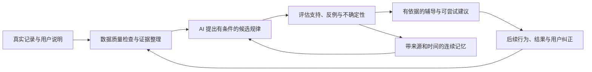

# 动态用户理解与连续辅导：后续产品方向

> 日期：2026-09-28
> 状态：**产品方向已确认；新增能力待实现、待验收。**
> 决策：以持续证据形成、检验和修正对用户的理解；AI 开放生成候选规律，统计与领域逻辑评估证据，Graphiti 组织相关经历和变化，Neo4j 支持关系查询，SQL 保存规范记录。
> 执行顺序与阶段状态以[路线图](../../roadmap.md)为准；开发任务见[实施计划](../plans/2026-09-28-dynamic-user-understanding-plan.md)。

## 1. 产品目标与适用范围

Mnemox 后续应能结合学习和任务数据，发现没有预先枚举的行为倾向，理解它们在什么条件、什么时间范围内适用，再通过新的经历与反馈修正判断。用户得到的是越来越细致、可以纠正的个性化辅导。

番茄钟只是示例。可参与分析的数据包括任务、目标、计划、学习会话、练习与复习结果、错题、费曼讲解、笔记、复盘、辅导对话和建议反馈。数据范围由具体问题、用户数据归属和现有授权决定；有数据不等于必须全部交给一次模型调用。

核心闭环：

第一条产品流程是动态学习节奏与连续辅导：从番茄钟、关联任务、复盘和建议结果出发，发现一个值得尝试的调整，记录执行情况，再在后续辅导中检验和更新。它是贯通流程的起点，不限制以后发现的规律种类。

## 2. 已确认的设计原则

1. **特性可以开放发现。** 不预设一份封闭的“自律型、拖延型、视觉型”等人格标签清单。可扩展的指标和证据类型用于检验假设，不限制 AI 只能发现预写规则。
2. **所有判断都有适用时间与条件。** 相对稳定表示当前证据较充分，不代表永久成立。工作日与周末、不同目标或任务类型下的规律可以并存。
3. **可信程度按每条判断评估。** 使用 7 天、1 个月或 1 年均不是自动升级门槛；需要考虑有效样本、时间覆盖、场景覆盖、数据质量、支持与反例。
4. **数据积累帮助减少随机波动，但不能自动消除偏差。** 一直只在晚上记录，不能据此推断晚上优于早上；多次复制同一事件也不是多份独立证据。
5. **保留长期背景，同时响应近期变化。** 对近期与历史分别评估，持续新证据可以缩小、削弱或替代旧判断。证据不足或长期未再观察时，允许返回未知或暂不适用。
6. **事实、用户自述、观察和假设分开。** AI 推测和用户认同均不能直接证明因果关系，也不能自动提高概念掌握度。
7. **发现与验证分开。** 用于提出规律的数据不能同时被当成独立验证；后续记录和预留的时间段用于检验，反例必须参与评估。
8. **先采用轻量方法。** 优先保证数据、证据和反馈可靠，再按实际误判引入更复杂模型。模型数量不作为完成标准。

## 3. 产品场景与技术承担的工作

| 场景 | 期望用户结果 | 主要工作 |
| --- | --- | --- |
| 动态学习节奏 | 理解近期什么条件下更容易投入或中断，尝试合适的时长与安排 | SQL 计算记录与结果；AI 理解背景；Graphiti 关联阶段变化和历史尝试 |
| 连续辅导 | 跨会话接续上次卡点，记得已尝试的解释与已解决的问题 | Graphiti 从选定经历构建和检索关联记忆，响应前核验 SQL 来源 |
| 学习方法效果 | 了解某种方法在哪些内容和阶段有帮助的迹象 | 比较后续直接学习证据，保留条件与不确定性；不固化学习风格标签 |
| 计划估时与启动阻力 | 发现低估耗时、任务不明确等可能影响执行的因素 | 分析任务与实际行动，检验拆分任务或明确第一步后的表现 |
| 辅导方式适应 | 根据执行结果和反馈调整提醒时机、建议长度与难度 | 复用 Coach 归因和偏好机制，区分喜欢建议与建议实际有效 |
| 知识补弱路径 | 从错题排查前置知识，安排诊断、补习与重测 | Neo4j 查询知识路径，SQL 叠加学习证据；图关系提供线索，诊断验证缺口 |
| 学习恢复与目标变化 | 中断后知道从哪里继续，目标变化后重新筛选旧建议 | 关联目标、未完成事项、历史卡点和适用时间，生成可确认的下一步 |
| 阶段复盘 | 看见哪些观察有证据、哪些只是猜测、哪些判断已被修正 | 汇总版本化判断和原始依据，允许用户纠正、忽略和删除 |

图组件的价值按上述任务是否得到改善、实现与维护成本是否合理来评估。相同 SQL 查询的延迟比较继续有用，但不单独决定新增产品能力的价值。

## 4. 当前代码基础与缺口

以下是 2026-09-28 的代码核查，不表示目标功能已经实现：

| 现有基础 | 证据入口 | 仍需补齐 |
| --- | --- | --- |
| 番茄钟已有任务/章节、时长、停止原因、备注及 Coach 行动关联 | [Pomodoro 模型](../../../backend/app/models/pomodoro.py) | 分析用统一时间与实际时长口径，完整结果关联和数据覆盖说明 |
| 画像已计算时长、完成率、近期趋势与活动时段 | [ProfileService](../../../backend/app/services/profile_service.py) | “最佳时段”主要按完成数量选取；不能作为学习效果或因果结论，需改为准确的活动描述 |
| 事件聚合可生成记忆候选 | [Agent 记忆学习服务](../../../backend/app/services/agent_memory_learning_service.py) | 目前主要为预写聚合规则，缺少开放假设、反例、独立验证和动态评估链 |
| Coach 已有建议反馈和行动归因 | [反馈服务](../../../backend/app/services/coach_learning_service.py)、[行动服务](../../../backend/app/services/coach_action_attempt_service.py) | 将假设版本和适用背景连接到建议与后续结果 |
| SQL 记忆声明已有审核、时间、纠错与失效 | [时态记忆 ADR](2026-08-23-temporal-memory-lifecycle-adr.md) | 行为假设独立于已确认事实建模，避免未经验证推测进入事实主链 |
| Neo4j 已有可选 GraphStore、学习路径与回退 | [GraphStore](../../../backend/app/services/graph_store/base.py) | 让知识路径进入日常诊断、任务与重测流程 |
| Graphiti 产品切片为已审核声明的 model-free 投影与时态查询 | [现有服务](../../../backend/app/services/graphiti_temporal_service.py) | 主产品尚无完整 episode 抽取、增量维护、跨会话辅导检索及假设演变集成 |

现有 SDK 安装和真实图数据库集成测试说明基础接入可运行，不证明新功能有效。现有 Stage 7 的 BM25/SQL 对照也没有覆盖本决策要求的完整连续辅导任务。

## 5. 最小领域契约

以下定义逻辑对象，不要求第一版为每个对象新建一张表；具体迁移应优先复用现有领域与任务设施。

### 5.1 经历和证据

每份证据至少能定位当前用户的来源类型、记录 ID、版本、发生时间和系统记录时间，并说明其属于客观记录、用户自述、直接学习结果或派生观察。统计观察保存计算方法、分析窗口和输入版本，能够重算。

一次会话的开始/结束事件、聊天摘要、周报和图抽取结果可能来自同一经历，必须保留共同来源，不能累加成独立支持。模型自己生成的判断或建议也不能成为证明该判断成立的新证据。

分析输入应明确缺失、截断、排除的 Demo/模拟数据、未知时区和不可解释的历史数据；不把没有记录等同于没有学习。

### 5.2 候选规律与评估记录

每条候选规律需要：

- 稳定身份、用户归属、版本和自然语言描述；不要求落入固定人格类别。
- 适用任务/目标/场景条件、观察时间范围、最近评估时间及复查条件。
- 支持证据、反对证据和当前未知项；保存来源引用而非模型自由编造的引用。
- 样本和覆盖摘要，包括原始数量、去重后的经历数量、时间/场景覆盖，以及不足原因。
- 提出该假设的模型/提示版本、评估方法版本；数字估计存在时同时保存估计对象、假设条件和不确定性。
- 前一版本与修订原因；能解释是新增支持、反例、情境变化、用户纠正还是来源失效。
- 可以观察的后续信号。暂时无法操作化、没有可检验证据的猜测保留为未验证，不升级为可靠规律。

生命周期采用“候选、观察中、有较充分支持、存在争议、待复查、已替代、已撤回”等可修订状态；这些状态表示证据和适用性，不表示人格被确认或因果已证明。用户审核状态另存，不能与统计支持程度混成一个分数。

可自动保存派生观察和候选假设，并以估计身份展示。它们不因此成为 `MemoryDeclaration` 的 confirmed fact；对目标、任务、日计划、笔记和已确认事实的写入继续遵守现有领域确认规则。不能要求用户逐条审核所有统计观察才能使用功能。

### 5.3 时间与冲突

“工作日晚上更易中断”和“周末晚上能持续投入”在条件不同的情况下可以并存。同条件下出现新反例，先调整支持程度或标记争议，不由最后一句话直接覆盖全部历史。

当前查询只使用仍适用且来源可见的版本；历史查询能区分“事情何时发生”和“系统何时得知”。纠错、来源更新/删除后重新评估受影响的判断；历史保留不能绕过用户删除，必要时只保留不含正文的审计标记。

## 6. 数据分析与模型选择

### 6.1 第一版必须处理的质量问题

- 去重和计量单位统一，区分计划时长、实际时长、完成与提前结束；按用户 IANA 时区构建分析窗口。
- 修复明确的数据错误；对真实异常保留背景。忘关计时器与一次真实长时间投入不能按同一规则删除。
- 按任务类型、难度和条件比较；学习时间长短不能单独证明效率、情绪或掌握度。
- 中位数、分位数等可用于减少极端值对汇总的影响，但同时保留分布与变化信号。
- 不以页面点击量、衍生摘要数量或重复提醒次数充当独立样本。

### 6.2 不确定性与变化

对完成率等定义清楚的指标，可比较区间估计或贝叶斯更新等轻量方法；采用前说明样本依赖、先验和适用范围。自由文本特性先显示证据强弱与限制，未经校准不得生成貌似精确的“性格准确率”。

对变化先比较近期与长期窗口，可采用可解释的时间衰减；窗口、权重和升级标准由回放与真实观察校准并记录版本，不能写死“满 30 天就可信”。同时保留长期信息，避免一次异常就重写画像。

开放探索会产生偶然相关。控制候选数量、合并同源假设、保留没有得到支持的结果，并用后续时间段验证；正式统计检验需要处理多重比较。不能只保留成功案例，再宣称发现能力很强。

### 6.3 文本与情感分析

先使用现有 AI 提取困难、尝试、结果、用户明确表达的感受与背景，每项回链原文并允许未知。语气积极/消极只是线索，不直接代表真实心理状态或稳定特性。

第一版不以独立情感分类器、专门模型训练、复杂时序预测、聚类人格或在线 bandit 为前置依赖。出现可复现的错误类型、成本或延迟瓶颈后，才比较候选方法，并要求真实任务质量或成本收益优于基线。这里的“学习用户”首先是记忆与判断的更新，不等于训练个人大模型。

## 7. SQL、AI、Graphiti 与 Neo4j 的职责

| 层 | 负责 | 不承担 |
| --- | --- | --- |
| SQL 与原始文件 | 规范记录、来源版本、候选与评估历史、事务、审核、权限、删除、结果归因 | 用固定画像字段概括所有可能的行为特性 |
| 统计与领域逻辑 | 可复算指标、样本/覆盖检查、不确定性、生命周期和建议约束 | 把相关性直接当作因果或掌握度 |
| AI | 理解语义、提出候选规律、组织解释与辅导 | 无证据给出确定判断、凭自报置信度确认事实 |
| Graphiti | 从筛选后的文本/JSON episode 抽取与关联经历，检索跨会话记忆，组织时间变化与来源 | 自动决定假设是否成立、成为用户事实唯一副本 |
| Neo4j | 承载相应图投影，执行关系和知识路径查询 | 替代 SQL 的业务事务或把图路径当作错误原因的证明 |

### 7.1 Graphiti 新切片边界

新能力扩展的是 episode 和连续辅导场景。现有 [Stage 7 V1 合同](2026-09-04-mnemox-v2-graphiti-temporal-slice-contract.md)仍约束当前已审核事实的 model-free 接口；不通过放宽旧过滤器把未验证假设塞进事实查询。

新切片须显式区分用户、来源、对象种类和版本，对事实与假设采用明确的查询隔离。输入选择有意义的会话、用户说明、阶段观察及结果，不能逐秒上传计时器或默认全量摄入历史聊天。

自动抽取结果先作为可追溯的派生候选，持久保存来源映射、模型版本和采用的结果；图投影可以从规范输入及已保存结果重建。重新调用模型得到的不同结果是新候选版本，不能伪装成同一次确定性重建。采用的实体映射或假设关系不能只存在于图中。

增量更新复用已有 outbox/任务机制，具备幂等、来源版本校验、重试、删除及可观察的就绪状态。读取时回 SQL 检查归属、版本、删除与假设状态，防止旧投影继续提供失效结论。图失败时保留 SQL 基础记录和现有辅导，明确降低的能力。

接入真实抽取、embedding 或重排时，分别记录模型调用、用量、预算与失败。复用现有 AI 配置和凭据边界；SDK 默认安装不等于开启这些调用。新切片按独立能力开关推进，不自动启用既有部署。

### 7.2 Neo4j 的用户功能

优先复用已有知识路径实现，形成“错题或卡点 → 可能的前置缺口 → 诊断 → 补习任务草案 → 重测”的流程。候选路径受类型、方向、深度和结果数量限制，来源和掌握状态回 SQL 核验。最短图路径不自动等于最佳学习路径。

行为假设与知识 Claim/先修边分开表达；同一图后端承载它们不意味着语义可以混用。高级路径不可用时明确显示能力限制，不宣称 SQL 基础回退具有同等图能力。

## 8. 功能验收与效果验证

| 验收场景 | 必须观察到的结果 |
| --- | --- |
| 少量记录或没有数据 | 允许不形成判断；展示估计和不足，不贴确定标签 |
| 同一会话产生多条事件/摘要 | 不重复累计独立支持，来源能回溯 |
| 记录多但场景单一 | 限定适用范围，不因总量大就泛化到未知场景 |
| 相近条件下持续支持并经过后续验证 | 判断可增强，并解释支持来自哪些新增经历 |
| 新反例或真实状态变化 | 降低支持、缩小范围或创建修订；保留符合删除规则的历史 |
| 不同任务下相反表现 | 条件分开，允许共存，不互相覆盖 |
| 用户纠正、资料修订或删除 | 当前辅导、候选、派生统计和图检索同步失效或重算，不能恢复已删除正文 |
| AI 生成无出处内容或重复旧判断 | 不成为新的客观证据，不自动强化自身结论 |
| 使用历史数据提出规律 | 后续时间段独立验证，不读取未来记录来生成过去判断 |
| 用户采纳建议 | 区分采纳、开始、实际完成及后续学习结果，不把点击当效果 |
| Graphiti/Neo4j/模型不可用 | 原始记录可保存，基础功能可用，增强结果与降级状态可区分 |
| 模型和真实图集成 | 真实小规模抽取、来源映射、时间查询、删除与重建通过；替身测试不代替质量验收 |

工程回放覆盖冷启动、重复、缺失、偏差、噪声、变化与故障。质量评测使用中文/双语真实或经授权脱敏的经历，区分抽取准确性、跨会话召回、过时判断引用、无依据判断、修正是否及时及成本；语义任务的人评与确定性回归分别记录。

按时间顺序评估：只使用当时已知的信息提出假设，再观察后续数据；有关联的同一会话不随意拆进训练与验证两侧。统计方法的假设和阈值先在开发集确定，独立验证集不反复用于调参。

与现有 SQL 统计和会话摘要形成可用基线，比较新增能力能否改善连续辅导、可解释性和实际行为。首批真实样本用于建立基线，随后在独立观察前登记目标、窗口和停止条件；不以任意的固定天数或合成集通过率代替效果证据。沿用建议执行率、中断恢复时长、复习按时率和有效学习时段数，并同时观察打扰反馈与成本。

## 9. 实施顺序与兼容

实施分为 DI-0 数据与评测契约、DI-1 候选规律和动态评估、DI-2 Graphiti 连续记忆、DI-3 建议结果闭环与知识补弱、DI-4 长期质量与模型重评。具体状态只在[路线图](../../roadmap.md)维护。

相关数据可靠性问题先于个性化自动判断收口；[功能评估](../../project-functional-assessment-2026-09-28.md)指出的时区、计划覆盖与任务完成一致性等，应在用作证据前核实和修复。旧数据保留质量标记，Demo/模拟数据不计入用户效果评估。

历史画像分数保留兼容读取，但不能自动升级为已验证特性或新判断的独立证据。新增字段/表随实现提供 SQLite/PostgreSQL 迁移、回填与回滚；重建不能重新确认用户拒绝或已删除的内容。关闭增强功能后，规范记录仍可使用和导出。

2026-09-04 的图架构决策继续作为工程基础；本决策将后续目标明确为可被用户感知和验证的功能。旧的同类查询 benchmark 与默认关闭状态继续保留，不作为停止新场景实现的理由，也不构成默认启用的证明。

## 10. 方法与能力参考

- [Graphiti Overview](https://help.getzep.com/graphiti/getting-started/overview)：增量 episode、时态关系、来源与混合检索的能力依据；不替代本项目的判断评估逻辑。
- [NIST：比例的区间估计](https://itl.nist.gov/div898/handbook/prc/section2/prc241.htm)：明确指标的小样本不确定性参考，采用前需核实样本假设。
- [NIST：指数加权移动平均](https://www.itl.nist.gov/div898/handbook/pmc/section3/pmc324.htm)：时间权重方法参考，不直接照搬工业控制阈值判断用户状态。
- [scikit-learn：时间序列验证](https://scikit-learn.org/stable/modules/cross_validation.html#time-series-split)：按时间验证、避免未来信息泄漏的参考。
- [Hugging Face：文本分类](https://huggingface.co/docs/transformers/tasks/sequence_classification)：情感标签的任务边界，不将积极/消极分类等同于学习状态。
