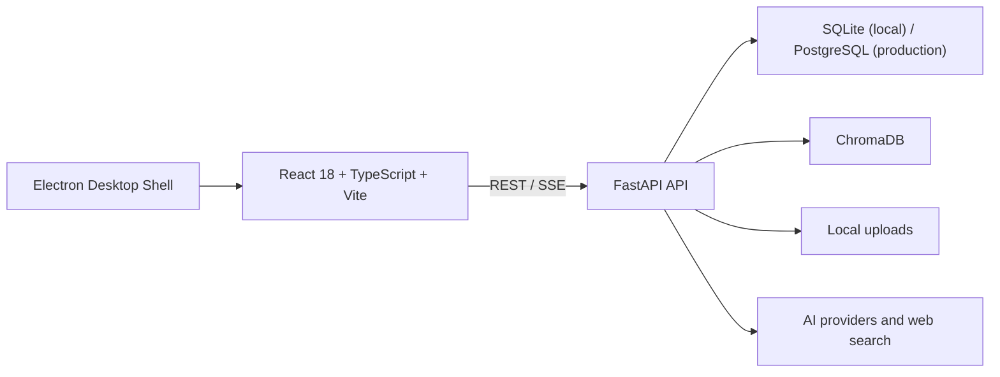

# Mnemox 技术基线

> 状态：维护中  
> 基线日期：2026-07-11  
> 当前版本：v1.3.0  
> 代码范围：`main` 分支

本文件描述当前仓库中已存在的技术实现、运行边界和维护约定。历史方案位于 `docs/superpowers/` 和其他设计文档中；它们用于理解决策过程，不应替代本技术基线。

## 1. 系统概览

Mnemox 是一个本地优先的 Web 应用，并提供 Windows Electron 桌面壳。



### 运行单元

| 目录 | 作用 | 关键入口 |
| --- | --- | --- |
| `frontend/` | React 学习工作台 | `src/main.tsx`、`src/App.tsx` |
| `backend/` | FastAPI API、学习业务与 AI 集成 | `app/main.py` |
| `desktop/` | Windows Electron 壳、更新与通知桥接 | `src/main.js` |
| `data/` | 本地 SQLite、上传文件、向量相关数据 | 运行时生成，不提交真实用户数据 |
| `release-manifest/` | 应用内更新清单 | `latest.json` |
| `scripts/` | 打包、发布、演示数据等维护脚本 | PowerShell/Python 脚本 |

## 2. 技术栈

| 层级 | 当前技术 |
| --- | --- |
| 前端 | React 18、TypeScript 5、Vite、React Router 6、Ant Design、Zustand |
| 前端数据与内容 | Axios、Dexie/IndexedDB、ECharts、Toast UI Editor、react-markdown、KaTeX |
| 后端 | Python 3.10+、FastAPI、Uvicorn、Pydantic Settings |
| 数据 | SQLAlchemy 2 Async、SQLite、PostgreSQL/asyncpg、Alembic |
| AI 与 RAG | OpenAI、Anthropic、Google GenAI、LlamaIndex、ChromaDB |
| 文件与分析 | PyPDF2、python-docx、pandas、NumPy、SciPy、openpyxl |
| 桌面端 | Electron、electron-builder、electron-updater |
| 测试 | pytest、pytest-asyncio、Vitest、Node test runner |
| 交付 | Docker Compose、Windows NSIS 安装包、GitHub Release 配置 |

## 3. 后端架构

### 3.1 应用入口与中间件

`backend/app/main.py` 创建 FastAPI 应用并负责：

- 应用启动和关闭时的数据库初始化、目录准备和资源清理。
- Episodic Memory 衰减。
- RAG 初始化与空向量库时的后台索引。
- CORS、速率限制、请求大小限制和安全响应头。
- 请求参数校验错误的中文友好提示。
- 已认证上传文件的安全读取，以及可选的前端静态站点托管。

### 3.2 API 组织

当前后端包含 28 个路由模块，按 `/api/*` 前缀组织。主要领域如下：

| 领域 | 路由模块 |
| --- | --- |
| 身份与系统 | `auth`、`system`、`images` |
| 对话与 AI | `chat`、`conversations`、`chat_projects`、`ai_settings`、`prompt_templates` |
| 学习内容 | `materials`、`rag`、`notes`、`obsidian_import` |
| 计划与执行 | `goals`、`plans`、`study_sessions`、`pomodoro` |
| 练习与复习 | `wrong_questions`、`review`、`anki` |
| 洞察与画像 | `learning`、`analytics`、`profile`、`memory`、`motivation`、`interventions` |
| Agent 与 Coach | `agent`、`agent_memory`、`coach` |

路由应保持薄：鉴权、请求/响应模型、状态码和领域调用可留在路由层；可复用业务规则、事务编排和 AI/RAG 集成应位于 `app/services/` 或 `app/ai/`。

### 3.3 数据与服务

- `app/models/`：当前有 22 个数据模型模块，覆盖用户、资料、章节、目标任务、学习事件、聊天、记忆、复习、Agent、Coach 等领域。
- `app/services/`：当前有 26 个服务模块，处理用户画像、事件、记忆、搜索缓存、笔记上下文、Agent 学习、Coach 策略和检索等。
- `app/ai/`：多模型 Provider、模型路由、Prompt 组装、RAG、搜索和错误归一化。
- `app/agents/`：Agent 运行时抽象；业务上与 `agent`、`agent_memory`、`coach` 路由及相关服务协作。

### 3.4 数据流

```text
用户操作
  -> 前端 service API client
  -> FastAPI router
  -> service / AI / RAG
  -> SQLAlchemy 数据模型、ChromaDB 或上传文件
  -> 学习事件、记忆、画像与 Coach 策略
  -> REST 或 SSE 返回前端
```

聊天完成后的摘要、记忆、反思、错题检测和学习事件采用分阶段处理。某一后处理失败不能删除已保存的对话内容。

## 4. 前端架构

### 4.1 页面与导航

主业务页面位于 `frontend/src/pages/`，当前包含对话工作台、Dashboard、番茄钟、错题、复习、目标任务、计划、笔记、记忆、掌握度、进度引擎、用户画像、Prompt、EDA、干预、Agent 和 Anki。

除 `/login` 外，路由通过 `ProtectedRoute` 保护。主工作区布局由 `components/Layout/ObsidianLayout.tsx` 与相关导航、侧栏、今日聚焦组件组织。

### 4.2 前端数据边界

- `services/`：唯一的后端 API 调用入口。`apiClient.ts` 负责 Bearer Token、通用错误处理与 401 清理。
- `stores/`：Zustand 管理认证、聊天、番茄钟和主题等跨页面状态。
- `db/studyDb.ts`：Dexie 本地数据表定义。
- `sync/`：同步引擎、队列和模块适配器。当前离线优先范围包括笔记、目标、目标任务、错题和 Anki 卡片。
- `hooks/`：离线优先业务 Hook。

新增接口不应直接在页面中散落 `fetch` 调用；新增离线实体需同时定义本地表、入队逻辑、同步适配器、失败状态和用户可见的处理方式。

## 5. AI、RAG 与 Agent 边界

### 5.1 多模型与搜索

AI 设置支持 OpenAI、Claude、Gemini、DeepSeek/Qwen 及 OpenAI-compatible 服务，并可为聊天、复习、错题、Agent 和 Embedding 等场景配置路由。联网搜索可走 provider hosted search、Tavily、应用层搜索，并在失败时回退到 DuckDuckGo/Bing。

### 5.2 RAG 降级策略

RAG 使用 LlamaIndex 与 ChromaDB 进行语义检索。Embedding 或向量服务不可用时，资料上传与问答不应返回 500，而应使用关键词检索降级。前端仍需把当前是否处于降级状态清楚地告知用户。

### 5.3 笔记上下文

聊天会通过 `note_context_service` 从当前用户的笔记中按关键词、标题、标签和更新时间检索最多三条相关摘录。摘录经过 `wrap_untrusted_context` 包装，并限制在 1,800 字符预算内；检索异常会被降级为无笔记上下文的正常聊天。流式接口以 SSE 返回参考笔记指示器，前端只提示本轮参考来源。

### 5.4 Agent 与 Coach

- Agent 汇总目标、今日任务、逾期任务、复习、错题、笔记、用户画像和记忆，输出行动建议或写入草案。
- 长期记忆分为可审核候选、已确认、锁定、忽略等状态；敏感或主观推断应进入用户审核。
- Coach 使用事件、用户偏好、每日上限、冷却和反馈统计选择是否触达及以何种渠道触达。
- Agent/Coach 的推荐必须能给出证据和风险理由；写入类操作必须走草案确认。

## 6. 安全基线

1. 所有领域查询、详情、更新和删除都必须按 `current_user.id` 或可验证的用户归属过滤。
2. 上传目录访问必须要求认证，并确保解析后的路径位于允许的上传根目录内。
3. `.env`、数据库、真实上传内容、ChromaDB 数据、日志和真实密钥均不得提交。
4. AI Key 与搜索 Key 只可在后端配置/加密存储，不应存入浏览器持久化数据。
5. 资料、笔记、搜索结果、工具返回值应作为不可信内容包装，禁止其改变系统策略、工具权限或确认流程。
6. 公开部署前需设置随机 `SECRET_KEY`、关闭 `DEBUG`、收紧 `CORS_ORIGINS`，并补充速率限制、审计和恶意文件扫描策略。

## 7. 本地开发与交付

### 7.1 开发运行

```powershell
# 后端
cd backend
pip install -r requirements-dev.txt
python -m uvicorn app.main:app --reload --host 0.0.0.0 --port 8000

# 前端（另开终端）
cd frontend
npm install
npm run dev -- --host 0.0.0.0 --port 5173
```

Docker 场景使用根目录 `docker-compose.yml`。Windows 本地体验可使用根目录 `start.bat` 或 `start.ps1`。

### 7.2 验证命令

```powershell
# 后端
cd backend
python -m pytest -q

# 前端
cd frontend
npm test
npm run build
npm run lint

# 桌面端
cd desktop
npm test
```

发布前还应执行 `git diff --check`，并验证版本号、发布清单和桌面安装包资产保持一致。

## 8. 当前技术债与优化方向

| 优先级 | 事项 | 原因 |
| --- | --- | --- |
| P0 | 多用户越权审计与回归测试 | 产品存在多领域详情、写入和文件访问接口，必须持续验证资源归属。 |
| P0 | 统一 Prompt Injection 防护 | RAG、笔记、搜索和工具返回均会进入模型上下文。 |
| P0 | RAG 状态前端可见化 | 当前后端已可降级，用户仍需知道回答是否基于语义检索。 |
| P1 | 拆分超大模块 | `learning`、`analytics`、Agent/Coach 相关实现的复杂度持续上升。 |
| P1 | 独立 token 预算 | 聊天历史、RAG、记忆和搜索内容需要明确的上下文配额。 |
| P1 | 离线冲突处理 UI | 现有同步队列可重试，但服务端与本地并发修改的用户决策仍需完善。 |
| P1 | 后台任务与可观测性 | 长耗时索引、AI 处理、重试需要结构化日志、状态和失败可视化。 |
| P2 | Alembic 迁移规范收敛 | 生产数据库升级应避免依赖 `create_all` 或临时迁移。 |
