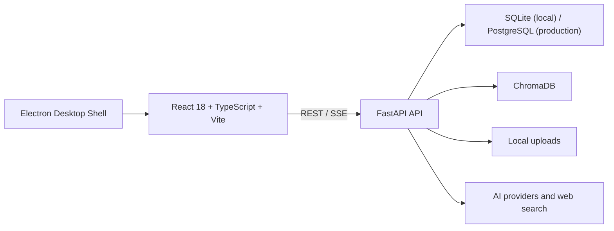
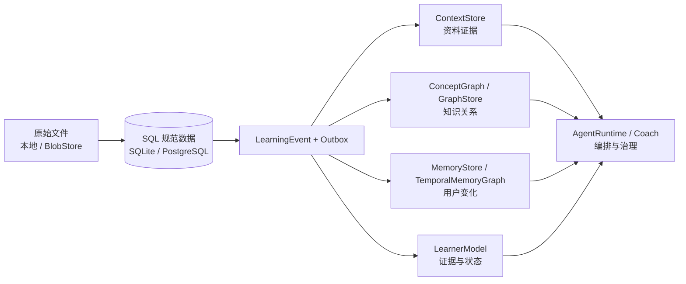

# Mnemox 技术基线

> 状态：维护中
>
> 基线日期：2026-08-22
>
> 当前发布版本：v1.3.0
> 代码范围：post-v1.3 统一开发基线；包含 `RetrievalRouter`、资料 SQL 检索投影、Chroma 生命周期、可审核 SQL 概念图谱、版本化来源、人工身份治理、先修缺口、强弱证据融合、可解释推荐、projection outbox、ContextStore、Coach 联想归因、Vault 安全和 SQL 记忆声明。AgentKernel 仍为多步只读原型，不代表 Phase 2 启动。

本文件描述当前仓库中已存在的技术实现、运行边界和维护约定。历史方案位于 `docs/superpowers/` 和其他设计文档中；它们用于理解决策过程，不应替代本技术基线。

面向下一阶段的目标架构与候选技术边界见 [2026-08-03 学习智能底座架构决策](superpowers/specs/2026-08-03-learning-intelligence-foundation-architecture.md)（混合 RAG、概念图谱、时态记忆、学习者模型与 AgentRuntime）；执行顺序见 [路线图](roadmap.md)。本文件只把已合入或已验证的能力写入“当前实现”；未提交原型、待迁移能力和实验性方案必须明确标注状态。

## 1. 系统概览

Mnemox 是一个本地优先的 Web 应用，并提供 Windows Electron 桌面壳。



### 运行单元

| 目录 | 作用 | 关键入口 |
| --- | --- | --- |
| `frontend/` | React 学习工作台 | `src/main.tsx`、`src/App.tsx` |
| `backend/` | FastAPI API、学习业务与 AI 集成 | `app/main.py` |
| `desktop/` | Windows Electron 壳、更新与通知桥接 | `src/main.js` |
| `data/` | 本地 SQLite、上传文件、向量相关数据 | 运行时生成，不提交真实用户数据 |
| `release-manifest/` | 应用内更新清单 | `latest.json` |
| `scripts/` | 打包、发布、演示数据等维护脚本 | PowerShell/Python 脚本 |

## 2. 技术栈

| 层级 | 当前技术 |
| --- | --- |
| 前端 | React 18、TypeScript 5、Vite、React Router 6、Ant Design、Zustand |
| 前端数据与内容 | Axios、Dexie/IndexedDB、ECharts、Toast UI Editor、react-markdown、KaTeX |
| 后端 | Python 3.10+、FastAPI、Uvicorn、Pydantic Settings |
| 数据 | SQLAlchemy 2 Async、SQLite、PostgreSQL/asyncpg、Alembic |
| AI 与 RAG | OpenAI、Anthropic、Google GenAI、LlamaIndex、ChromaDB |
| 文件与分析 | PyPDF2、python-docx、pandas、NumPy、SciPy、openpyxl |
| 桌面端 | Electron、electron-builder、electron-updater |
| 测试 | pytest、pytest-asyncio、Vitest、Node test runner |
| 交付 | Docker Compose、Windows NSIS 安装包、GitHub Release 配置 |

## 3. 后端架构

### 3.1 应用入口与中间件

`backend/app/main.py` 创建 FastAPI 应用并负责：

- 应用启动和关闭时的数据库初始化、目录准备和资源清理。
- Episodic Memory 衰减。
- RAG 初始化、缺失资料投影补建，以及失败索引/删除墓碑的启动恢复。
- CORS、速率限制、请求大小限制和安全响应头。
- 请求参数校验错误的中文友好提示。
- 已认证上传文件的安全读取，以及可选的前端静态站点托管。

### 3.2 API 组织

当前后端包含 31 个路由模块，按 `/api/*` 前缀组织。主要领域如下：

| 领域 | 路由模块 |
| --- | --- |
| 身份与系统 | `auth`、`system`、`images` |
| 对话与 AI | `chat`、`conversations`、`chat_projects`、`ai_settings`、`prompt_templates` |
| 学习内容 | `materials`、`rag`、`notes`、`obsidian_import` |
| 计划与执行 | `goals`、`plans`、`study_sessions`、`pomodoro` |
| 练习与复习 | `wrong_questions`、`review`、`anki` |
| 洞察与画像 | `learning`、`analytics`、`profile`、`memory`、`motivation`、`interventions` |
| Agent 与 Coach | `agent`、`agent_memory`、`coach` |
| 学习者模型 | `learner_model`（状态、证据、人工修正、重算与投影重放） |

路由应保持薄：鉴权、请求/响应模型、状态码和领域调用可留在路由层；可复用业务规则、事务编排和 AI/RAG 集成应位于 `app/services/` 或 `app/ai/`。

### 3.3 数据与服务

- `app/models/`：当前有 25 个数据模型模块，覆盖用户、资料、章节、目标任务、学习事件、学习证据/概念状态、聊天、记忆、复习、Agent、Coach 等领域。
- `app/services/`：当前有 46 个服务模块，处理用户画像、事件、学习者模型、概念图谱、推荐、投影、记忆、搜索缓存、笔记上下文、Agent 学习、Coach 策略和检索等。
- `app/ai/`：多模型 Provider、模型路由、Prompt 组装、RAG、搜索和错误归一化。
- `app/agents/`：Agent 运行时抽象；业务上与 `agent`、`agent_memory`、`coach` 路由及相关服务协作。

### 3.4 数据流

```text
用户操作
  -> 前端 service API client
  -> FastAPI router
  -> service / AI / RAG
  -> SQLAlchemy 数据模型、ChromaDB 或上传文件
  -> 学习事件、记忆、画像与 Coach 策略
  -> REST 或 SSE 返回前端
```

聊天完成后的摘要、记忆、反思、错题检测和学习事件采用分阶段处理。某一后处理失败不能删除已保存的对话内容。

## 4. 前端架构

### 4.1 页面与导航

主业务页面位于 `frontend/src/pages/`，当前包含对话工作台、Dashboard、番茄钟、错题、复习、目标任务、计划、笔记、记忆、掌握度、进度引擎、用户画像、Prompt、EDA、干预、Agent 和 Anki。

除 `/login` 外，路由通过 `ProtectedRoute` 保护。主工作区布局由 `components/Layout/ObsidianLayout.tsx` 与相关导航、侧栏、今日聚焦组件组织。

### 4.2 前端数据边界

- `services/`：唯一的后端 API 调用入口。`apiClient.ts` 负责 Bearer Token、通用错误处理与 401 清理。
- `stores/`：Zustand 管理认证、聊天、番茄钟和主题等跨页面状态。
- `db/studyDb.ts`：Dexie 本地数据表定义。
- `sync/`：同步引擎、队列和模块适配器。当前离线优先范围包括笔记、目标、目标任务、错题和 Anki 卡片。
- `hooks/`：离线优先业务 Hook。

新增接口不应直接在页面中散落 `fetch` 调用；新增离线实体需同时定义本地表、入队逻辑、同步适配器、失败状态和用户可见的处理方式。

## 5. AI、RAG 与 Agent 边界

### 5.1 多模型与搜索

AI 设置支持 OpenAI、Claude、Gemini、DeepSeek/Qwen 及 OpenAI-compatible 服务，并可为聊天、复习、错题、Agent 和 Embedding 等场景配置路由。联网搜索可走 provider hosted search、Tavily、应用层搜索，并在失败时回退到 DuckDuckGo/Bing。

### 5.2 统一检索与 RAG 降级

资料、笔记、概念、记忆和学习者状态通过 `RetrievalRouter` 进入主聊天、ChatAgent、AgentKernel 与 `/api/materials/search`。资料后端固定为 `Chroma dense + SQL keyword + RRF`，先按当前用户、项目和资料范围授权，再融合结果并按 L0/L1/L2 装载证据。Embedding 不可用时保留规范 SQL 分块与关键词召回；单个来源故障不应破坏其他来源或使资料上传返回 500。

`retrieval_projections` 记录用户、来源类型/ID、后端、来源版本、已索引版本、embedding/分块配置指纹、状态、错误、尝试次数和时间戳；`retrieval_projection_chunks` 保存带用户、来源版本、序号和内容哈希的可重建 SQL 分块清单。领域资料和原始文件是规范来源，SQL 分块与 Chroma 向量均是派生投影。

```text
上传 / 更新规范资料
    -> SQL 分块清单与来源版本提交
    -> Chroma 向量生成
    -> ready / degraded / failed

删除规范资料 + 删除墓碑
    -> SQL 分块同步清除
    -> Chroma 按 user_id + material_id 删除
    -> deleted；失败时保留 failed 墓碑供 retry
```

`RetrievalProjectionService` 提供 `ingest`、`refresh`、`prepare_forget`、`forget`、`retry`、`rebuild_user` 和 `forget_user`；资料更新替换旧清单与向量，配置变化将旧投影标记为降级，服务重启恢复中断的索引或删除。资料侧栏显示单条状态、错误和重试，AI 设置显示当前用户的聚合状态。若 manifest 哈希与当前 SQL 正文不一致，关键词检索直接回退规范正文。

固定语料位于 `backend/tests/fixtures/retrieval_eval_cases.json`。`backend/evaluate_retrieval.py` 离线评测 Recall@5/10、MRR、NDCG@10、平均/P95 延迟、用户隔离、删除残留、空查询和无 embedding 降级；常规 GitHub CI 对生产 hybrid 设置 Recall@5 不低于 `0.75` 的门禁。选型证据见 [检索生命周期与质量 ADR](superpowers/specs/2026-08-22-retrieval-lifecycle-quality-adr.md)。

### 5.3 笔记上下文

聊天笔记检索保留 `note_context_service -> ContextStore`，并作为 note source 纳入 `RetrievalRouter`。当前 `KeywordContextStore` 对用户 SQL 笔记按标题、标签和正文匹配；资料 source 已完成独立 SQL chunk 投影、Dense/Sparse 融合、版本更新、删除恢复和离线质量集，但笔记尚未迁移到相同持久化 manifest。摘录经过 `wrap_untrusted_context` 包装并受字符预算限制；笔记来源故障降级为正常聊天，流式接口以 SSE 返回参考指示器。

### 5.4 Agent 与 Coach

- Agent 汇总目标、今日任务、逾期任务、复习、错题、笔记、用户画像和记忆，输出行动建议或写入草案。
- 当前稳定主路径仍是规则简报与一次性 Planner；主线中的 AgentKernel 原型支持多步只读工具调用和执行日志，但尚未接入前端、SSE 或草案执行闭环，不能视为已替代 Planner。新增的 AgentRuntime v0 只在 PostgreSQL 服务端运行：用户明确开启定时评估后，低频检查复习积压，并把一条仍受 Coach 策略约束的建议放入 Agent 面板；它不做自动写入或网页推送。
- 长期记忆分为可审核候选、已确认、锁定、忽略等状态；敏感或主观推断应进入用户审核。
- 人工创建/修订和聊天提炼、会话反思、Agent 学习等自动路径都会写入 `MemoryDeclaration` 审计历史，保留来源、有效时间、置信度、审核状态、规则/模型版本和替代关系；`UserMemory` 继续承载当前产品投影。
- Coach 使用事件、用户偏好、每日上限、冷却和反馈统计选择是否触达及以何种渠道触达；`coach_action_attempts` 将一条建议和用户明确开始的行动关联起来。番茄钟开始/完成/中断、复习完成和已确认的日计划草案会写入真实领域事件并关闭该尝试；不能自动观察的动作只能由用户明确确认完成或放弃。建议回放返回触发、尝试和经过最小化的领域/Coach 事件时间线。
- Agent/Coach 的推荐必须能给出证据和风险理由；写入类操作必须走草案确认。

## 6. 目标学习智能底座（部分已实现）

本节是工程目标与真实实现状态的对照，不是当前部署拓扑。当前运行时仍是 SQLite/PostgreSQL、Chroma、关键词降级、SQL 概念表、`UserMemory` + `MemoryDeclaration` 和原生 Agent/Coach；Qdrant、Neo4j、Graphiti、LangGraph 均未被写入当前技术栈。学习者模型与记忆声明切片均使用 SQL 实现，不依赖任何候选组件。



### 6.1 规范数据与可重建投影

| 领域 | 当前实现 | 目标规范来源 | 允许的专用投影 |
| --- | --- | --- | --- |
| 资料与片段 | 上传文件、SQL `Material`、版本化 SQL chunk 清单和 Chroma | 原始文件 + SQL `Material` | `retrieval_projections`、SQL chunk 清单、Chroma 向量；均可按用户重建或删除 |
| 笔记 | SQL `Note` Markdown、标签、关联和 `source_path`；另有关键词检索路径 | SQL `notes`（Mnemox 内部原文、归属与更新时间） | `ContextStore` chunk/关键词/向量/摘要；概念关系与记忆候选仅作带来源派生数据 |
| 知识关系 | `concepts`、`concept_edges`、`concept_links`、`concept_aliases`、`concept_source_evidence`、`concept_audit_events` | SQL 中带用户归属、来源版本、置信度、审核状态和人工操作历史的概念图 | `GraphStore`（Neo4j 等，仅在真实 SQL 多跳不足后评估） |
| 长期记忆 | `UserMemory` 当前投影、带事实键/唯一约束/冲突审核/有效期的 `MemoryDeclaration` 审计历史、会话摘要与事件 | SQL 中带来源、有效时间、冲突处理、人工纠错和替代关系的记忆声明 | Graphiti 时态记忆图（仅在出现真实 SQL 能力缺口且 Spike 通过时评估） |
| 学习能力 | `learner_evidence` 不可变证据、`user_concept_state` 可重算状态；`Concept.mastery` 仅兼容读取 | SQL `learner_evidence` / `user_concept_state` | 分析视图/缓存；不得把状态只留在图或向量库 |
| Agent 运行 | Planner、AgentJob、草案确认 | SQL 中的运行、草案、确认和审计记录 | LangGraph checkpoint 等运行态存储（若 Spike 通过） |

所有投影必须记录 source/version/namespace、幂等键、消费状态和错误。用户删除、资料更新或权限变更先更新规范来源，再由 outbox 刷新或清除投影；投影可从 SQL 和原始文件重建。

### 6.2 目标领域接口

| 接口 | 负责的能力 | 当前状态 |
| --- | --- | --- |
| `BlobStore` | 原始文件、版本、删除与读取授权 | 需要从现有本地上传抽象出来 |
| `RetrievalRouter` / `ContextStore` | 跨来源查询、范围过滤、混合召回、分层加载、删除 | Router 已统一资料/笔记/概念/记忆/学习状态；资料具备版本化 SQL/Chroma 投影和完整生命周期；笔记仍使用可降级 SQL ContextStore |
| `ConceptGraph` / `GraphStore` | 关系维护、来源、邻域/路径查询、人工修正 | SQL 图谱已存在；独立图存储尚未评估 |
| `MemoryStore` / `TemporalMemoryGraph` | 记忆声明、时间有效性、冲突/失效、相关记忆检索 | SQL 已覆盖事实唯一性、冲突审核、确认替代、纠错原因、自动失效、全入口过滤和派生删除；筛选 episode 图投影只在真实需求成立后评估 |
| `LearnerModel` | 证据记录、状态聚合、遗忘风险、下一步建议 | `learner_model_service` 与 `learning_recommendation_service` 已完成强弱证据、练习计数、FSRS/目标/先修解释型推荐、API 和前端下钻；真实 holdout 校准待积累 |
| `AgentRuntime` | 运行、流式、暂停/恢复、取消与工具编排 | 原生 AgentKernel 原型存在；已交付 opt-in 的复习积压 server worker、最小运行记录与 Agent 面板 nudge，SSE/暂停恢复/通用工具编排和 LangGraph 对比仍未完成 |

接口只定义业务语义，不泄露 Qdrant、Neo4j、Graphiti 或 LangGraph 的类型到 Router/页面层。领域服务永远负责鉴权、权限过滤、草案确认、审计和业务事务。

### 6.2.1 笔记的三层存储与三阶段检索

笔记采用三层逻辑存储，不要求三套物理数据库：

1. SQL `notes` 是原始 Markdown、标题、标签、归属、关联和更新时间的规范来源。
2. `ContextStore` 承载可重建的 chunk、关键词/稀疏索引、向量、摘要和索引版本。
3. 概念关系、记忆候选和学习证据引用是独立派生数据，必须携带 `user_id + note_id + source_version`；不得覆盖原文或直接改写掌握度。

查询顺序固定为“路由与范围过滤 -> 混合召回 -> 重排与 L0/L1/L2 分层加载”。聊天笔记检索现已只依赖 `ContextStore`，当前 `KeywordContextStore` 直接查询 SQL，因此 `ingest/forget` 是幂等 no-op；这完成了接口边界和用户隔离的首条迁移，但不代表独立索引、Dense/Sparse 混合召回或更新/删除闭环已经完成。完整语义和剩余验收见 [2026-08-13 决策](superpowers/specs/2026-08-13-note-context-memory-architecture.md)。

目标生命周期：

```text
Note 写入/更新 + LearningEvent + outbox
  -> ContextStore ingest/refresh
  -> 可选概念关系与 staged 记忆候选

Note 删除/失效
  -> ContextStore forget
  -> 清理 chunk/向量/缓存
  -> 删除或失效来源派生数据
```

检索输出至少包含 `source_type=note`、`source_id`、标题、命中摘录、检索模式、内容/索引版本和降级状态。更新后不得召回旧版本，删除后不得在关键词、向量、缓存、图谱或未确认记忆候选中留下可检索残留。

### 6.3 学习证据与状态的当前切片

学习事件是原始事实，学习证据是可重放的模型输入，学习者状态是可再计算的派生结果。本轮已新增并通过 SQLite/Alembic 迁移验证：

```text
learner_evidence
  user_id, concept_id, evidence_type, evidence_category, dimension,
  score, reliability, source_event_id, observed_at,
  source_type, source_id, model_version, payload_version, payload

user_concept_state
  user_id, concept_id, mastery_estimate, confidence,
  forgetting_risk, attempt_count, correct_count, hint_count,
  mastery_dimensions, common_error_type,
  last_evidence_at, last_reviewed_at, next_review_at,
  manual_override, source_event_id, reliability, model_version,
  explanation_summary, updated_at
```

`learner_model_service` 将证据类型限制为直接证据（`answer`、`recall`、`explanation`、`application`、`hint_count`、`review_result`）、间接信号（`study_duration`、`study_frequency`、`repeated_question`、`interruption`、`recovery`）以及 `legacy_mastery` / `manual_override`。直接证据按可靠度和 90 天半衰期加权；通常 `score` 越高表示表现越好，`hint_count` 的原始分数则表示提示依赖度并在聚合时显式反转。间接信号只调整置信度和遗忘风险，解释摘要明确记录其影响，不能单独提高掌握度；答题、正确和提示计数从可回放证据重新派生。复习中心及错题复习共用 FSRS 优先调度，并在同一事务内回填 `review_result`。人工修正也写事件和证据，重算时保留直到用户明确清除。Graphiti 的记忆检索可以提供带来源的学习上下文，但不得写成唯一的 mastery 输入。

SQL 概念图额外保存别名、来源证据、审核状态和操作审计。资料创建/更新后，本地解析标题、定义、标记词、括号别名和明确先修箭头，不调用 LLM；自动结果处于 `pending`，只有人工确认后的节点与关系可以进入先修遍历和推荐。资料来源版本变化时清理旧摘录及仅由旧资料支持的自动关系；人工概念、其他来源及已有学习证据保持不变。概念支持改名、别名、合并、拆分、删除，合并迁移挂接、关系、来源、学习证据、错题和 outbox；所有关系校验当前用户并阻止先修环。

`learning_recommendation_service` 只读组合确认后的概念图、状态、活跃目标、错题和 FSRS 到期项，生成到期复习、先修补缺、无提示回忆、针对性练习和目标推进五类候选；固定公式为 `0.28×风险 + 0.20×目标 + 0.24×先修阻塞 + 0.16×错误 + 0.12×紧迫 - 0.12×疲劳`。每条建议提供中文原因、分项得分、证据 ID、目标、阻塞概念与 FSRS 来源，不直接执行用户数据写入。完整契约和 Neo4j no-go 见 [概念图谱与学习推荐 ADR](superpowers/specs/2026-08-22-concept-graph-learning-recommendations-adr.md)。

SQL 时态记忆以 `user_id + fact_key` 识别事实，并使用条件为 `review_status = 'confirmed' AND valid_to IS NULL AND fact_key != ''` 的部分唯一索引保证同一事实只有一条开放的已确认声明。自动矛盾值进入 `staged` 并关联 `conflicts_with_id`；旧事实在人工确认前保持生效。用户接受候选会在同一事务内关闭旧事实并设置 `supersedes_id`；拒绝、纠错和到期分别保留 `resolution_reason`。过期值在统一检索、聊天、Coach、Agent、反馈排序与学习快照的 SQL 入口均被过滤；用户纠错、删除、替代或失效会移除引用旧事实的 `agent_core_profile`。完整契约和 Graphiti 暂缓依据见 [SQL 时态记忆生命周期 ADR](superpowers/specs/2026-08-23-temporal-memory-lifecycle-adr.md)。

迁移 `20260804_01` 将每个既有 `Concept.mastery`（0–100）复制为可靠度 0.35 的 `legacy_mastery` 证据，并初始化同值的 `user_concept_state`；`20260804_02` 新增 `projection_outbox`，`20260804_03` 对已验证的 v1.3 SQLite 漂移做条件式对齐，`20260809_05` 新增 Outbox 运维状态，`20260812_06` 为未完成队列聚合新增部分索引；`20260816_07` 与 `20260816_08` 增加 Vault 稳定身份、同步状态和冲突候选，`20260816_09` 增加可审计记忆声明，`20260822_10` 增加资料检索投影及版本化 SQL chunk 清单，`20260822_11` 增加概念审核、别名、来源证据、操作审计及学习状态计数，`20260823_12` 增加记忆事实键、冲突关联、处理原因、历史重复清理和当前事实部分唯一索引，`20260826_13` 增加 Coach 建议开始与未继续的反馈统计，`20260826_14` 新增 Coach 行动尝试及番茄钟关联字段，`20260827_15` 增加账号会话版本与持久登录节流状态。SQLite 本地启动通过 lightweight migration 执行增量 DDL 和一次性回填，并用 `mnemox_lightweight_migrations` 记录状态；PostgreSQL 只通过 Alembic。

默认 SQLite 的 lightweight migration 与 Alembic 迁移链已覆盖到 head `20260827_15`。此前学习者模型收口备份为 `backend/data/backups/study-pre-slice-close-20260805-085415.db`，SHA256 `28AF023FD4950BE191389B57C097698653BC3E2AEB0937907B04CD0DD3221AB8`，与当时 `study.db` 一致。源库包含 16 个用户、19 条学习事件和 0 个概念，因此 legacy 证据和状态均为 0；outbox 也为 0，因为 schema 迁移不会为历史事件自动创建任务，历史投影必须显式触发 replay。早期步骤见 [数据库升级演练报告](database-rehearsal-2026-08-05.md)，当前备份、恢复和升级证据见 [PostgreSQL 发布演练报告](postgres-release-rehearsal-2026-08-28.md)。

一次性 PostgreSQL 16 演练库已从历史版本升级并验证 Phase 1 数据保留：用户、资料、笔记、概念和学习事件保留，可靠度 0.35 的 legacy 证据与状态按预期生成。CI 除启动 PostgreSQL 16 空库、验收真实 `SKIP LOCKED`、共享策略升级、双 worker exactly-once、独立心跳和 `alembic check` 外，还会从 `20260801_01` 写入固定历史数据，执行 custom-format dump/restore，再通过生产入口升级到代码 head 并核对数据。2026-08-28 当前部署的 `20260826_14` dump 已在一次性恢复库成功升级到 `20260827_15`，schema drift 为零且稳定数据量不变；临时库已删除，源库仍保持 `20260826_14`。正式发布窗口仍需在快照保护下显式升级源库，并核对生产数据、Vault、记忆声明、检索投影 schema 和回滚准备；生产回滚依赖升级前快照与应用版本同步回退，不使用自动 downgrade。

### 6.4 事件与投影流

目标写入顺序为“领域数据 + `LearningEvent` + `projection_outbox` 同一事务提交 -> 幂等消费者投影”。`record_learning_event` 现在会在同一 SQLAlchemy 事务中创建 outbox 行；`ProjectionOutbox` 具备用户/概念范围、幂等键、模型/载荷版本、`pending/processing/processed/failed` 状态、尝试次数、锁定时间、错误信息和可用时间。`projection_outbox_service` 支持重复消费、崩溃后回收、指数退避、按用户/概念/时间范围重放和状态重建；Review/Anki 完成复习会在请求事务内只消费对应 `source_event_id` 的投影，失败仍保留为可恢复 outbox 行。删除用户或概念会级联清理 outbox、证据和状态。

当前工作区已验证数据库原子幂等入队、所有可领取状态的最大重试限制、显式重放重置、概念级状态串行锁、525 条事件游标分页重放、跨用户/跨概念隔离和严格 API 输入边界。应用生命周期在 PostgreSQL 上会启动一个可配置 worker；一轮最多处理配置批量，但每条任务使用独立 session，在自己的事务内认领、投影并提交，避免多实例跨概念锁交叉，关闭数据库前优雅停止。全局 worker 直接以 PostgreSQL `FOR UPDATE SKIP LOCKED` 认领任务，使并发实例能跳过忙行并继续分配其他用户工作；认领后按用户排序取得 transaction advisory lock。用户范围 API/replay 先取得其用户 advisory lock，再领取行；其行锁冲突同样使用 `SKIP LOCKED` 跳过。SQLite/桌面端因仍保留请求内事件级消费而明确停用常驻 worker，避免无行锁数据库出现双消费者。`OUTBOX_WORKER_ID` 是可配置的逻辑前缀，每个运行时都会持久化独立的心跳 ID；受保护的 `/internal/outbox/metrics` 聚合未完成队列、跨实例活跃/轮询失败 worker、DLQ 和告警，不返回任务载荷或异常正文。`/health` 只返回不含主机标识和异常正文的本实例累计统计，并保留最近一次持久投影失败时间；SQLite 会标记 `sqlite_single_consumer`。真实 PostgreSQL 16 多实例门禁已在 GitHub CI 通过；正式生产升级仍是独立发布收口项目。

学习者模型 API 位于 `/api/learner-model`：概念状态及解释、分页/幂等证据、只读推荐、人工修正/撤销、单概念或批量重算、按用户/概念/时间范围重放，以及用户隔离的 outbox 入口均已提供。`/api/concepts` 同时支持详情、先修缺口、来源、审核、别名、改名、合并、拆分、删除及操作审计。前端 `/mastery` 展示掌握度、置信度、遗忘风险、练习计数、来源摘录、先修缺口、身份治理和建议原因，并区分直接、间接、人工和 legacy 证据。

### 6.5 受控候选技术

| 技术 | 定位 | 当前结论 |
| --- | --- | --- |
| Qdrant | 资料 dense+sparse+RRF 对照实验 | 真实 Qdrant Local 已验证隔离、删除、重建和 sparse fallback；原生 RRF Recall@5 `0.95` 低于现有 hybrid 的 `0.9833`，轻量词项重排仅追平。**No-go**：不进入生产依赖。 |
| Neo4j | `GraphStore` Spike 候选 | 只在多跳查询/图谱编辑需求证明 SQL 不足后评估；不自动增加桌面常驻服务 |
| Graphiti | `TemporalMemoryGraph` Spike 候选 | 只投影筛选后的状态变化；SQL 仍是记忆事实、审核和删除的来源 |
| LangGraph | `AgentRuntime` Spike 候选 | 必须通过持久化、SSE、确认式写入、恢复/取消、隔离、回放、降级和桌面分发验收 |
| LlamaIndex | 导入/文档处理编排 | 保留；不作为用户状态事实来源 |
| FSRS | 间隔复习调度 | 保留；回答“何时复习”，不回答“下一步学什么” |
| Cognee、Mem0 | 对照/设计参考 | 不作为核心依赖或事实来源 |
| LightRAG | 评估与策略参考 | 不进入运行时依赖 |
| Microsoft GraphRAG | 不适用 | 明确排除，不做 Spike |

## 7. 安全基线

1. 所有领域查询、详情、更新和删除都必须按 `current_user.id` 或可验证的用户归属过滤。
2. 上传目录访问必须要求认证，并确保解析后的路径位于允许的上传根目录内。
3. `.env`、数据库、真实上传内容、ChromaDB 数据、日志和真实密钥均不得提交。
4. AI Key 与搜索 Key 只可在后端配置/加密存储，不应存入浏览器持久化数据。
5. 资料、笔记、搜索结果、工具返回值应作为不可信内容包装，禁止其改变系统策略、工具权限或确认流程。
6. 公开部署前需设置随机 `SECRET_KEY`、关闭 `DEBUG`、收紧 `CORS_ORIGINS`，并补充速率限制、审计和恶意文件扫描策略。

## 8. 本地开发与交付

### 8.1 开发运行

```powershell
# 后端
cd backend
pip install -r requirements-dev.txt
python -m uvicorn app.main:app --reload --host 0.0.0.0 --port 8000

# 前端（另开终端）
cd frontend
npm install
npm run dev -- --host 0.0.0.0 --port 5173
```

Docker 场景使用根目录 `docker-compose.yml`。Windows 本地体验可使用根目录 `start.bat` 或 `start.ps1`。

### 8.2 数据库迁移

PostgreSQL 只允许通过 `python run_migrations.py` 管理 schema。迁移链由冻结的 v1.3 基线和 Phase 1 增量组成：空库直接升级；经过严格表/列指纹校验的无版本 v1.3 库先写入基线版本再升级；其他无版本库会失败退出，要求先备份并人工对齐，避免错误 `stamp`。当前 head 为 `20260827_15`。该入口会用 PostgreSQL session advisory lock 串行化 schema 指纹识别、可能的 baseline stamp 和 Alembic upgrade，因此多副本启动时后续副本会等待当前迁移完成；不得以直接 `alembic upgrade` 绕过该入口。Docker 在启动 Uvicorn 前执行该入口。应用生命周期在 PostgreSQL 上只校验 Alembic head，绝不执行 `create_all`。Alembic 自动检查忽略 ORM 注释和 SQLite 本地 lightweight 账本，只比较结构、类型、约束和索引。

### 8.3 验证命令

```powershell
# 后端
cd backend
python -m pytest -q
python evaluate_retrieval.py --backend hybrid --min-recall-at-5 0.75 --summary-only

# 可选 Qdrant 复验，不属于生产依赖
pip install -r requirements-spike.txt
python evaluate_retrieval.py --backend all --include-qdrant --summary-only

# 前端
cd frontend
npm test
npm run build
npm run lint
# 先启动 Vite，并安装 Playwright Chromium
npm run test:e2e

# 桌面端
cd desktop
npm test
```

发布前还应执行 `git diff --check`，并验证版本号、发布清单和桌面安装包资产保持一致。

CI 还会在独立 PostgreSQL 16 服务库上执行空库迁移、`test_postgres_release_gate.py`、历史库 dump/restore/升级演练与 `alembic check`。历史门禁固定验证用户、资料、笔记、概念、事件、legacy learner evidence 和当前 schema；两个验收文件只有在对应环境变量明确指向 `postgresql+asyncpg` 时运行，普通 SQLite 单元套件会跳过它们。

## 9. 当前技术债与优化方向

| 优先级 | 事项 | 原因 |
| --- | --- | --- |
| P0 | 正式 PostgreSQL 发布升级 | 空库、多 worker、历史数据 dump/restore 和 `20260826_14 -> 20260827_15` 临时库升级均已具备自动门禁并完成本地实演；正式源库仍需在发布窗口完成冻结写入、快照、显式升级、生产数据/Vault/记忆/检索投影 schema 核对与回滚准备。 |
| P0 | 真实关键路径 E2E | Chromium 草案取消/确认门禁与 Windows smoke 已在 GitHub CI 通过；仍需真实后端集成和 Windows Electron 启动/安装包 E2E。 |
| P0 | 多用户越权审计与回归测试 | 产品存在多领域详情、写入和文件访问接口，必须持续验证资源归属。 |
| P0 | 统一 Prompt Injection 防护 | RAG、笔记、搜索和工具返回均会进入模型上下文。 |
| P2 | RAG 状态前端回归 | 该能力已在 v1.2.0 主体落地，后续随检索迁移继续验证降级状态、最近错误和提示一致性。 |
| P1 | 拆分超大模块 | `learning`、`analytics`、Agent/Coach 相关实现的复杂度持续上升。 |
| P1 | 检索真实数据与笔记投影 | `RetrievalRouter`、资料 SQL/Chroma 投影、混合召回、更新/删除/重建及合成质量集已完成；后续扩大真实问题样本，并按需要补笔记独立 manifest。 |
| P1 | 学习者模型真实校准 | 后端状态/证据、强弱信号、练习计数、FSRS、先修/目标/错误解释型推荐与前端下钻已完成；真实 holdout 数据不足，真实数据校准和生产排序监控待补。 |
| P1 | 事件投影与数据生命周期 | outbox 幂等、重试、分页回放、隔离、DLQ、常驻 worker、聚合指标和此前 PostgreSQL 16 CI 已通过；资料、概念来源和时态记忆派生均具备删除/失效清理，正式发布验收待补。 |
| P1 | 时态记忆真实规模验证 | SQL 冲突、审核、纠错、到期失效、唯一约束与派生删除主链已完成；真实跨会话查询样本不足，只有出现明确缺口时才评估筛选 episode 与 Graphiti。 |
| P1 | Obsidian 同步一致性 | 稳定 Vault/文件身份、冲突候选、路径与文件安全保护、扫描失败保护和用户提示已完成；真实多 Vault 冲突/删除、并发幂等、watchdog 与写回仍待验收。 |
| P1 | 联想与 Coach 反馈闭环 | 显式联想已接入 Coach；行为闭环已能记录展示、开始、真实领域完成/中断与用户确认，并可回放。仍需积累真实样本、验证行为变化归因和保守阈值。 |
| P1 | 后台任务与可观测性 | 已接入 opt-in 的低频复习积压 worker，按用户偏好行锁串行化；只有生成建议或需要下轮重试时才写入用户可见的最小运行记录，`/health` 暴露不含异常正文的运行计数。长耗时索引、AI 处理、通用重试/取消和失败可视化仍需统一。 |
| P1 | AgentRuntime 产品化 | 原生单场景 worker、Agent 面板建议和周报草案已接入；仍需比较原生 Kernel 与 LangGraph 的持久化/SSE/确认/恢复边界，并完成通用 fallback 和完整回放。 |
| P1 | 北极星指标事件链路 | 后端已有四项指标的事件计算（`north_star_metrics_service` 与 `/api/analytics/north-star`），建议执行率区分领域事件与用户确认；Agent 页展示四项指标与观察范围。生产归因窗口、覆盖率监控和真实样本复核仍待完成。 |
| P1 | 离线冲突处理 UI | 现有同步队列可重试，但服务端与本地并发修改的用户决策仍需完善。 |
| P2 | LLM 成本与数据生命周期 | 后台任务和概念抽取需要每用户预算、超时/熔断、日志脱敏、保留期限和删除级联。 |

## 10. 演进方向与当前状态（2026-08-23 复核）

以下目标由 [2026-08-03 学习智能底座决策](superpowers/specs/2026-08-03-learning-intelligence-foundation-architecture.md) 定义。状态以代码和验收证据为准；“部分完成”不等于完成标准已满足。

| 方向 | 摘要 | 决策 | 阶段 |
| --- | --- | --- | --- |
| 规范数据与投影 | 关系型核心保留；补学习证据、概念状态、记忆声明、outbox 与检索投影 | 新 ADR §2/§4 | ✅ 学习证据、计数、outbox、时态记忆事实身份/唯一性/派生清理、资料 SQL chunk 与概念别名/来源/审计均已实现；正式发布仍单独验收 |
| 复习调度 | `py-fsrs` 替换手写 SM-2 风格调度 | 保留 | ✅ FSRS 优先 + SM-2 降级；版本化迁移、数据保留回归、离线 DDL 和一次性 PostgreSQL 16 演练完成 |
| 检索底座 | `RetrievalRouter` 统一检索；资料 SQL/Chroma 投影与受控选型 | 08-22 检索 ADR | ✅ 资料/笔记/概念/记忆/学习状态已统一；资料具备 ingest/refresh/forget/retry/rebuild、质量门禁和 Qdrant no-go，生产保留 Chroma + SQL keyword + RRF |
| 概念图谱 | 可审查的关系、证据和人工修正；Neo4j 为条件 Spike | 08-22 概念图谱 ADR | ✅ SQL 自动候选、别名、来源审核、更新/删除清理、错题回填、身份治理、环路拦截与先修缺口已接入；当前不引入 Neo4j |
| 时态记忆 | SQL 记忆声明 + Graphiti 条件投影 | 08-23 时态记忆 ADR | ✅ SQL 事实唯一约束、历史重复回填、跨来源冲突审核、用户纠错、确认替代、自动失效、全入口过滤与派生画像删除已完成；Graphiti 暂不引入 |
| 学习者模型 | 多源证据、状态、遗忘风险与下一步推荐 | 08-22 概念图谱 ADR | ✅ 强弱证据、答题/正确/提示计数、错题与 FSRS 回填、先修/目标/错误解释型推荐和前端下钻已完成；真实 holdout 校准仍待数据积累 |
| Obsidian 同步 | 先完成拉取式增量同步的稳定 ID、冲突/删除策略；watchdog 与写回后置 | 保留 | 🔶 稳定身份、冲突候选、安全输入边界和用户提示已完成；真实多 Vault 验收、watchdog 与写回未完成 |
| AgentRuntime | 原生 Kernel 与 LangGraph 的受控比较；草案确认、回放和 fallback 后再接调度 | 新 ADR §5/§6 | 🔶 工作区原型有；LangGraph 未评估，未接前端、SSE 或草案闭环 |
| 后台调度与自学习 | Coach 治理下的 catch-up、归因和确定性分桶 | 保留 | 🔶 显式联想已有 shown/accepted/completed 归因链；行为变化看板、确定性实验和调度未开始 |
