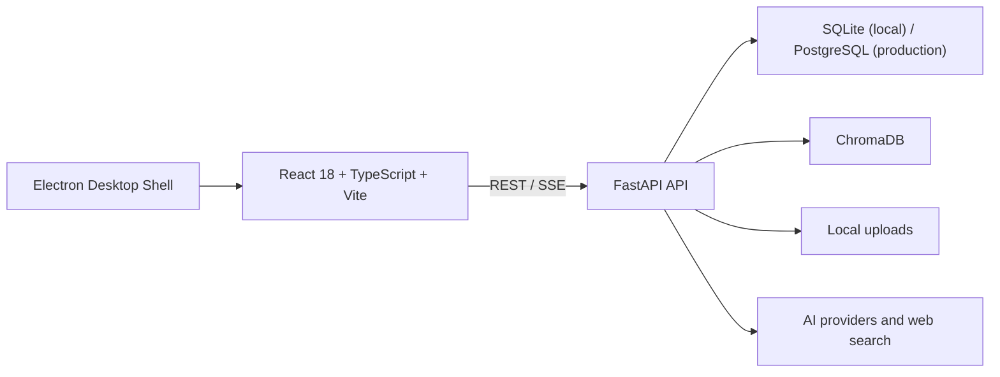
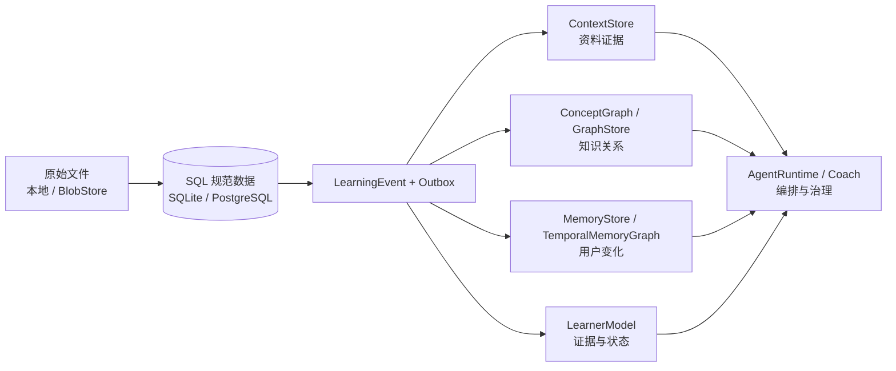

# Mnemox 技术基线

> 状态：维护中
>
> 基线日期：2026-08-13
>
> 当前发布版本：v1.3.0
> 代码范围：`main` 的 post-v1.3 开发基线；学习者模型、projection outbox、运维 API、数据库演练和前端证据下钻已完成聚焦回归，AgentKernel 仍只作为多步只读原型，不代表 Phase 2 已启动或替代现有 Planner

本文件描述当前仓库中已存在的技术实现、运行边界和维护约定。历史方案位于 `docs/superpowers/` 和其他设计文档中；它们用于理解决策过程，不应替代本技术基线。

面向下一阶段的目标架构与候选技术边界见 [2026-08-03 学习智能底座架构决策](superpowers/specs/2026-08-03-learning-intelligence-foundation-architecture.md)（混合 RAG、概念图谱、时态记忆、学习者模型与 AgentRuntime）；执行顺序见 [路线图](roadmap.md)。本文件只把已合入或已验证的能力写入“当前实现”；未提交原型、待迁移能力和实验性方案必须明确标注状态。

## 1. 系统概览

Mnemox 是一个本地优先的 Web 应用，并提供 Windows Electron 桌面壳。



### 运行单元

| 目录 | 作用 | 关键入口 |
| --- | --- | --- |
| `frontend/` | React 学习工作台 | `src/main.tsx`、`src/App.tsx` |
| `backend/` | FastAPI API、学习业务与 AI 集成 | `app/main.py` |
| `desktop/` | Windows Electron 壳、更新与通知桥接 | `src/main.js` |
| `data/` | 本地 SQLite、上传文件、向量相关数据 | 运行时生成，不提交真实用户数据 |
| `release-manifest/` | 应用内更新清单 | `latest.json` |
| `scripts/` | 打包、发布、演示数据等维护脚本 | PowerShell/Python 脚本 |

## 2. 技术栈

| 层级 | 当前技术 |
| --- | --- |
| 前端 | React 18、TypeScript 5、Vite、React Router 6、Ant Design、Zustand |
| 前端数据与内容 | Axios、Dexie/IndexedDB、ECharts、Toast UI Editor、react-markdown、KaTeX |
| 后端 | Python 3.10+、FastAPI、Uvicorn、Pydantic Settings |
| 数据 | SQLAlchemy 2 Async、SQLite、PostgreSQL/asyncpg、Alembic |
| AI 与 RAG | OpenAI、Anthropic、Google GenAI、LlamaIndex、ChromaDB |
| 文件与分析 | PyPDF2、python-docx、pandas、NumPy、SciPy、openpyxl |
| 桌面端 | Electron、electron-builder、electron-updater |
| 测试 | pytest、pytest-asyncio、Vitest、Node test runner |
| 交付 | Docker Compose、Windows NSIS 安装包、GitHub Release 配置 |

## 3. 后端架构

### 3.1 应用入口与中间件

`backend/app/main.py` 创建 FastAPI 应用并负责：

- 应用启动和关闭时的数据库初始化、目录准备和资源清理。
- Episodic Memory 衰减。
- RAG 初始化与空向量库时的后台索引。
- CORS、速率限制、请求大小限制和安全响应头。
- 请求参数校验错误的中文友好提示。
- 已认证上传文件的安全读取，以及可选的前端静态站点托管。

### 3.2 API 组织

当前后端包含 31 个路由模块，按 `/api/*` 前缀组织。主要领域如下：

| 领域 | 路由模块 |
| --- | --- |
| 身份与系统 | `auth`、`system`、`images` |
| 对话与 AI | `chat`、`conversations`、`chat_projects`、`ai_settings`、`prompt_templates` |
| 学习内容 | `materials`、`rag`、`notes`、`obsidian_import` |
| 计划与执行 | `goals`、`plans`、`study_sessions`、`pomodoro` |
| 练习与复习 | `wrong_questions`、`review`、`anki` |
| 洞察与画像 | `learning`、`analytics`、`profile`、`memory`、`motivation`、`interventions` |
| Agent 与 Coach | `agent`、`agent_memory`、`coach` |
| 学习者模型 | `learner_model`（状态、证据、人工修正、重算与投影重放） |

路由应保持薄：鉴权、请求/响应模型、状态码和领域调用可留在路由层；可复用业务规则、事务编排和 AI/RAG 集成应位于 `app/services/` 或 `app/ai/`。

### 3.3 数据与服务

- `app/models/`：当前有 25 个数据模型模块，覆盖用户、资料、章节、目标任务、学习事件、学习证据/概念状态、聊天、记忆、复习、Agent、Coach 等领域。
- `app/services/`：当前有 47 个服务模块，处理用户画像、事件、学习者模型、投影、记忆、搜索缓存、笔记上下文、Agent 学习、Coach 策略和检索等。
- `app/ai/`：多模型 Provider、模型路由、Prompt 组装、RAG、搜索和错误归一化。
- `app/agents/`：Agent 运行时抽象；业务上与 `agent`、`agent_memory`、`coach` 路由及相关服务协作。

### 3.4 数据流

```text
用户操作
  -> 前端 service API client
  -> FastAPI router
  -> service / AI / RAG
  -> SQLAlchemy 数据模型、ChromaDB 或上传文件
  -> 学习事件、记忆、画像与 Coach 策略
  -> REST 或 SSE 返回前端
```

聊天完成后的摘要、记忆、反思、错题检测和学习事件采用分阶段处理。某一后处理失败不能删除已保存的对话内容。

## 4. 前端架构

### 4.1 页面与导航

主业务页面位于 `frontend/src/pages/`，当前包含对话工作台、Dashboard、番茄钟、错题、复习、目标任务、计划、笔记、记忆、掌握度、进度引擎、用户画像、Prompt、EDA、干预、Agent 和 Anki。

除 `/login` 外，路由通过 `ProtectedRoute` 保护。主工作区布局由 `components/Layout/ObsidianLayout.tsx` 与相关导航、侧栏、今日聚焦组件组织。

### 4.2 前端数据边界

- `services/`：唯一的后端 API 调用入口。`apiClient.ts` 负责 Bearer Token、通用错误处理与 401 清理。
- `stores/`：Zustand 管理认证、聊天、番茄钟和主题等跨页面状态。
- `db/studyDb.ts`：Dexie 本地数据表定义。
- `sync/`：同步引擎、队列和模块适配器。当前离线优先范围包括笔记、目标、目标任务、错题和 Anki 卡片。
- `hooks/`：离线优先业务 Hook。

新增接口不应直接在页面中散落 `fetch` 调用；新增离线实体需同时定义本地表、入队逻辑、同步适配器、失败状态和用户可见的处理方式。

## 5. AI、RAG 与 Agent 边界

### 5.1 多模型与搜索

AI 设置支持 OpenAI、Claude、Gemini、DeepSeek/Qwen 及 OpenAI-compatible 服务，并可为聊天、复习、错题、Agent 和 Embedding 等场景配置路由。联网搜索可走 provider hosted search、Tavily、应用层搜索，并在失败时回退到 DuckDuckGo/Bing。

### 5.2 RAG 降级策略

RAG 使用 LlamaIndex 与 ChromaDB 进行语义检索。Embedding 或向量服务不可用时，资料上传与问答不应返回 500，而应使用关键词检索降级。前端已有 Online/Fallback 状态和最近错误提示；后续仍需在浏览器 E2E 与检索迁移中回归覆盖，确保不同入口的状态语义一致。

### 5.3 笔记上下文

聊天会通过 `note_context_service` 从当前用户的笔记中按关键词、标题、标签和更新时间检索最多三条相关摘录。摘录经过 `wrap_untrusted_context` 包装，并限制在 1,800 字符预算内；检索异常会被降级为无笔记上下文的正常聊天。流式接口以 SSE 返回参考笔记指示器，前端只提示本轮参考来源。

### 5.4 Agent 与 Coach

- Agent 汇总目标、今日任务、逾期任务、复习、错题、笔记、用户画像和记忆，输出行动建议或写入草案。
- 当前稳定主路径仍是规则简报与一次性 Planner；主线中的 AgentKernel 原型支持多步只读工具调用和执行日志，但尚未接入前端、SSE 或草案执行闭环，不能视为已替代 Planner。
- 长期记忆分为可审核候选、已确认、锁定、忽略等状态；敏感或主观推断应进入用户审核。
- Coach 使用事件、用户偏好、每日上限、冷却和反馈统计选择是否触达及以何种渠道触达。
- Agent/Coach 的推荐必须能给出证据和风险理由；写入类操作必须走草案确认。

## 6. 目标学习智能底座（部分已实现）

本节是工程目标与真实实现状态的对照，不是当前部署拓扑。当前运行时仍是 SQLite/PostgreSQL、Chroma、关键词降级、SQL 概念表、`UserMemory` 和原生 Agent/Coach；Qdrant、Neo4j、Graphiti、LangGraph 均未被写入当前技术栈。学习者模型首个后端垂直切片已经使用 SQL 实现，不依赖任何候选组件。



### 6.1 规范数据与可重建投影

| 领域 | 当前实现 | 目标规范来源 | 允许的专用投影 |
| --- | --- | --- | --- |
| 资料与片段 | 上传文件、`Material`、Chroma | 文件存储 + SQL 的文件/解析版本/chunk 元数据 | `ContextStore` 索引（Chroma、Qdrant 等） |
| 知识关系 | `concepts`、`concept_edges`、`concept_links` | SQL 中带来源、置信度和审核状态的概念图 | `GraphStore`（Neo4j 等，若 Spike 通过） |
| 长期记忆 | `UserMemory`、会话摘要、事件 | SQL 中带来源、有效时间、审核状态的记忆声明 | Graphiti 时态记忆图（若 Spike 通过） |
| 学习能力 | `learner_evidence` 不可变证据、`user_concept_state` 可重算状态；`Concept.mastery` 仅兼容读取 | SQL `learner_evidence` / `user_concept_state` | 分析视图/缓存；不得把状态只留在图或向量库 |
| Agent 运行 | Planner、AgentJob、草案确认 | SQL 中的运行、草案、确认和审计记录 | LangGraph checkpoint 等运行态存储（若 Spike 通过） |

所有投影必须记录 source/version/namespace、幂等键、消费状态和错误。用户删除、资料更新或权限变更先更新规范来源，再由 outbox 刷新或清除投影；投影可从 SQL 和原始文件重建。

### 6.2 目标领域接口

| 接口 | 负责的能力 | 当前状态 |
| --- | --- | --- |
| `BlobStore` | 原始文件、版本、删除与读取授权 | 需要从现有本地上传抽象出来 |
| `ContextStore` | 入库、混合检索、分层加载、删除 | 协议和关键词保底已存在；真实业务流未迁移 |
| `ConceptGraph` / `GraphStore` | 关系维护、来源、邻域/路径查询、人工修正 | SQL 图谱已存在；独立图存储尚未评估 |
| `MemoryStore` / `TemporalMemoryGraph` | 记忆声明、时间有效性、冲突/失效、相关记忆检索 | `UserMemory` 有部分字段；时态模型未实现 |
| `LearnerModel` | 证据记录、状态聚合、遗忘风险、下一步建议 | `learner_model_service` 已实现 `record_evidence`、`get_concept_state`、`recompute_concept_state`、`apply_manual_override`；复习事件已接入；推荐排序与前端下钻未实现 |
| `AgentRuntime` | 运行、流式、暂停/恢复、取消与工具编排 | 原生 AgentKernel 原型存在；LangGraph 未评估 |

接口只定义业务语义，不泄露 Qdrant、Neo4j、Graphiti 或 LangGraph 的类型到 Router/页面层。领域服务永远负责鉴权、权限过滤、草案确认、审计和业务事务。

### 6.3 学习证据与状态的当前切片

学习事件是原始事实，学习证据是可重放的模型输入，学习者状态是可再计算的派生结果。本轮已新增并通过 SQLite/Alembic 迁移验证：

```text
learner_evidence
  user_id, concept_id, evidence_type, evidence_category, dimension,
  score, reliability, source_event_id, observed_at,
  source_type, source_id, model_version, payload_version, payload

user_concept_state
  user_id, concept_id, mastery_estimate, confidence,
  forgetting_risk, mastery_dimensions, common_error_type,
  last_evidence_at, last_reviewed_at, next_review_at,
  manual_override, source_event_id, reliability, model_version,
  explanation_summary, updated_at
```

`learner_model_service` 将证据类型限制为直接证据（`answer`、`recall`、`explanation`、`application`、`hint_count`、`review_result`）、间接信号（`study_duration`、`study_frequency`、`repeated_question`、`interruption`、`recovery`）以及 `legacy_mastery` / `manual_override`。直接证据按可靠度和 90 天半衰期加权；通常 `score` 越高表示表现越好，`hint_count` 的原始分数则表示提示依赖度并在聚合时显式反转。间接信号只调整置信度和遗忘风险，解释摘要明确记录其影响，不能单独提高掌握度。复习路由先写 `LearningEvent`，再在同一事务内写 `review_result` 证据和派生状态。人工修正也写事件和证据，重算时保留直到用户明确清除。Graphiti 的记忆检索可以提供带来源的学习上下文，但不得写成唯一的 mastery 输入。

迁移 `20260804_01` 将每个既有 `Concept.mastery`（0–100）复制为可靠度 0.35 的 `legacy_mastery` 证据，并初始化同值的 `user_concept_state`；`20260804_02` 新增 `projection_outbox`，`20260804_03` 对已验证的 v1.3 SQLite 漂移做条件式对齐（API key 长度、无效 provider 外键和记忆索引），`20260809_05` 新增 Outbox 运维状态，`20260812_06` 为未完成队列聚合新增部分索引。SQLite 本地启动通过 lightweight migration 执行一次性回填，并用 `mnemox_lightweight_migrations` 标记避免给 rollout 后的新概念补写 legacy 证据；PostgreSQL 只通过 Alembic。

默认 SQLite 已先备份，并已通过 lightweight migration 对齐到 head `20260812_06`。此前学习者模型收口备份为 `backend/data/backups/study-pre-slice-close-20260805-085415.db`，SHA256 `28AF023FD4950BE191389B57C097698653BC3E2AEB0937907B04CD0DD3221AB8`，与当时 `study.db` 一致。源库包含 16 个用户、19 条学习事件和 0 个概念，因此 legacy 证据和状态均为 0；outbox 也为 0，因为 schema 迁移不会为历史事件自动创建任务，历史投影必须显式触发 replay。完整演练和回滚步骤见 [数据库升级演练报告](database-rehearsal-2026-08-05.md)。

一次性 PostgreSQL 16 演练库已从 v1.3 基线升级到当时的 `20260804_03`：2 个用户、2 个概念和 2 条学习事件保留，生成 2 条可靠度 0.35 的 legacy 证据和 2 条状态；mastery/score 分别为 72.5/0.725 与 41/0.41。演练还完成 1 条 outbox 在线消费，并核对用户、概念和事件外键均为 `ON DELETE CASCADE`。演练容器已删除；`20260809_05` 和 `20260812_06` 仍需在正式 PostgreSQL 发布窗口连同多实例 worker、`SKIP LOCKED`、策略升级和心跳语义验收。正式环境回滚依赖升级前快照与应用版本同步回退，不使用自动 downgrade。状态重算只消费截至重算时间的证据，记录最新来源事件、可靠度、模型版本、更新时间和解释摘要；读取已有状态时会刷新时间相关的置信度与遗忘风险。

### 6.4 事件与投影流

目标写入顺序为“领域数据 + `LearningEvent` + `projection_outbox` 同一事务提交 -> 幂等消费者投影”。`record_learning_event` 现在会在同一 SQLAlchemy 事务中创建 outbox 行；`ProjectionOutbox` 具备用户/概念范围、幂等键、模型/载荷版本、`pending/processing/processed/failed` 状态、尝试次数、锁定时间、错误信息和可用时间。`projection_outbox_service` 支持重复消费、崩溃后回收、指数退避、按用户/概念/时间范围重放和状态重建；Review/Anki 完成复习会在请求事务内只消费对应 `source_event_id` 的投影，失败仍保留为可恢复 outbox 行。删除用户或概念会级联清理 outbox、证据和状态。

当前工作区已验证数据库原子幂等入队、所有可领取状态的最大重试限制、显式重放重置、概念级状态串行锁、525 条事件游标分页重放、跨用户/跨概念隔离和严格 API 输入边界。应用生命周期在 PostgreSQL 上会启动一个可配置 worker；一轮最多处理配置批量，但每条任务使用独立 session，在自己的事务内认领、投影并提交，避免多实例跨概念锁交叉，关闭数据库前优雅停止。全局 worker 直接以 PostgreSQL `FOR UPDATE SKIP LOCKED` 认领任务，使并发实例能跳过忙行并继续分配其他用户工作；认领后按用户排序取得 transaction advisory lock。用户范围 API/replay 先取得其用户 advisory lock，再领取行；其行锁冲突同样使用 `SKIP LOCKED` 跳过。SQLite/桌面端因仍保留请求内事件级消费而明确停用常驻 worker，避免无行锁数据库出现双消费者。`OUTBOX_WORKER_ID` 是可配置的逻辑前缀，每个运行时都会持久化独立的心跳 ID；受保护的 `/internal/outbox/metrics` 聚合未完成队列、跨实例活跃/轮询失败 worker、DLQ 和告警，不返回任务载荷或异常正文。`/health` 只返回不含主机标识和异常正文的本实例累计统计，并保留最近一次持久投影失败时间；SQLite 会标记 `sqlite_single_consumer`。真实 PostgreSQL 多实例验收仍是发布窗口项目。

学习者模型 API 位于 `/api/learner-model`：概念状态及解释、分页证据历史、人工修正/撤销、单概念或批量重算、按用户/概念/时间范围重放，以及用户隔离的 outbox 处理入口均已提供。前端 `/mastery` 页面展示掌握度、置信度、遗忘风险、可靠度、模型版本、计算依据和证据历史，并区分直接、间接、人工和 legacy 来源。

### 6.5 受控候选技术

| 技术 | 定位 | 当前结论 |
| --- | --- | --- |
| Qdrant | `ContextStore` 的混合检索 Spike 候选 | 需完成 Windows 打包、无 embedding 降级、用户隔离、删除/迁移、质量和成本验收；未采纳前继续使用现有基线 |
| Neo4j | `GraphStore` Spike 候选 | 只在多跳查询/图谱编辑需求证明 SQL 不足后评估；不自动增加桌面常驻服务 |
| Graphiti | `TemporalMemoryGraph` Spike 候选 | 只投影筛选后的状态变化；SQL 仍是记忆事实、审核和删除的来源 |
| LangGraph | `AgentRuntime` Spike 候选 | 必须通过持久化、SSE、确认式写入、恢复/取消、隔离、回放、降级和桌面分发验收 |
| LlamaIndex | 导入/文档处理编排 | 保留；不作为用户状态事实来源 |
| FSRS | 间隔复习调度 | 保留；回答“何时复习”，不回答“下一步学什么” |
| Cognee、Mem0 | 对照/设计参考 | 不作为核心依赖或事实来源 |
| LightRAG | 评估与策略参考 | 不进入运行时依赖 |
| Microsoft GraphRAG | 不适用 | 明确排除，不做 Spike |

## 7. 安全基线

1. 所有领域查询、详情、更新和删除都必须按 `current_user.id` 或可验证的用户归属过滤。
2. 上传目录访问必须要求认证，并确保解析后的路径位于允许的上传根目录内。
3. `.env`、数据库、真实上传内容、ChromaDB 数据、日志和真实密钥均不得提交。
4. AI Key 与搜索 Key 只可在后端配置/加密存储，不应存入浏览器持久化数据。
5. 资料、笔记、搜索结果、工具返回值应作为不可信内容包装，禁止其改变系统策略、工具权限或确认流程。
6. 公开部署前需设置随机 `SECRET_KEY`、关闭 `DEBUG`、收紧 `CORS_ORIGINS`，并补充速率限制、审计和恶意文件扫描策略。

## 8. 本地开发与交付

### 8.1 开发运行

```powershell
# 后端
cd backend
pip install -r requirements-dev.txt
python -m uvicorn app.main:app --reload --host 0.0.0.0 --port 8000

# 前端（另开终端）
cd frontend
npm install
npm run dev -- --host 0.0.0.0 --port 5173
```

Docker 场景使用根目录 `docker-compose.yml`。Windows 本地体验可使用根目录 `start.bat` 或 `start.ps1`。

### 8.2 数据库迁移

PostgreSQL 只允许通过 `python run_migrations.py` 管理 schema。迁移链由冻结的 v1.3 基线和 Phase 1 增量组成：空库直接升级；经过严格表/列指纹校验的无版本 v1.3 库先写入基线版本再升级；其他无版本库会失败退出，要求先备份并人工对齐，避免错误 `stamp`。当前 head 为 `20260812_06`。该入口会用 PostgreSQL session advisory lock 串行化 schema 指纹识别、可能的 baseline stamp 和 Alembic upgrade，因此多副本启动时后续副本会等待当前迁移完成；不得以直接 `alembic upgrade` 绕过该入口。Docker 在启动 Uvicorn 前执行该入口。应用生命周期在 PostgreSQL 上只校验 Alembic head，绝不执行 `create_all`。Alembic 自动检查忽略 ORM 注释和 SQLite 本地 lightweight 账本，只比较结构、类型、约束和索引。

### 8.3 验证命令

```powershell
# 后端
cd backend
python -m pytest -q

# 前端
cd frontend
npm test
npm run build
npm run lint

# 桌面端
cd desktop
npm test
```

发布前还应执行 `git diff --check`，并验证版本号、发布清单和桌面安装包资产保持一致。

## 9. 当前技术债与优化方向

| 优先级 | 事项 | 原因 |
| --- | --- | --- |
| P0 | 正式 PostgreSQL 发布升级 | 一次性 PostgreSQL 16 演练库已完成 v1.3→`20260804_03` 升级并通过数据量、outbox、外键和 `alembic check` 核对；正式库仍需在发布窗口升级到 `20260812_06`，并执行多实例 worker、`SKIP LOCKED`、策略升级、心跳、快照、核对与回滚准备。 |
| P0 | 真实关键路径 E2E | 当前“关键路径”主要是 ASGI API 冒烟；需要浏览器/桌面端覆盖草案确认与执行。 |
| P0 | 多用户越权审计与回归测试 | 产品存在多领域详情、写入和文件访问接口，必须持续验证资源归属。 |
| P0 | 统一 Prompt Injection 防护 | RAG、笔记、搜索和工具返回均会进入模型上下文。 |
| P2 | RAG 状态前端回归 | 该能力已在 v1.2.0 主体落地，后续随检索迁移继续验证降级状态、最近错误和提示一致性。 |
| P1 | 拆分超大模块 | `learning`、`analytics`、Agent/Coach 相关实现的复杂度持续上升。 |
| P1 | 检索碎片化与 ContextStore 迁移 | 当前只有接口和关键词保底，RAG、笔记、记忆仍有独立检索路径。 |
| P1 | 学习者模型数据边界收口 | 后端状态/证据 API、人工修正、批量重算、用户隔离、前端证据下钻和离线校准基线已实现；真实 holdout 数据不足，推荐排序待补。 |
| P1 | 事件投影与数据生命周期 | `projection_outbox`、同事务写入、事件级在线消费、幂等消费、重试/崩溃恢复、525 条分页重放、范围隔离、删除级联、常驻 worker、DLQ、跨实例聚合指标和告警已验证；ContextStore/图谱/记忆投影及真实 PostgreSQL 多实例发布验收待补。 |
| P1 | 时态记忆语义 | `UserMemory` 已有来源/证据/过期字段，但缺有效时间、冲突/失效、筛选 episode 和可验证的 Graphiti 适配。 |
| P1 | Obsidian 同步一致性 | 当前是手动拉取；需要稳定 vault/file ID、跨 vault 隔离、冲突/删除策略、并发幂等和用户可见差异。 |
| P1 | 联想与 Coach 反馈闭环 | 联想计算已有，但尚未记录 shown/feedback/采纳基线。 |
| P1 | 后台任务与可观测性 | 调度器尚未接入；长耗时索引、AI 处理、重试需要结构化日志、状态、幂等、锁和失败可视化。 |
| P1 | AgentRuntime 产品化 | 原型是同步 JSON；需先比较原生 Kernel 与 LangGraph 的持久化/SSE/确认/恢复边界，再完成前端、fallback 和回放。 |
| P1 | 北极星指标事件链路 | 后端已有四项指标的事件计算原型（`north_star_metrics_service` 与 `/api/analytics/north-star`，并有单元测试）；前端看板、生产归因窗口、覆盖率监控和 Coach 触达链路仍待完成。 |
| P1 | 离线冲突处理 UI | 现有同步队列可重试，但服务端与本地并发修改的用户决策仍需完善。 |
| P2 | LLM 成本与数据生命周期 | 后台任务和概念抽取需要每用户预算、超时/熔断、日志脱敏、保留期限和删除级联。 |

## 10. 演进方向与当前状态（2026-08-03）

以下目标由 [2026-08-03 学习智能底座决策](superpowers/specs/2026-08-03-learning-intelligence-foundation-architecture.md) 定义。状态以代码和验收证据为准；“部分完成”不等于完成标准已满足。

| 方向 | 摘要 | 决策 | 阶段 |
| --- | --- | --- | --- |
| 规范数据与投影 | 关系型核心保留；补学习证据、用户概念状态、记忆声明与 outbox | 新 ADR §2/§4 | 🔶 学习证据/用户概念状态已验证；outbox/API 主体和数据库演练已完成，最终边界回归待收口；记忆声明与其他通用投影未实现 |
| 复习调度 | `py-fsrs` 替换手写 SM-2 风格调度 | 保留 | ✅ FSRS 优先 + SM-2 降级；版本化迁移、数据保留回归、离线 DDL 和一次性 PostgreSQL 16 演练完成 |
| 检索底座 | `ContextStore` 统一检索；Qdrant 为 Spike 候选 | 新 ADR §3/§5 | 🔶 OpenViking 已否决；当前 ContextStore 是关键词 SQL 保底，旧 RAG 仍使用 Chroma，业务迁移未完成 |
| 概念图谱 | 可审查的关系、证据和人工修正；Neo4j 为条件 Spike | 新 ADR §3/§5 | 🔶 图谱/联想计算有；关系质量、人工编辑、学习者状态和下钻未完成 |
| 时态记忆 | SQL 记忆声明 + Graphiti 条件投影 | 新 ADR §3/§5 | 🔶 `UserMemory` 有来源/证据/过期字段；时态模型与 Graphiti 适配未开始 |
| 学习者模型 | 多源证据、状态、遗忘风险与下一步推荐 | 新 ADR §3 | 🔶 后端、outbox、批量重放、API、前端展示和校准基线已验证；真实数据校准、推荐排序和生产监控待补 |
| Obsidian 同步 | 先完成拉取式增量同步的稳定 ID、冲突/删除策略；watchdog 与写回后置 | 保留 | 🔶 拉取式 MVP 有；watchdog、前端入口、删除和写回未完成 |
| AgentRuntime | 原生 Kernel 与 LangGraph 的受控比较；草案确认、回放和 fallback 后再接调度 | 新 ADR §5/§6 | 🔶 工作区原型有；LangGraph 未评估，未接前端、SSE 或草案闭环 |
| 后台调度与自学习 | Coach 治理下的 catch-up、归因和确定性分桶 | 保留 | ⏳ 调度未开始；只有反馈聚合，归因和看板未开始 |
